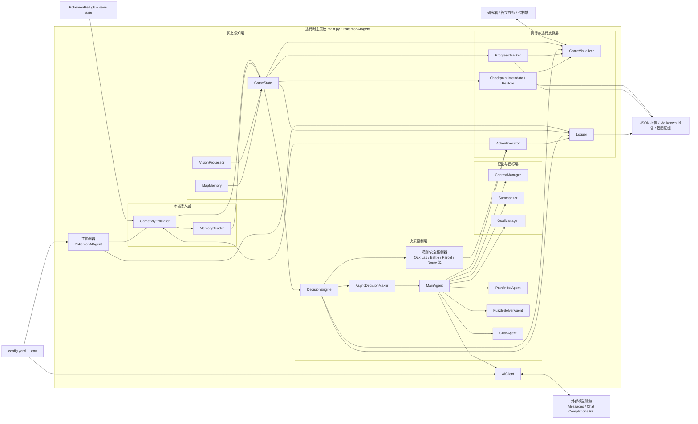
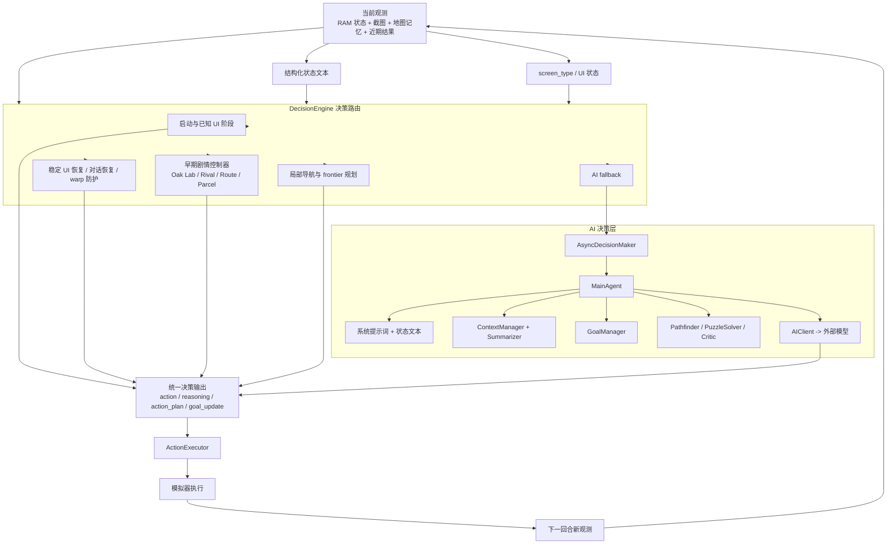
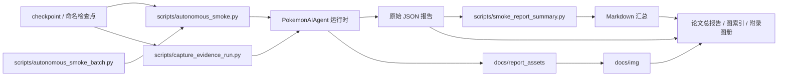

# 2026-04-05 系统架构图

本文档基于当前项目实际代码结构整理，主要对应以下模块：

- `main.py`
- `src/emulator/*`
- `src/state/*`
- `src/control/*`
- `src/agents/*`
- `src/memory/*`
- `src/tools/*`
- `src/runtime/checkpoints.py`
- `src/visualization/visualizer.py`
- `scripts/autonomous_smoke.py`
- `scripts/autonomous_smoke_batch.py`
- `scripts/capture_evidence_run.py`
- `scripts/smoke_report_summary.py`

可直接作为论文第 3 章“系统设计与实现”的架构图基础。

## 1. 总体系统架构图

## 2. 决策子系统架构图

这张图更适合放到论文“智能体决策链路设计”小节，用来说明系统不是单纯把截图丢给大模型，而是先经过规则控制层、再进入 AI 决策层。

## 3. 实验与取证链路图

这张图适合放到论文“实验设计与证据组织”章节。

## 4. 论文中建议使用的图题

- 图 3-1 系统总体架构图
- 图 3-2 决策与控制子系统架构图
- 图 4-1 实验与证据采集流程图

## 5. 论文写作建议

如果只放一张图，建议优先使用“总体系统架构图”。

如果论文篇幅允许，建议按下面方式组合：

1. 第 3 章放“总体系统架构图”
2. 第 3 章决策设计小节放“决策子系统架构图”
3. 第 4 章实验设计小节放“实验与取证链路图”

## 6. 可直接引用的摘要说明

本系统以 `main.py` 中的 `PokemonAIAgent` 作为运行时主协调器，通过模拟器驱动、RAM 状态读取、可选视觉分析和地图记忆构造统一游戏状态，再由 `DecisionEngine` 将规则控制器与大模型主智能体结合，输出动作并通过 `ActionExecutor` 回写到模拟器。系统同时具备上下文记忆、目标管理、检查点恢复、实时可视化和标准化实验脚本，从而形成“感知-决策-执行-观测-评估”闭环。
