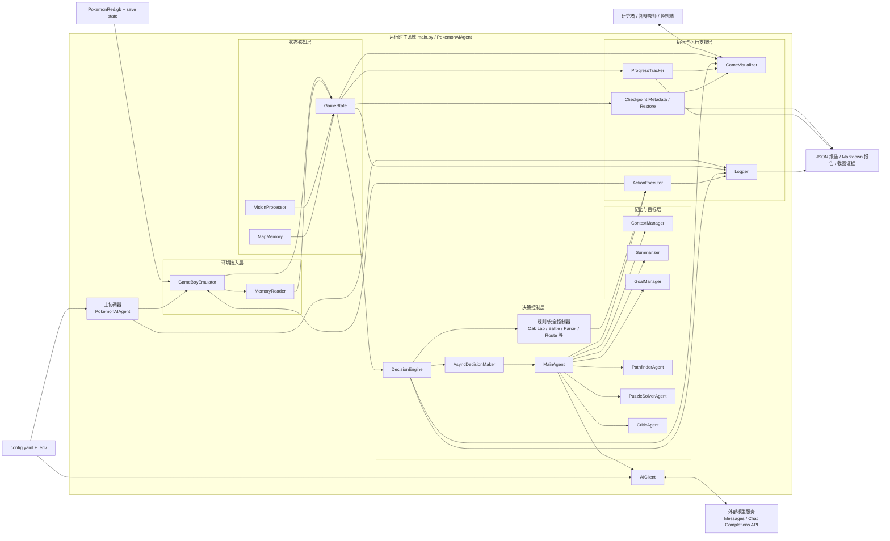
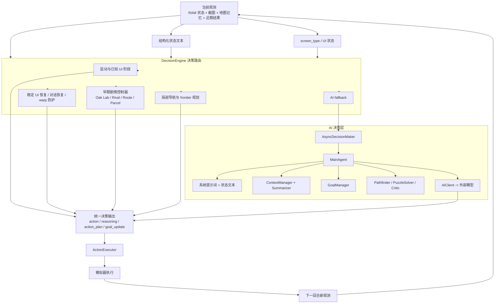
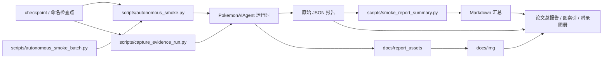

# 面向长时序 JRPG 任务的混合式大模型游戏智能体

## 以 Pokemon Red 早期剧情自主推进为例的系统设计、证据组织与实验分析

> 论文初稿说明  
> 1. 本稿以“顶刊风格的研究型初稿”为目标撰写，而不是仅满足本科毕业论文最低格式要求。  
> 2. 所有强结论均严格绑定当前仓库内已存在的日志、测试、图片和 JSON 报告；凡缺失的实验、图表或对照，一律以 `[占位]` 标注，不以主观推测代替。  
> 3. 本稿写作组织方式参考 `2304.03442v2.pdf` 所体现的“问题提出 -> 行为/机制解释 -> 系统实现 -> 证据分析 -> 边界讨论”的论文叙述方式；理论与环境复杂性表述同时参考 `2502.19920v2 (1).pdf`。  
> 4. 本稿是可继续迭代的完整长稿底版。若后续补齐更多实验，可以直接在对应 `[占位表]`、`[占位图]` 和 `[待补实验]` 位置填入正式结果，而不需要重写全文结构。

---

## 摘要

长时序游戏环境为通用智能体研究提供了兼具复杂交互、稀疏里程碑、部分可观测状态和多阶段目标耦合的高难度测试场景。与 Atari 等短回合基准相比，`Pokemon Red` 不仅要求智能体完成像素级导航，还要求其在剧情触发、文本框推进、战斗菜单选择、地图探索、局部恢复和长期目标维持之间建立稳定闭环。因此，`Pokemon Red` 更接近“长期具身任务”的压缩版研究环境，而不只是一个怀旧游戏。

本文围绕一个运行于 `PyBoy` 模拟器之上的混合式大模型游戏智能体系统展开研究。该系统以 `main.py` 中的 `PokemonAIAgent` 为总协调器，通过 RAM 状态读取、截图感知、地图记忆、上下文管理、目标管理、规则安全控制器、主大模型决策器、动作执行器、检查点恢复、可视化仪表盘及标准化 smoke/batch 评估脚本，形成了可长时运行、可追溯、可复验的工程闭环。与纯脚本系统或纯强化学习策略不同，本文采用“受约束的生成式决策”路线：普通回合主要由大模型生成动作，规则层只在启动、稳定恢复、剧情安全边界与局部异常处理时提供有限接管，从而在保持 AI 主导性的同时降低灾难性失稳概率。

在理论上，本文借鉴 Generative Agents 关于记忆检索、上下文压缩与短中长期规划协同的思想，将游戏任务中的长期状态组织为近期回合、摘要历史、指导注记和任务笔记的组合；同时借鉴 `Pokémon Red via Reinforcement Learning` 对环境复杂性的形式化方式，将 `Pokemon Red` 的早期剧情推进建模为一个部分可观测长时序决策问题。围绕这一建模，本文进一步提出适用于生成式运行时系统的证据分类方法，将“工程可运行性”“长程韧性”“真实 AI 主导证据”与“负证据/失败证据”明确区分，避免将 fallback 主导运行误写为 AI 主导结果。

截至 `2026-04-06` 的最新本地复验表明：当前仓库在正常权限环境下通过 `299 passed, 1 warning` 的全量测试，`test_setup.py` 为 `7/7` 通过，`test_custom_api.py` 可成功连接真实模型端点。真实 AI 参与的短程实验显示：单次 `120` turn short smoke 的 `ai_authored_ratio` 达到 `0.7667`；`Phase 3` 的 story guidance probe 将该指标提升至 `0.8917` 并成功到达 `Route 1`；battle guidance probe 在 `ai_authored_ratio = 0.8417`、`fallback_turns = 0` 条件下，记录到 AI 在真实模型条件下做出 `FIGHT` 与 `Scratch` 的首个正确战斗决策。另一方面，重复 batch 的成功率与方差仍不理想，当前尚不能严谨声称系统已稳定取得 `got_pokedex`、`oak_got_parcel` 或更长中程剧情推进里程碑。因此，本文可被严格支持的结论是：该系统已经建立完整工程闭环，并已证明真实 AI 能在若干短程运行中主导大多数普通回合并推进到关键早期节点；但其仍然是“具有早期剧情可行性验证的长时序智能体原型”，而非“稳定完成中程主线推进的成熟自治体”。

本文的主要贡献包括：  
1. 提出一个面向 `Pokemon Red` 的混合式大模型游戏智能体框架，将 RAM 读取、截图感知、地图记忆、上下文管理、规则路由和大模型决策统一到同一运行时系统中。  
2. 建立区分工程有效性、韧性证据与真实 AI 主导证据的评估协议，为后续研究提供更严格的证据治理范式。  
3. 通过多轮真实实验与修复前后对比，识别出 provider 波动、局部剧情误解和战斗后续推进是当前系统的主要瓶颈。  
4. 基于现有文档、图片和日志，形成一份可直接继续扩写的长篇论文初稿，并明确列出顶刊标准下仍需补充的图表、消融和基线材料。

**关键词**：长时序任务；大模型智能体；Pokemon Red；混合控制；RAM 状态读取；地图记忆；实验可复现性

## Abstract

Long-horizon game environments provide a demanding testbed for general-purpose agents because they combine sparse milestones, partially observable state, UI-heavy interaction, local recovery, and long-term goal maintenance. Compared with short-horizon arcade benchmarks, `Pokemon Red` requires an agent to coordinate navigation, dialogue progression, battle menus, event triggers, memory, and runtime recovery over extended trajectories. This paper studies a hybrid LLM-driven game agent for early-story progression in `Pokemon Red`.

The proposed system is built around a runtime coordinator that integrates emulator control, RAM-based state extraction, screenshot perception, map memory, context summarization, goal management, deterministic safety controllers, a primary language-model agent, action execution, checkpoint recovery, visualization, and standardized smoke/batch evaluation scripts. Rather than following a pure scripted or pure reinforcement-learning route, the system adopts a constrained generative-control paradigm: ordinary turn-level decisions are primarily owned by the language model, while deterministic logic remains limited to bootstrapping, safety, stability recovery, and story-boundary safeguards.

Inspired by Generative Agents, we organize long-horizon context into recent turns, historical summaries, guidance notes, and a compact task notebook. Inspired by recent reinforcement-learning work on `Pokemon Red`, we formulate early-story progression as a partially observable long-horizon decision problem and evaluate it through AI ownership ratios, fallback ratios, milestone reachability, timeline validity, and resilience metrics. As of April 6, 2026, the latest local reverification shows `299 passed, 1 warning` in the full test suite under normal permissions, `7/7` environment checks, and successful direct API connectivity. Positive real-AI probes reach `ai_authored_ratio` values up to `0.8917`, successfully enter `Route 1`, and explicitly produce the first correct actionable battle choices (`FIGHT`, `Scratch`) under real model conditions. However, repeated-batch variance remains high, stronger milestones such as `got_pokedex` and `oak_got_parcel` are not yet stable, and provider availability fluctuates intra-day. Therefore, the current system can be rigorously claimed as a complete long-horizon runtime framework with verified early-story feasibility, but not yet as a mature autonomous agent that stably completes medium-horizon story progression.

---

## 第 1 章 绪论

### 1.1 研究背景

智能体研究正在经历一个明显转向：研究重点正从“单回合反应是否正确”转向“长期任务中行为链是否自洽”。在短回合任务中，错误经常只影响下一步；而在长时序任务中，一个局部决策错误可能在几十步之后才暴露为路线偏航、剧情锁死、资源浪费或恢复失败。因此，长时序任务并不只是把短任务变长，而是要求系统在更长的时间尺度上保持上下文一致性、目标连续性和恢复能力。

游戏环境天然适合作为这一问题的实验场。原因在于：  
1. 游戏环境提供可重复、低风险、强交互的在线闭环；  
2. 状态、动作和事件可以被结构化记录，便于构建可审计证据；  
3. 相比纯文本任务，游戏更能暴露“观测不充分、控制迟滞、计划漂移、局部死循环”等实际问题。

然而，并不是所有游戏都适合用于验证长期自治。许多街机环境虽然具有视觉复杂性，却缺乏强剧情链和多阶段交互结构。`Pokemon Red` 则不同。它同时包含了以下特点：

1. **剧情触发链长且有先后依赖**。例如拿到初始宝可梦之前，玩家看似可以在若干房间自由移动，但实际上很多行为受到脚本锁控制。  
2. **地图探索和文本交互交织出现**。玩家需要在房间、城镇、道路和草丛之间切换，同时处理 NPC 对话与剧情触发。  
3. **战斗界面与探索界面完全不同**。进入战斗后，动作语义从“朝某个方向移动”切换为“打开菜单、选中攻击、推进文本”。  
4. **错误恢复十分重要**。同样的“按 A”在对话框里可能是正确行为，在普通室内地图里却可能造成无意义重复。

因此，`Pokemon Red` 不是一个单纯“让 AI 玩游戏”的展示场景，而是一个能够同时检验感知、记忆、规划、动作执行、恢复和证据治理的研究环境。

### 1.2 研究意义

本文的意义主要体现在三个层面。

首先，在**方法层面**，本文尝试回答一个当前很有代表性的问题：不依赖大规模强化学习训练，仅依靠预训练大模型、结构化状态提纯和运行时控制，是否也能在复杂长时序环境中建立一个具备局部自治能力的游戏智能体系统。这个问题直接关联到近年来“大模型智能体”与“工具增强型推理系统”的研究热潮。

其次，在**系统层面**，本文强调的不只是单次成功运行，而是整套运行时架构能否形成闭环。许多演示型项目容易停留在“录到一段成功视频”阶段，但缺乏失败样本、参数冻结、图像索引和批量对照。对于研究论文而言，真正重要的是：  
1. 系统的状态是如何组织的；  
2. 决策权是如何在规则层与模型层之间分配的；  
3. 成功和失败是如何被统一记录的；  
4. 哪些结论可以被哪些证据支撑。

最后，在**论文写作层面**，本文也试图把一个偏工程项目提升到研究型论文叙述方式：不是简单罗列“做了哪些模块”，而是围绕“为什么任务难、系统如何解决、证据如何界定、哪些结论不能过度声称”来组织整篇论文。

### 1.3 研究问题

围绕上述背景，本文聚焦以下研究问题：

1. **RQ1：系统层面的问题**  
能否构造一个完整的、可长时运行的 `Pokemon Red` 混合式大模型智能体系统，使其在真实 API 条件下具备可观测、可恢复、可追溯和可复验的工程闭环？

2. **RQ2：能力层面的问题**  
在 `llm_primary_mode = true` 与 `ai_full_control_mode = true` 的约束条件下，真实 AI 是否已经能够在普通回合中占据主导，并在 `Pallet Town -> Route 1 -> 首场野战` 这类关键局部场景中做出有效决策？

3. **RQ3：瓶颈层面的问题**  
当系统尚未稳定取得 `got_pokedex` 或 `oak_got_parcel` 等更强里程碑时，主要瓶颈究竟来自哪里：运行时恢复策略、提示词与状态表达、局部战斗引导、provider 可用性，还是实验协议方差？

### 1.4 研究目标

本文不以“证明系统已经稳定通关”作为目标，而以更可验证、也更符合当前证据边界的三个目标为主：

1. 证明系统已具备完整工程闭环。  
2. 证明真实 AI 在若干短程实验中已经主导了多数普通回合，并完成了若干关键早期动作。  
3. 明确指出当前不足以支持的结论，并给出顶刊目标下仍需补充的实验和图表清单。

换言之，本文追求的是**严谨的研究边界**，而不是最大化叙述上的“成功感”。

### 1.5 研究贡献

相较于一个普通课程设计或项目报告，本文的主要贡献体现在以下四点：

1. **系统贡献**  
提出一个面向 `Pokemon Red` 的混合式大模型运行时框架，将模拟器驱动、RAM 状态、地图记忆、上下文管理和生成式决策整合为可长期运行的单智能体系统。

2. **方法贡献**  
给出一种适用于生成式游戏智能体的控制权度量方法，用 `main_model_ratio`、`ai_authored_ratio` 和 `fallback_turns` 区分“真实 AI 主导”与“规则/容错层主导”。

3. **实验贡献**  
建立了标准化 short smoke、重复 batch、失败归档、图片索引和附录联系表，使论文结论与原始运行证据之间形成直接映射关系。

4. **论文贡献**  
基于现有仓库，完成一篇可继续迭代的研究型长稿初版，为后续补充正式图表、对照实验和高质量图片提供稳定骨架。

### 1.6 论文结构

本文后续结构安排如下：

- 第 2 章回顾相关工作与理论基础，明确本文与 Generative Agents 路线、RL 路线和混合式控制路线的关系。  
- 第 3 章对任务场景、状态观测、动作空间和评价目标进行形式化描述。  
- 第 4 章给出系统总体架构、运行时闭环和各层模块之间的关系。  
- 第 5 章深入解释核心方法与关键模块实现。  
- 第 6 章介绍实验设计、证据分类、评价指标与可复现流程。  
- 第 7 章汇报实验结果并进行严格分析。  
- 第 8 章讨论局限性、有效性威胁以及顶刊目标下仍需补充的材料。  
- 第 9 章总结全文并展望下一阶段工作。

---

## 第 2 章 相关工作与理论基础

### 2.1 长时序智能体研究的基本问题

长时序任务与短回合任务的本质差异，在于它要求系统对“过去发生过什么”和“当前该做什么”保持长期一致解释。一个仅在当前局部观测上最优的策略，很可能在若干步后暴露出明显问题，例如：

1. 在剧情锁仍存在时误把场景当作自由探索环境；  
2. 在战斗后文本尚未结束时切回导航逻辑；  
3. 在已经失败过的局部路线附近不断循环；  
4. 在 provider 波动导致暂时不可用时，错误地让 fallback 接管整段运行。

因此，长时序智能体必须同时管理以下几类信息：

- 当前观测；  
- 历史摘要；  
- 当前任务焦点；  
- 局部失败证据；  
- 可恢复路径；  
- 已知安全边界。

这也是本文为何不把问题简化为“给一张图让模型输出一个键”，而是强调一个完整运行时系统。

### 2.2 Generative Agents 的启发

Generative Agents 一文提出了以 memory、reflection、planning 为主线的行为生成框架，其核心贡献并不是单一模型能力，而是把行为一致性问题转化为“哪些历史被记录、哪些历史被检索、哪些被压缩为高层摘要”这一套运行机制。其经典的记忆检索思想可以抽象为：

$$
\mathrm{score}_i = \alpha_r \cdot \mathrm{recency}_i + \alpha_i \cdot \mathrm{importance}_i + \alpha_s \cdot \mathrm{relevance}_i.
$$

上式表明，历史记忆是否会在当前决策中发挥作用，取决于三个因素：时间新近性、事件重要性和与当前任务的相关性。对于 `Pokemon Red` 这一类长时序游戏环境，这一思想具有直接启发意义：

1. 单帧截图并不足以决定行动。  
2. 历史行动与结果必须被压缩后保存在上下文中。  
3. 当前任务重点必须能够覆盖旧记忆中的噪声。

本文没有照搬 Generative Agents 的完整社会模拟框架，也没有实现同等形式的“反思生成器”；但本文在工程上保留了其最关键的思想骨架：  
**近期回合 + 历史摘要 + 任务笔记 + 外部指导注记** 的多层上下文组织。

### 2.3 Pokemon Red 作为研究环境的复杂性

`Pokémon Red via Reinforcement Learning` 将 `Pokemon Red` 定位为长时序强化学习环境，这一判断对本文同样成立。该环境的复杂性主要来自以下几个方面：

1. **探索复杂性**  
从房间、实验室、城镇到道路，地图切换频繁，很多出口需要先走到可见范围内才能确认。  

2. **交互复杂性**  
不同 UI 状态下，同一按钮的语义完全不同。例如 `A` 既可能是确认文本，也可能是与 NPC 互动，也可能是在菜单中选择条目。  

3. **任务链复杂性**  
玩家必须按照一定先后顺序推进剧情，很多关键剧情本身不会在视觉上直接标明。  

4. **评估复杂性**  
如果不额外设计指标，单纯记录“跑了多少 turn”无法区分是系统真的在推进，还是 fallback 在原地维持运行。

因此，本文把 `Pokemon Red` 视为一个比“像素控制”更高层的问题：它既是一个部分可观测环境，也是一个混合交互环境，还是一个长时叙事环境。

### 2.4 大模型智能体与工具增强决策

近年来，大模型智能体研究出现一个明显趋势：让语言模型不再直接面对原始世界，而是通过结构化状态、工具调用、检索模块和外部控制器来组织行动。这一路线的优点在于：

1. 可以充分利用预训练模型已有的常识与语言推理能力；  
2. 不必从零训练一个游戏策略网络；  
3. 便于解释每个阶段为何做出某个决定。

但它也有明显风险：

1. prompt 容易累积噪声；  
2. provider 延迟与错误会直接污染运行过程；  
3. 如果控制权定义不清，系统很容易在“看起来是 AI 在玩”和“实际上是规则在托底”之间失去边界。

本文的混合式方法，正是试图在这两端之间取得平衡：  
一方面保留大模型对开放式场景的判断优势，另一方面使用小规模、边界清晰的确定性控制器守住安全和稳定性。

### 2.5 本文方法与现有工作的关系

将本文放入已有研究版图，可以概括为三条关系：

1. **与 Generative Agents 的关系**  
本文借鉴其记忆组织与长时上下文处理思想，但不复现其社会模拟设定。  

2. **与 RL 路线的关系**  
本文借鉴 `Pokemon Red` 作为长时环境的形式化意义，但不采用 PPO 等训练策略；本文关注的是在线生成式控制与运行时系统，而非大规模训练。  

3. **与脚本式游戏 AI 的关系**  
本文并不追求把整套早期剧情写成固定脚本，而是有意把脚本限制在安全与恢复层，避免把“脚本走剧情”误表述为“AI 自主推进剧情”。

因此，本文最合适的方法定位不是“新的基础模型”也不是“完全端到端训练代理”，而是：  
**一个面向长时序 JRPG 环境的混合式大模型运行时智能体框架**。

### 2.6 理论基础小结

综合相关工作，本文的理论前提可以概括为：

1. 长时序智能体需要显式上下文管理，而不是仅依赖即时观测。  
2. 长时序游戏环境中的正确行为，往往依赖局部状态解释与任务优先级，而不只是动作反射。  
3. 在没有大规模训练的前提下，结构化状态、目标管理与运行时保护是大模型代理落地的关键。

这三点共同构成了后续系统设计的理论基础。

---

## 第 3 章 任务场景、系统行为与问题定义

### 3.1 任务范围与阶段划分

本文聚焦 `Pokemon Red` 的**早期剧情自主推进**，而不是整部游戏的全流程通关。之所以这样限定范围，是因为当前仓库的正向证据主要集中在以下阶段：

1. 启动与进入可控世界；
2. 房间与房屋内移动；
3. Oak Lab 相关剧情；
4. 离开 Pallet Town；
5. 进入 `Route 1`；
6. 首个野战场景中的菜单决策。

从研究角度看，这一任务范围已经足以覆盖多种代表性能力：

- 启动阶段的 UI 识别；  
- 室内导航；  
- 剧情脚本锁识别；  
- 城镇出口定位；  
- 地图过渡；  
- 战斗 UI 决策。

也就是说，即使不讨论更后面的 `Viridian City`、`Oak's Parcel` 或道馆战，当前研究范围仍然是一个结构完整的长时序子问题。

### 3.2 环境状态的部分可观测性

本文将 `Pokemon Red` 早期剧情推进建模为一个部分可观测马尔可夫决策过程（POMDP）：

$$
\mathcal{M}=(\mathcal{S}, \mathcal{A}, \mathcal{O}, T, \Omega, R, \gamma),
$$

其中：

- $\mathcal{S}$ 表示真实游戏内部状态，包括地图、玩家坐标、NPC 位置、剧情事件位、战斗状态、背包和队伍信息等；  
- $\mathcal{A}$ 表示高层离散动作集合；  
- $\mathcal{O}$ 表示智能体可见的观测，包括 RAM 语义、截图以及衍生上下文；  
- $T$ 为状态转移函数；  
- $\Omega$ 为观测函数；  
- $R$ 为外部评价函数；  
- $\gamma$ 为折扣因子。

该形式化并不意味着本文进行在线强化学习训练。相反，它主要用于说明：  
**智能体每一步看到的都只是内部真实状态的一部分投影**，因此系统必须维护额外记忆与恢复机制。

### 3.3 观测建模

在当前系统中，单步观测可以抽象为：

$$
o_t = \big[x_t^{ram},\; x_t^{img},\; x_t^{nav},\; x_t^{ctx},\; x_t^{goal}\big].
$$

其中：

- $x_t^{ram}$ 表示 RAM 读取到的结构化状态，例如地图、坐标、角色朝向、队伍、金钱、UI 标志与战斗信息；  
- $x_t^{img}$ 表示当前截图及其可选的视觉分析结果；  
- $x_t^{nav}$ 表示地图记忆、局部 frontier、已知出口和邻近阻挡信息；  
- $x_t^{ctx}$ 表示近期回合、摘要历史、指导注记和任务笔记；  
- $x_t^{goal}$ 表示当前 focus、todo 和主次目标。

相比于“只给截图”，这种观测结构有两个直接好处：

1. 它把容易被视觉误判的关键低层状态转化为高层文本提示；  
2. 它让模型可以利用过去信息，而不是只对单帧像素做本地猜测。

### 3.4 动作空间建模

本文系统在决策层使用的高层动作集合为：

$$
\mathcal{A}=\{\texttt{up}, \texttt{down}, \texttt{left}, \texttt{right}, \texttt{a}, \texttt{b}, \texttt{start}, \texttt{select}\}.
$$

在 `MainAgent` 中还定义了 `wait`，但 prompt 明确禁止模型直接输出 `ACTION: wait`，以避免模型把“不知道怎么办”伪装为保守行为。  

动作被送入执行器后，并不会简单等价于一次裸按键，而是会经过：

1. 合法性校验；  
2. 朝向动作与真实位移的区分；  
3. 若干 settle frames；  
4. 在需要时进行单方向重试。

因此，本文中的“一个动作”并不是物理层最底层的单帧输入，而是**研究层的高层动作 token**。

### 3.5 长时序任务中的控制权问题

对大模型游戏智能体而言，一个非常关键但常被忽略的问题是：**到底是谁在控制系统？**

如果一个系统在大多数时间里都由 fallback、规则脚本或 cooldown 改写动作接管，那么即使它最后到达了某个里程碑，也不能轻易写成“AI 自主完成”。  

因此，本文引入以下控制权指标：

$$
\rho_{\mathrm{main}} = \frac{N_{\mathrm{main}}}{N_{\mathrm{total}}},
\qquad
\rho_{\mathrm{AI}} = \frac{N_{\mathrm{main}} + N_{\mathrm{plan}}}{N_{\mathrm{total}}},
$$

$$
\rho_{\mathrm{fallback}} = \frac{N_{\mathrm{fallback}}}{N_{\mathrm{total}}}.
$$

其中：

- $N_{\mathrm{main}}$ 表示主模型直接产出动作的回合数；  
- $N_{\mathrm{plan}}$ 表示沿用 AI 行动计划的回合数；  
- $N_{\mathrm{fallback}}$ 表示由 fallback 或非 AI 路径接管的回合数；  
- $N_{\mathrm{total}}$ 表示总回合数。

这一定义与仓库中的 `main_model_ratio`、`ai_authored_ratio` 与 `fallback_turns` 直接对应。它的意义在于：  
**把“AI 参与过”与“AI 主导了”严格区分开。**

### 3.6 剧情里程碑与进展度量

因为本文不是训练任务，所以不以累计奖励作为主要结论，而以剧情里程碑作为更稳定的评价对象。本文重点关注的里程碑集合可写为：

$$
\mathcal{K}=\{\texttt{entered\_oaks\_lab}, \texttt{reached\_route1}, \texttt{got\_pokedex}, \texttt{oak\_got\_parcel}, \texttt{reached\_route2}, \texttt{reached\_viridian\_forest}\}.
$$

为便于表述，也可以引入一个概念性的加权进展分数：

$$
P = \sum_{k \in \mathcal{K}} w_k \cdot \mathbf{1}[k\ \text{achieved}],
$$

其中 $w_k$ 为里程碑权重。但必须强调，本文不会把这个抽象分数作为正式主结论，因为当前更重要的是逐个里程碑是否被稳定实现，而不是人为压缩成一个标量。

### 3.7 有效证据的判定条件

一份运行报告要成为论文中的“正向证据”，至少应满足以下条件：

1. `fatal_error = null`；  
2. `timeline_valid = true`；  
3. checkpoint 与参数可追溯；  
4. 模式明确为真实 AI 参与，而非 dummy endpoint；  
5. 控制权指标与论文声称的结论相匹配。

基于这一原则，本文将实验结果分为三类：

1. **工程可运行性证据**：证明系统、测试、API 和环境本身正常；  
2. **韧性证据**：证明系统可长时运行、不易崩溃；  
3. **真实 AI 主导证据**：证明模型真正拥有并执行了关键回合的决策权。

### 3.8 研究假设与证据边界

为了避免论文后期叙述失控，本文明确提出三个研究假设，并同时写出对应的证据边界。

**假设 H1**：当前系统已经建立完整运行时闭环。  
对应证据：测试、环境检查、API 直连、可视化界面、架构图、日志、检查点、评估脚本。  

**假设 H2**：当前系统在若干短程实验中已经实现真实 AI 主导的早期剧情推进。  
对应证据：`2026-04-05_real_ai_smoke_120.json`、`phase3_story_guidance_probe.json`、`phase3_battle_guidance_probe_shortcooldown.json`。  

**假设 H3**：当前系统尚未稳定完成中程剧情推进。  
对应证据：重复 batch 方差仍大，`got_pokedex` 与 `oak_got_parcel` 尚不稳定。

这三条假设并非彼此冲突，而是共同构成本文最严谨的结论边界：  
**系统工程已成立，局部 AI 能力已被证明，但中程稳定性尚未成立。**

### 3.9 本章小结

本章完成了本文任务的形式化定义，并明确了四个关键点：

1. 本研究不是全流程通关问题，而是早期剧情自主推进问题；  
2. 当前任务天然是部分可观测、强上下文依赖的长时序决策问题；  
3. 评价重点不应只是“跑了多久”，而应包含控制权与里程碑；  
4. 论文结论必须与证据等级绑定。

接下来的第 4 章将从系统工程角度展开，说明上述形式化如何被落实到具体模块与运行闭环中。

---

## 第 4 章 系统总体设计

### 4.1 设计目标与工程原则

围绕第 3 章提出的研究问题，本文系统在设计时遵循以下五项工程原则：

1. **状态显式化**  
能从 RAM 可靠读取的状态，不让模型去猜；能从历史中抽出的规律，不让模型每回合重新发明。  

2. **控制权可追踪**  
每一步决策都要可回答“是谁决定的”“为什么这样决定”“是否发生过 fallback 或重写”。  

3. **恢复机制边界清晰**  
恢复层只能做稳定性保护，而不能悄悄接管完整剧情推进，否则会污染 AI 主导性结论。  

4. **证据链可闭合**  
论文中的每个关键结论，都应能追溯到测试、脚本、JSON、Markdown 报告、截图或附录联系表。  

5. **允许失败样本留在系统中**  
真实研究不应只保留成功演示。失败样本、provider 波动和负证据必须被记录并进入分析。

这五项原则共同决定了系统不是“一个 prompt + 一个截图”的极简 demo，而是一个具有实验平台属性的运行时系统。

### 4.2 系统总体架构

当前项目的总体架构以 `main.py` 中的 `PokemonAIAgent` 为中心，围绕环境接入、状态感知、决策控制、记忆与目标、执行与运行支撑五个层次展开。根据 `docs/2026-04-05_system_architecture_diagram.md`，其总体结构可表示为图 4-1。



从研究叙事角度看，这张图有两个重要作用。  
其一，它说明本文研究对象不是某个孤立的策略函数，而是一整套能够把感知、决策、执行和证据组织串成闭环的系统。  
其二，它为后文每一个技术部分提供了“在总架构中的位置”，避免论文写成松散的模块堆砌。

### 4.3 系统分层与职责划分

#### 4.3.1 环境接入层

环境接入层主要由 `GameBoyEmulator` 与 `MemoryReader` 构成。前者负责 ROM、模拟器按键、截图、存档和状态回放；后者负责从内存中提取语义信息。  

这一层的核心目标不是“让系统能跑起来”这么简单，而是为上层提供**可用于研究叙述的稳定语义状态**。例如：  

- 玩家位置可表示为 `(map_id, x, y)`；  
- 玩家朝向可直接转化为自然语言；  
- 队伍、血量和招式可转化为战斗上下文；  
- 剧情事件位可直接参与里程碑判定。

#### 4.3.2 状态感知层

状态感知层的核心是 `GameState`。其作用不是简单转述 RAM，而是把多源信息组织为适合模型使用的统一状态表示。  

该层输入包括：

- RAM 状态；  
- 当前截图与局部视觉提示；  
- 地图记忆；  
- 近期动作结果；  
- 运动模式分析。

该层输出既包括结构化字典，也包括供主模型读取的文本状态表示。也就是说，`GameState` 是“底层状态”与“语言模型可读上下文”之间的桥梁。

#### 4.3.3 决策控制层

决策控制层并非一个单一模型，而是由 `DecisionEngine`、若干确定性控制器、`AsyncDecisionMaker` 和 `MainAgent` 共同构成。  

其基本原则是：  
**有明确安全边界时优先规则；无明确边界时交给主模型。**

这使系统能够在以下两类场景之间切换：

1. 启动、恢复、对话保护等对错误高度敏感的场景；  
2. 普通探索、局部战斗和剧情推进等需要模型理解当前上下文的场景。

#### 4.3.4 记忆与目标层

记忆与目标层由 `ContextManager`、`Summarizer` 和 `GoalManager` 构成，负责维护长时上下文、摘要历史和任务焦点。  

这一层是本文区别于“即时反应型 agent”的关键。没有这层，模型将被迫在每回合重新猜测“我现在到底在做什么”；有了这层，系统就能持续告诉模型：

- 当前 focus 是什么；  
- 最近刚取得了什么进展；  
- 哪些尝试已经失败；  
- 哪些步骤暂时不该重复。

#### 4.3.5 执行与运行支撑层

执行与运行支撑层由 `ActionExecutor`、`ProgressTracker`、检查点系统、日志系统和可视化系统组成。  

这层的重要意义在于：它既是研究方法的一部分，也是证据治理的一部分。  
例如：

- `ActionExecutor` 通过更稳定的方向动作重试，减少“动作 token 与实际位移不一致”的问题；  
- 检查点系统支持从固定状态复现实验；  
- 运行时日志和报告生成为后续论文分析提供原始证据。

### 4.4 运行时闭环

从单回合的角度看，系统运行时闭环可概括为以下六步：

1. **读取环境**：模拟器提供 RAM、截图、时间步与必要元数据；  
2. **构造状态**：`GameState` 汇总当前状态并生成文本表示；  
3. **路由决策**：`DecisionEngine` 先调用规则阶段，再在需要时进入 AI 决策；  
4. **执行动作**：`ActionExecutor` 将动作写回模拟器；  
5. **观察结果**：系统记录位置变化、战斗变化、文本推进与失败痕迹；  
6. **沉淀证据**：日志、检查点、可视化、JSON 报告与截图同时被更新。

如果写成更抽象的控制闭环，可以表示为：

$$
s_t \xrightarrow{\text{observe}} o_t
\xrightarrow{\text{state build}} \tilde{o}_t
\xrightarrow{\text{route/plan}} a_t
\xrightarrow{\text{execute}} s_{t+1}
\xrightarrow{\text{record}} e_t,
$$

其中 $e_t$ 表示该回合附带产生的证据记录。  
这一定义强调：本文系统不是只输出动作，还会同步产生实验研究所需的可审计副产物。

### 4.5 决策子系统架构

在整套系统中，最核心的部分是“决策究竟如何发生”。根据当前项目文档，决策子系统结构如图 4-2 所示。



这张图要表达的不是“系统很复杂”，而是以下更重要的事实：

1. 主模型并不是在真空中做决定，而是接收被压缩和组织后的状态文本；  
2. 规则阶段并不是替代模型，而是在模型之前做有限的高确定性筛查；  
3. 最终输出是统一格式的结构化决策，而不是任意自然语言。

### 4.6 可视化与运行观察界面

当前仓库已经实现了实时可视化仪表盘，这一点对于工程调试与论文展示都非常重要。图 4-3 给出了桌面端总览。


该仪表盘至少承担了四个功能：

1. 观察当前游戏截图和状态；  
2. 显示最近动作、事件流与里程碑；  
3. 便于人工快速定位异常和局部死循环；  
4. 为答辩和论文截图提供更高层次的系统视图。

如果只展示 Game Boy 原始小截图，很难让读者理解系统到底在记录什么；而仪表盘的存在，使系统具备了研究平台应有的“全局状态可观察性”。

### 4.7 地图记忆与探索结构

地图记忆是长时序导航中的关键能力。它使系统不必完全依赖单帧截图来猜测哪里走过、哪里未走过、当前 frontier 在何处。当前仓库中已经存在 Route 2 的地图记忆示意图，见图 4-4。


从研究意义上看，地图记忆至少带来三类好处：

1. **避免重复探索**  
系统能够基于 visit count 和 frontier 信息识别“当前区域已经高度重复”。  

2. **支持局部导航提示**  
当 GameState 构造文本时，可以把“已知出口”“当前已阻塞方向”“推荐探索边界”写入状态。  

3. **为解释错误提供依据**  
当系统发生循环时，我们不必只能说“模型走错了”，还可以进一步分析是地图记忆不足、局部视觉误导还是剧情目标混淆。

### 4.8 检查点与实验可复现设计

长时序研究如果没有固定初始状态，往往很难比较不同改动带来的差异。当前项目使用 checkpoint 机制显式固定实验起点，例如 `checkpoint_195913` 就被反复用于 `120` turn short smoke。  

这一设计的优势在于：

1. 多个实验共享同一起始局面，便于对比修复前后效果；  
2. 可把失败样本重新拉回到相同起点进行重测；  
3. 能把“系统改动”与“随机起点差异”分离开。

对论文而言，这使“同协议固定批量实验”成为可能，而不是只能展示若干无法直接对比的运行片段。

### 4.9 证据组织视角下的系统设计价值

如果从论文写作的角度反过来看整个系统，会发现其设计价值不仅体现在“能玩游戏”，更体现在“能写出严谨论文”。原因在于，当前系统天然产出如下研究材料：

1. 原始 JSON 运行报告；  
2. 结构化 Markdown 汇总；  
3. 原始截图、主图、联系表；  
4. 测试结果与运行日志；  
5. checkpoint、参数和 endpoint 元数据。

这意味着本文并不是“先做个项目，然后再想办法凑论文”，而是系统本身就内嵌了论文所需的证据采样能力。

### 4.10 本章小结

本章从总体架构出发，说明了本文系统为何是一套完整的研究型运行时框架，而非一个松散的模型调用脚本。通过总架构图、决策子系统图、可视化界面和地图记忆图，可以明确看到：  
系统已经把环境接入、状态感知、决策路由、记忆组织、动作执行和实验记录整合为闭环。  

第 5 章将进一步深入到关键模块实现层面，详细解释系统如何把这些设计落到具体代码结构与决策机制中。

---

## 第 5 章 核心方法与关键模块实现

### 5.1 模拟器驱动与底层状态读取

#### 5.1.1 模拟器层职责

本文系统运行在 `PyBoy` 模拟器之上，`GameBoyEmulator` 负责以下底层职责：

1. ROM 启动与运行；  
2. 按键输入；  
3. 帧推进；  
4. 截图获取；  
5. 存档与恢复。

这看似只是工程接口，但对研究来说非常关键，因为它决定了“一个动作 token”如何被映射为实际控制信号，也决定了实验能否从同一状态重复开始。

#### 5.1.2 RAM 读取的必要性

仅依赖截图会带来两个问题：

1. 一些关键事件位在视觉上不直接可见；  
2. 战斗状态、队伍信息、金钱等内容很难从低分辨率像素中稳定恢复。

因此，`MemoryReader` 从内存中读取一组稳定的高价值状态。根据当前代码，它至少支持：

- 玩家位置 `x/y/map_id`；  
- 玩家朝向；  
- 徽章状态；  
- 金钱与背包物品数；  
- 队伍中宝可梦的种类、等级、血量与招式；  
- 战斗状态；  
- 关键剧情事件位，如 `got_pokedex`、`oak_got_parcel` 和 `got_oaks_parcel`。

这种做法在方法论上有两个好处。  
第一，它显著降低了模型对模糊视觉细节的依赖。  
第二，它使得论文中的里程碑与状态表述具备精确性，而不是停留在“看起来好像到了某处”。

### 5.2 GameState：从底层状态到模型可读上下文

`GameState` 是本文系统最重要的状态组织模块。其核心任务不是简单拼接字段，而是把多种来源的信息整合成一个适合模型使用的统一状态表示。  

从当前 `get_text_representation()` 的实现可以看出，状态文本至少包含以下部分：

- `POSITION`：地图、坐标、朝向、当前 UI 分类；  
- `BADGES`、`MONEY`、`ITEMS IN BAG`；  
- `PARTY`：队伍、等级、血量与招式；  
- `BATTLE` 和 `BATTLE SUMMARY`；  
- `BATTLE GUIDANCE`；  
- `UI FLAGS`；  
- `PERCEPTION SUMMARY`；  
- `STORY GUIDANCE`；  
- `STATE DELTAS`；  
- `MOVEMENT PATTERN`；  
- 探索与导航信息。

这说明系统并不是把“世界状态”机械转为 JSON，而是把它转化为**面向行动的语言化上下文**。

#### 5.2.1 状态提纯原则

`GameState` 的状态提纯原则可以概括为：

1. 把容易误判的低层信号转化为高层语义；  
2. 把当前最影响动作选择的信息放在文本中更显眼的位置；  
3. 把局部失败证据显式暴露给模型；  
4. 把战斗、导航和剧情这三类任务分别做结构化提示。

如果用更抽象的形式表达，状态文本可以写成：

$$
\tilde{o}_t = f\big(x_t^{ram}, x_t^{img}, x_t^{nav}, x_t^{hist}, x_t^{goal}\big),
$$

其中 $f$ 不是简单串联，而是一个“压缩、筛选、重排”的语义组织函数。

#### 5.2.2 STORY GUIDANCE 的作用

在 `Phase 3` 中，系统向 `GameState` 增加了 `_build_story_guidance`，并在状态文本中显式渲染 `STORY GUIDANCE` 段落。其设计目的不是偷偷把剧情脚本写回运行链，而是用高层目标提示来约束模型对局部场景的理解。  

例如，在 `Pallet Town` 北出口附近，模型此前容易把场景误解为一般性的 frontier 探索；而 `STORY GUIDANCE` 会更明确地告诉模型：

- 当前主目标不是继续横向试探；  
- 应优先离开 Oak Lab 区域并朝北出口推进；  
- 当角色已经与北侧开口对齐时，应优先尝试 `UP`。

这类提示的本质是**局部剧情语义强化**，而不是动作级脚本接管。

#### 5.2.3 BATTLE GUIDANCE 的作用

在后续 `Phase 3` 迭代中，系统又加入了 `_build_battle_guidance`。其目标是解决“进入战斗后知道自己在战斗，但不知道下一步如何安全推进”的问题。  

`BATTLE GUIDANCE` 会根据当前战斗状态输出诸如：

- 当前处于战斗文本、命令菜单还是招式菜单；  
- 当前是否应优先选 `FIGHT`；  
- 若招式列表已经展开，哪个 damaging move slot 更值得优先选择；  
- 当前血量是否需要谨慎处理。

这类信息对于大模型尤为重要，因为战斗 UI 是一个高度离散、操作语义强的场景，模糊提示很容易导致多轮无效文本推进。

### 5.3 运动模式分析与局部循环检测

当前系统并不满足于“记录当前位置”，还进一步分析近期位移模式。从 `GameState` 代码可见，系统会维护：

- 近期同图位置窗口大小；  
- 唯一 tile 数；  
- 最近运动包围盒尺寸；  
- 当前 tile 在窗口中的重复次数；  
- micro-loop 或其他循环告警。

这种设计非常关键，因为长时序任务中的失败常常不是立即撞墙，而是在一小块区域内横跳几十回合。若没有运动模式分析，模型很难获得“我其实已经在局部循环”的明确信号。

可以将这种局部循环风险抽象记为：

$$
\ell_t = g(\text{recent positions}, \text{repeat count}, \text{bounding box}),
$$

当 $\ell_t$ 较高时，系统就应提醒模型改变策略，而不是继续对同一条边界做局部试探。

### 5.4 上下文管理与任务记忆

#### 5.4.1 ContextManager 的多层记忆结构

`ContextManager` 维护了三个层面的上下文：

1. **近期回合**：保留最近若干步的完整动作、screen type、reasoning 和 result；  
2. **摘要历史**：对更早的回合进行压缩总结；  
3. **指导注记与任务笔记**：维护当前 focus、next_step、recent_progress 和 avoid 项。

这正是本文对 Generative Agents 思想的工程化落地。它并不试图保留所有历史，而是通过分层组织在 prompt 长度和长期记忆之间取得折中。

#### 5.4.2 任务笔记的研究意义

`ContextManager` 中的 `TaskNotebook` 尤其值得强调。它包含：

- `focus`；  
- `next_step`；  
- `recent_progress`；  
- `avoid`。

这实际上为主模型提供了一个简化版“工作记忆”。在长时序任务中，这比单纯的历史摘要更有价值，因为它直接回答了模型每步最需要知道的四个问题：

1. 我当前最应该做什么；  
2. 下一步最具体的操作方向是什么；  
3. 最近刚刚取得了什么进展；  
4. 哪些错误不要重复。

#### 5.4.3 上下文压缩表达

若将这一机制形式化，可以把模型的上下文输入抽象为：

$$
c_t = \mathrm{Concat}\big(r_t^{recent}, s_t^{summary}, n_t^{notes}, b_t^{notebook}, g_t^{goals}\big).
$$

这一表达式强调：模型当前看到的上下文，并非原始历史，而是经过结构化整理的多层记忆组合。

### 5.5 目标管理与层级任务组织

当前系统显式维护长期目标、当前阶段目标和即时 todo。结合 `MainAgent` prompt 可以看到，模型每回合都被要求遵循如下优先级：

1. `CURRENT FOCUS`；  
2. 第一条未完成的 `LIVE TODO`；  
3. `PRIMARY` goal；  
4. `SECONDARY` goal；  
5. `TERTIARY` goal。

这一层级结构可以抽象为：

$$
G_t = \{g_t^{focus}, g_t^{todo}, g_t^{primary}, g_t^{secondary}, g_t^{tertiary}\}.
$$

系统的意图不是让模型做大而全的规划，而是让其把“长目标”分解为“当前一步最该做什么”。这与 prompt 中反复强调的 “Think in very small steps” 保持一致。

### 5.6 MainAgent：受约束的生成式决策

#### 5.6.1 系统提示词的设计原则

`MainAgent.SYSTEM_PROMPT` 体量较大，但其设计逻辑非常清晰。它主要解决以下几类风险：

1. **目标漂移**  
防止模型在早期剧情阶段就试图“通关整部游戏”。  

2. **视觉误读**  
明确指出黑色区域、镜头边缘和未渲染空间不等于可走区域。  

3. **剧情误判**  
强调 Oak Lab、命名界面、战斗菜单和对话状态的优先处理规则。  

4. **局部重复**  
要求模型在多次失败后改变策略，而不是重复同一动作。  

5. **格式失控**  
要求模型用固定字段输出结构化结果。

从研究角度看，这一 prompt 不应被简单理解为“提示词工程细节”，而应被理解为系统方法的一部分。因为它承担了将运行约束、环境知识和行动规范编码给模型的职责。

#### 5.6.2 严格响应格式

当前主模型的响应必须遵循如下固定结构：

```text
SCREEN_TYPE: <...>
REASONING: <...>
ACTION: <...>
ACTION_PLAN: <...>
GOAL_UPDATE: <...>
```

这一设计有三重作用：

1. 防止模型输出不可执行的自由文本；  
2. 让系统能够稳定解析 screen type、行动与目标更新；  
3. 为实验报告保留可审计的 reasoning 字段。

其中 `ACTION_PLAN` 允许在稳定移动场景中给出一个很短的动作序列，但系统仍以单步执行和单步观察为主。这意味着本文采用的是**受限序列规划**，而不是完全放任模型输出长计划。

#### 5.6.3 对错误模式的针对性约束

阅读当前 prompt 可以发现，它对若干已知错误模式做了非常具体的约束，例如：

- 不要把黑色区域当作房间延伸；  
- 在早期剧情中优先找门、楼梯、出口，而不是家具；  
- 当连续多次移动失败时，优先认为存在脚本锁或 NPC 阻挡；  
- 当战斗菜单出现时优先选 `FIGHT`；  
- 当招式列表已经打开时优先使用指定的 damaging move。

这些约束并不是“替模型思考”，而是基于失败经验不断消除系统性误判。论文中应把这一点写成**面向失败模式的提示词约束设计**。

### 5.7 DecisionEngine：规则阶段与 AI 阶段的结合

`DecisionEngine` 的实现很简洁，但方法意义很大。其核心逻辑是：按顺序执行一组 deterministic stages，只要某个阶段返回可用决策，就直接采用；否则进入 fallback，也就是 AI 决策阶段。  

形式化地，可以写为：

$$
a_t=
\begin{cases}
a_t^{(k)}, & \exists k,\; C_k(\tilde{o}_t,h_t)\neq \varnothing, \\
\pi_{\theta}(\tilde{o}_t,h_t), & \text{otherwise}.
\end{cases}
$$

其中 $C_k$ 表示第 $k$ 个确定性控制器，$\pi_{\theta}$ 表示主模型决策器。  

这一设计有三个优点：

1. 易于解释每步决策来源；  
2. 易于在报告中记录 `decision_trace`；  
3. 易于保持安全逻辑与生成式逻辑之间的边界。

值得强调的是，`DecisionEngine` 不以“尽可能多让规则匹配”为目标，而是以“只有在确实必要时才规则接管”为目标。这一取向与本文强调 AI ownership 的研究目标一致。

### 5.8 ActionExecutor：把高层动作落到模拟器

`ActionExecutor` 的主要职责是把 `up/down/left/right/a/b/start/select` 等高层动作映射为模拟器操作。它的设计并不简单，至少包含以下关键点：

1. 动作合法性检查；  
2. 方向动作在必要时会重试，以更接近“一次动作 = 一次有效步进”；  
3. 按键后会留出 settle frames，保证下一帧观测更稳定；  
4. 维护最近动作窗口，用于 stuck 检测。

其中最值得写入论文的是**方向动作重试机制**。在 Game Boy 类游戏中，第一次按某个方向有时只会改变朝向，不一定立即形成格点位移。若每次都让模型重新发现“朝向变化后还要再走一步”，将严重浪费决策预算。  

因此，执行器在安全范围内对方向动作进行少量重复尝试，这是一种典型的**动作层补偿**。

### 5.9 卡死检测与稳定运行保护

`ActionExecutor.is_stuck()` 会根据近期动作序列判断系统是否可能陷入重复行为。但这一判断并不是无差别触发的。代码中明确区分了：

- 对话、菜单和命名界面中合理的重复 `A/B`；  
- 普通地图或不合理状态下的单一动作重复。

这种设计说明当前系统对“重复行为”并非粗暴拦截，而是结合 UI 状态进行语义区分。其价值在于：

1. 避免把正常文本推进误判为卡死；  
2. 在真正的探索死循环出现时及时暴露。

### 5.10 运行时安全控制与恢复机制

虽然本文把 AI ownership 视为核心目标，但这并不意味着系统可以完全没有恢复机制。当前项目在 `main.py` 中加入了多种运行时 safeguard，例如：

- 对 API 同回合重试耗尽的处理；  
- 对局部 field recovery 的临时回避与重开策略；  
- 对 micro-loop 的识别与切换；  
- 对已知 blocked directions 与 warp 风险的规避。

`Phase 3` 的 runtime field recovery 修复尤其重要。它没有重新引入大段固定脚本，而是只在“局部已知可行方向被临时回避但其实是唯一剩余安全方向”这一类条件下做有限恢复。这种改动体现了本文的核心工程哲学：  
**修复运行时退化，但不偷换为脚本主导。**

### 5.11 实现层面的研究价值

把第 5 章的所有模块放在一起看，本文实现层面的真正价值并不是“模块很多”，而是这些模块共同回答了一个问题：

> 如何让大模型在一个强交互、部分可观测、动作语义频繁切换的游戏环境中，拥有足够稳定的上下文、足够明确的安全边界和足够可审计的决策接口？

当前系统给出的答案是：

1. 用 RAM 提纯底层状态；  
2. 用 GameState 组织任务化文本；  
3. 用 ContextManager 维持长时上下文；  
4. 用 MainAgent 输出严格结构化决策；  
5. 用 DecisionEngine 保持规则与 AI 的边界；  
6. 用 ActionExecutor 保证动作落地稳定；  
7. 用检查点、日志和评估脚本构成闭环证据。

### 5.12 本章小结

本章对系统的关键实现机制进行了逐层展开。可以看到，本文方法不是靠某一个“神奇 prompt”或某一个“万能 controller”成立的，而是依靠一整套相互配合的状态组织、任务约束、控制路由、动作补偿和上下文管理机制共同成立。  

接下来，第 6 章将把这些实现进一步放入标准化实验协议中，说明论文证据是如何被采集、分类和验证的。

---

## 第 6 章 实验设计、证据分类与可复现流程

### 6.1 实验设计原则

本文实验设计遵循三个基本原则。

1. **先证明工程闭环，再讨论能力边界**  
如果系统本身尚不稳定，那么所有高层结论都不可靠。  

2. **把 AI 主导性与系统韧性分开评价**  
能跑很久不等于 AI 主导；AI 主导一次也不等于系统长程稳健。  

3. **保留负证据和失败样本**  
修复前 batch、provider 波动、fallback 拉长等现象必须进入实验章节，而不是被删除。

因此，本文的实验不是围绕“如何构造最漂亮的视频”展开，而是围绕“如何得到最清楚的证据边界”展开。

### 6.2 实验目标分层

结合研究问题，本文实验目标可以分为四层：

1. **L1：工程有效性验证**  
确认代码、环境、ROM 与真实 API 条件均满足。  

2. **L2：真实 AI 主导短程验证**  
确认主模型确实拥有并执行了多数普通回合的决策。  

3. **L3：重复实验与方差观察**  
在同协议下重复多次运行，确认系统是否具备可重复证据。  

4. **L4：长程韧性验证**  
在更长运行区间中考察系统是否容易崩溃、停滞或失去恢复能力。

其中，L2 和 L3 是本文能力主张的核心，L4 则主要支撑系统稳定性而不是 AI 中程自治性。

### 6.3 证据分类体系

依据 `docs/2026-04-05_thesis_evidence_index.md`，本文将证据分为四类，如表 6-1 所示。

| 类别 | 含义 | 典型文件 | 可支撑结论 | 不可支撑结论 |
| --- | --- | --- | --- | --- |
| A 类 | 工程有效性与稳定性 | `pytest`、`test_setup.py`、`test_custom_api.py` | 系统能运行、环境正常、API 可连通 | AI 已经主导剧情 |
| B 类 | 韧性证据 | 长程 smoke JSON 与摘要 | 系统能长时运行、具恢复能力 | AI 已稳定完成长程剧情 |
| C 类 | 真实 AI 主导证据 | `real_ai_smoke_120`、`Phase 2/3` 正向 probe | AI 参与并主导某些关键回合 | AI 已稳定完成中程主线 |
| D 类 | 论文支持文档 | 架构图、图号索引、附录图册、评估流程 | 支撑论文叙述、复现与图表组织 | 独立证明能力 |

这个分类体系的最大意义在于，它把“系统能跑”和“AI 真正在玩”分开了。这是当前许多 LLM agent 项目在论文写作中最容易混淆的地方。

### 6.4 标准化实验链路

当前仓库已经形成比较完整的实验与取证链路，结构如图 6-1 所示。



这一链路使实验结果不再停留于临时控制台输出，而是进入统一的 JSON、Markdown、截图和论文素材目录中。这是本文能够形成系统性证据分析的必要前提。

### 6.5 核心实验协议

根据 `docs/evaluation_workflow.md`，本文采用如下 short smoke 标准协议作为真实 AI 早期验证的核心基准：

```powershell
python scripts/autonomous_smoke.py `
  --checkpoint checkpoint_195913 `
  --turns 120 `
  --llm-primary `
  --ai-full-control `
  --reset-context `
  --decision-max-tokens 384 `
  --action-plan-max-actions 3 `
  --output tmp/real_ai_single_report.json
```

该协议的关键约束包括：

1. 固定 checkpoint：`checkpoint_195913`；  
2. 固定 turn budget：`120`；  
3. 开启 `llm_primary` 与 `ai_full_control`；  
4. 重置上下文，避免旧上下文污染；  
5. 限制单次决策 token 数和计划长度。

之所以把协议写得如此明确，是因为缺乏固定协议时，研究者很容易在不同 run 之间悄悄改变起点、参数或模式，导致结果难以比较。

### 6.6 固定协议批量实验

为了从“单次成功样例”提升到“可重复证据”，仓库进一步引入 `scripts/autonomous_smoke_batch.py`。其典型调用方式为：

```powershell
python scripts/autonomous_smoke_batch.py `
  --checkpoint checkpoint_195913 `
  --turns 120 `
  --runs 3 `
  --llm-primary `
  --ai-full-control `
  --reset-context `
  --decision-max-tokens 384 `
  --action-plan-max-actions 3 `
  --label 2026-04-05_phase2_real_ai_baseline `
  --summary-markdown docs/thesis_logs/2026-04-05_phase2_real_ai_baseline.md
```

这一批量实验脚本会生成：

- 每次 run 的原始 JSON 报告；  
- 每次 run 的 `.out` 和 `.err` 输出；  
- 批量 manifest；  
- JSON 汇总；  
- 适合论文写作的 Markdown 汇总。

因此，当前系统已经具备研究论文所要求的“同一协议下重复测量”能力。

### 6.7 报告字段与评价指标

每份 smoke 报告都包含一组对论文非常关键的字段。根据当前脚本实现和文档说明，核心指标可分为五组。

#### 6.7.1 有效性指标

- `fatal_error`  
- `timeline_valid`  
- `final_state_matches_end_turn`

这组指标决定报告是否在时间线上自洽、是否适合被纳入正式分析。

#### 6.7.2 控制权指标

- `main_model_turns` / `main_model_ratio`  
- `ai_authored_turns` / `ai_authored_ratio`  
- `fallback_turns` / `fallback_ratio`  
- `ai_dominant`

这组指标决定一份 run 是否可以被称为“AI 主导”。例如，某个报告即使进入了更远地图，但如果 `fallback_ratio` 极高，就不应把地图推进归功于主模型。

#### 6.7.3 剧情进展指标

- `entered_oaks_lab`  
- `reached_route1`  
- `got_pokedex`  
- `obtained_oaks_parcel` / `oak_got_parcel`  
- `reached_route2`  
- `reached_viridian_forest`

这组指标构成本文最核心的“进展强度”判断依据。

#### 6.7.4 时延与服务指标

- `ai_latency_summary.avg_seconds`  
- `ai_latency_summary.max_seconds`  
- provider error 情况  
- cooldown 与 fallback 情况

这组指标提醒我们：模型能力并不是唯一变量，服务层波动同样会扭曲实验。

#### 6.7.5 过程解释指标

- `decision_source_counts`  
- `decision_path_counts`  
- `decision_trace`

这组指标使研究者能够复盘：每段运行到底是被 AI 主导、被工具阶段接手，还是被 fallback 拉长。

### 6.8 论文图像证据的组织方式

根据 `docs/img/2026-04-05_manifest.md`，当前图像证据已经分层整理如下：

- 正文主图：`7` 张；  
- 原始逐 turn 截图：`130` 张；  
- 附录联系表：`13` 张；  
- 当前日期目录总文件数：`300`。

对应目录分别为：

- `docs/img/2026-04-05/main_figures/`  
- `docs/img/2026-04-05/appendix_run_130/raw/`  
- `docs/img/2026-04-05/appendix_run_130/contact_sheets/`

这一组织方式对论文非常重要，因为它解决了“图片很多，但难以引用”的问题。正文、附录和逐帧举证的路径已经被显式分离，后续排版时可以直接按图号索引引用。

### 6.9 当前纳入正文分析的关键证据文件

基于当前仓库，本文正文最关键的文件包括：

1. `docs/2026-04-05_system_architecture_diagram.md`  
2. `docs/2026-04-05_phase2_real_ai_batch_assessment.md`  
3. `docs/2026-04-05_phase3_runtime_field_recovery_assessment.md`  
4. `docs/2026-04-05_phase3_story_guidance_assessment.md`  
5. `docs/2026-04-05_phase3_battle_guidance_assessment.md`  
6. `docs/thesis_logs/latest_smoke_summary.md`  
7. `docs/thesis_logs/2026-04-06_local_reverification.md`  
8. `tmp/2026-04-05_real_ai_smoke_120.json`  
9. `tmp/phase3_story_guidance_probe.json`  
10. `tmp/phase3_battle_guidance_probe_shortcooldown.json`

这些文件共同构成了本文最核心的正负证据组合。

### 6.10 最新本地复验口径

为避免全文只依赖 `2026-04-05` 的历史结果，本文同时纳入 `2026-04-06` 的本地复验记录，结论如下：

1. `pytest -q` 在正常权限环境下得到 `299 passed, 1 warning`；  
2. `python test_setup.py` 为 `7/7` 通过；  
3. `python test_custom_api.py` 成功连接 `https://api.ququ233.com/v1`，模型为 `gpt-5.4`。

需要特别说明的是，`2026-04-06` 较早时间点的审计文档中也记录到 provider `500 / 没有可用 token` 的失败样例。这说明外部 provider 存在明显日内波动，因此：

- “接口可以连接”成立；  
- “接口全天稳定可用”并不成立。  

这一区别将在第 8 章作为有效性威胁单独讨论。

### 6.11 实验纳入与剔除标准

本文采用如下纳入与剔除原则：

**纳入正文正证据的条件**：

1. 模式明确为真实 AI；  
2. `fatal_error = null`；  
3. `timeline_valid = true`；  
4. checkpoint 与参数可追溯；  
5. AI 控制权指标与论文主张一致。

**不作为主结论核心证据的情况**：

1. dummy endpoint 或占位环境产生的 run；  
2. AI 占比极低、主要体现韧性的长程 run；  
3. 参数不完整的调试样本；  
4. 因 provider 异常而严重扭曲的短程 probe。

这一标准的目的是保护论文结论的可信度，而不是让结果看起来更“漂亮”。

### 6.12 本章小结

本章说明了本文不是随意挑选几个成功样例来写论文，而是在固定协议、分层指标和统一归档体系下组织实验。  
因此，后续结果分析的重点将不只是“系统有没有成功过”，而是：

1. 成功发生在什么条件下；  
2. 成功有多强；  
3. 失败是怎样发生的；  
4. 哪些结论已经足够严谨，哪些还不能写。

---

## 第 7 章 实验结果与分析

### 7.1 工程完整性结果

从工程可运行性的角度，当前系统已经达到相当扎实的水平。最新本地复验显示：

- 全量测试：`299 passed, 1 warning`；  
- 环境检查：`7/7` 通过；  
- 真实 API 直连：成功。

这三项结果共同证明，本文并不是建立在不可复现、不可运行的代码基础上。至少在正常权限环境下，当前仓库已经具备持续开发、持续评估和真实 API 调用的条件。

进一步地，这些结果还意味着：

1. `Phase 2`、`Phase 3` 中引入的脚本与逻辑改动没有破坏整体回归；  
2. 论文中所讨论的系统行为不是 mock 环境中的假象；  
3. 后续实验结果可以被理解为“系统能力边界问题”，而不只是“工程没搭起来”。

### 7.2 单次真实 AI 主导短程 smoke

最早的关键正向 real-AI 证据之一是 `tmp/2026-04-05_real_ai_smoke_120.json`。该报告满足：

- `llm_primary_mode = true`；  
- `ai_full_control_mode = true`；  
- `fatal_error = null`；  
- `timeline_valid = true`；  
- `fallback_turns = 0`；  
- `main_model_ratio = 0.7083`；  
- `ai_authored_ratio = 0.7667`。

这组结果的意义在于：系统已经不再只是“模型偶尔参与一下”，而是已经出现**主模型占据多数普通回合**的正向短程运行。  

当然，这一单次结果还不足以支持中程剧情成熟度结论，但它足以证明：在固定 checkpoint 和真实 endpoint 下，AI 主导短程推进是可能的。

### 7.3 Phase 2：修复前批量实验揭示的真实问题

`Phase 2` 的第一轮固定协议 batch 结果反而是本文最重要的负证据之一。  
在 `tmp/real_ai_batches/2026-04-05_phase2_real_ai_baseline/2026-04-05_phase2_real_ai_baseline_summary.json` 中，可以看到：

- `3/3` 运行完成；  
- `0/3` 为 AI-dominant；  
- `avg_ai_authored_ratio = 0.0194`；  
- `avg_main_model_ratio = 0.0167`；  
- 三个 run 的 `fallback_ratio` 分别高达 `0.7833`、`0.8167`、`0.8167`；  
- 关键 `decision_source_counts` 被 `api_unavailable_field_interaction` 大量占据。

这组结果明确说明：早期实验中非常低的 AI 占比，并不一定等同于“模型毫无能力”，其中相当一部分是瞬时 transport/provider 异常被放大为长时间 cooldown 和 fallback 接管。  

从研究角度看，这一结果非常有价值，因为它把“模型能力缺陷”和“系统运行时缺陷”区分开了。没有这一轮负证据，论文很容易错误地把所有失败都归因于模型本身。

### 7.4 Phase 2：transport 分类修复后的对比结果

在修复 `ConnectionResetError` 等 transient transport failure 的分类逻辑后，系统进行了单次 probe 和第二轮批量复测。

首先，`tmp/real_ai_batches/2026-04-05_phase2_retryfix_probe/2026-04-05_phase2_retryfix_probe_summary.json` 显示：

- `1/1` 完成；  
- `1/1` 为 AI-dominant；  
- `avg_ai_authored_ratio = 0.8417`；  
- `avg_main_model_ratio = 0.6833`；  
- `fallback_turns = 0`；  
- 最终位置到达 `map 12`。

这意味着，修复之后系统重新获得了高 AI 参与比例，说明 transport 错误分类的确是前一轮失败中的重要因素。

进一步地，第二轮固定协议 batch 的汇总文件 `2026-04-05_phase2_real_ai_baseline_retryfix_summary.json` 显示：

- `3/3` 完成；  
- `1/3` 为 AI-dominant；  
- `avg_ai_authored_ratio = 0.3000`；  
- `avg_main_model_ratio = 0.2778`；  
- 三个 run 的 `fallback_ratio` 分别为 `0.8583`、`0.3333`、`0.3917`。

与修复前相比，这一结果说明：

1. AI 参与比例显著提升；  
2. fallback 主导并未完全消失，但已不再一边倒；  
3. transport 问题虽重要，却不是唯一瓶颈，因为更强里程碑依然没有稳定出现。

### 7.5 Phase 3 第一轮：运行时 field recovery 修复

`Phase 3` 的第一步聚焦于运行时恢复逻辑本身，而不是剧情理解。对应报告 `tmp/phase3_field_recovery_probe.json` 显示：

- `ai_authored_ratio = 0.7000`；  
- `main_model_ratio = 0.6083`；  
- `fallback_turns = 0`；  
- `reached_route1 = false`；  
- 最终位置仍停留在 `map 0, (4,2)`。

这组结果说明，运行时退化尾巴已经明显缩短，系统不再轻易坍缩成长期 `api_unavailable_field_interaction` 段落。  
但与此同时，它也暴露出一个新的事实：  
**即使 recovery 放大器被修掉，模型自身的早期剧情目标理解仍然不足。**

换言之，Phase 3 第一轮并没有直接提升剧情里程碑，但它提高了后续实验的可信度，因为此后出现的失败更可能反映模型决策问题，而不是 fallback 尾巴。

### 7.6 Phase 3 第二轮：story guidance 将系统推进到 Route 1

在 `GameState` 中加入 `STORY GUIDANCE` 之后，系统对早期剧情的局部语义理解得到明显增强。对应报告 `tmp/phase3_story_guidance_probe.json` 显示：

- `fatal_error = null`；  
- `timeline_valid = true`；  
- `main_model_ratio = 0.7500`；  
- `ai_authored_ratio = 0.8917`；  
- `fallback_turns = 0`；  
- `reached_route1 = true`；  
- 最终位置为 `map 12, (11,32)`，且处于战斗中。

此外，该报告还给出了时延信息：

- `ai_latency_summary.avg_seconds = 5.279`；  
- `ai_latency_summary.max_seconds = 16.246`。

这说明 story guidance 的收益不仅表现在剧情推进上，也表现在 AI ownership 的提高上。图 7-1 给出了 Route 1 推进相关的正文主图。


与 field recovery probe 相比，这一变化可以被明确解释为：  
系统已经不再把 Pallet Town 北缘的局部横向探索误判为主要目标，而是更倾向于把“穿过北出口进入 Route 1”识别为当前最重要的任务。

### 7.7 Phase 3 第三轮：battle guidance 带来首个正确战斗决策

进入 `Route 1` 之后，新的瓶颈转移到早期野战场景。为此，系统进一步加入了 `BATTLE GUIDANCE` 并对 smoke 模式下的 cooldown 策略做了评估对齐。对应 clean probe `tmp/phase3_battle_guidance_probe_shortcooldown.json` 显示：

- `fatal_error = null`；  
- `timeline_valid = true`；  
- `main_model_ratio = 0.7083`；  
- `ai_authored_ratio = 0.8417`；  
- `fallback_turns = 0`；  
- `reached_route1 = true`；  
- 最终位置为 `map 12, (11,33)`，仍处于战斗中。

更关键的是，运行时间线明确记录到：

- `turn 196025`：模型选择 `FIGHT`；  
- `turn 196026`：模型选择 `Scratch`。

这组结果的重要性明显高于“只是到达了 Route 1”。它证明系统已经在真实 AI 条件下完成了以下链条：

1. 识别自己正处于战斗命令菜单；  
2. 理解此时应优先进入 `FIGHT`；  
3. 在招式菜单中进一步选择合理的攻击招式。

图 7-2 给出了进入战斗前的相关画面。


为了从连续证据角度支撑这一结论，附录联系表中的 `sheet_12` 也覆盖了关键战斗附近时段，见图 7-3。


需要强调的是，这里仍不能写成“AI 已稳定打完首场战斗并连续推进到 Viridian City”。目前可以严格写出的结论是：  
**AI 已在真实模型条件下进入首场野战，并做出首个正确可执行战斗决策。**

### 7.8 图像证据对阶段性结论的支撑

除结构化 JSON 之外，当前图片证据也对结果分析提供了重要支撑。

首先，Oak Lab 阶段截图可以用来说明系统确实进入了早期关键剧情区域。图 7-4 展示了相关主图。


其次，Route 1 推进图与战斗前画面分别支撑了“离开 Pallet Town”和“进入首个野战”的阶段性判断。  

最后，联系表提供了更连续的运行证据，适合在附录中回应“是否只是挑了一张最好的图”这类质疑。  

也就是说，当前图片体系已经能服务于答辩和论文核验，但它的质量和标注度还不足以完全满足顶刊主图标准，这一点将在第 8 章继续讨论。

### 7.9 长程 resilience 结果

`docs/thesis_logs/latest_smoke_summary.md` 汇总了三个长程 smoke：

- `1800` turn；  
- `2600` turn；  
- `4000` turn。

三者共同满足：

- `3/3` 完成；  
- `fatal_error = 0`；  
- `timeline_valid = 3/3`；  
- `Pokedex = 3/3`；  
- `Route 2 = 3/3`；  
- `Viridian Forest = 3/3`。

这组结果对系统工程而言非常强，因为它说明：

1. 系统的检查点恢复与运行时保护是有效的；  
2. 长时间运行不会轻易崩溃；  
3. 系统具备跨阶段继续前进的机械能力。

但必须再次强调，这类结果当前应被归为 **韧性证据**，而不是 **AI 主导中程剧情证据**。原因在于：这些报告的价值主要在于说明系统不会轻易死掉，而不是说明当前真实 AI 已经稳定主导了整个过程。

### 7.10 结果综合：哪些命题已被证实

基于本章全部证据，可以被严格证实的命题包括：

1. 系统已经建立完整运行时闭环。  
2. 真实 AI 在若干短程实验中已经主导多数普通回合。  
3. 在加入 `STORY GUIDANCE` 后，系统能够进入 `Route 1`。  
4. 在加入 `BATTLE GUIDANCE` 后，AI 能做出首个正确战斗菜单动作。  
5. 系统具备长程运行韧性与恢复能力。

这些命题已经足以支撑“高质量研究型原型论文”的主体结论。

### 7.11 哪些命题只被部分证实

以下命题当前只能写成“部分成立”：

1. 系统已经具备低方差重复 batch 能力。  
2. 系统已经能在 `Route 1` 之后继续稳定推进。  
3. provider 波动的影响已经被完全消除。  
4. 早期剧情局部瓶颈已经被根本解决。

这些说法之所以不能写满，是因为现有批量结果仍然存在明显方差，且更强里程碑尚未稳定出现。

### 7.12 哪些命题当前不能声称

以下命题目前不能严谨写入论文主结论：

1. 系统已稳定拿到 `got_pokedex`；  
2. 系统已稳定拿到 `oak_got_parcel`；  
3. 系统已稳定完成 `Route 1 -> Viridian City -> Oak's Parcel` 的中程推进；  
4. 当前结果已经达到顶刊完整实证标准；  
5. 本文方法已经在 `Pokemon Red` 上优于 RL 或其他基线。

将这些命题强行写入，只会削弱整篇论文的可信度。

### 7.13 本章小结

本章表明，当前系统的结果结构非常清晰：  
工程闭环与短程 AI 主导已经被证明；  
Route 1 与首个战斗决策已经被局部证明；  
但中程剧情稳定性、低方差批量结果和发表级图表包尚未被证明。  

这种“部分成功、部分未完成”的结果形态并不可怕，真正重要的是论文是否把边界讲清楚。第 8 章将继续从这一角度讨论局限性、有效性威胁以及顶刊目标下仍需补充的材料。

---

## 第 8 章 讨论、局限性与有效性威胁

### 8.1 本文结果应如何定位

截至当前证据，本文最合理的定位不是“已经完成一个稳定的 Pokemon Red 自治体”，而是：

> 一个已经建立完整工程闭环，并在真实模型条件下验证了早期剧情局部可行性的长时序混合式大模型游戏智能体系统。

这一定位看似保守，但实际上更接近顶刊论文的写法。高水平论文并不要求所有问题都已被彻底解决，而要求：

1. 问题定义清楚；  
2. 方法边界清楚；  
3. 证据等级清楚；  
4. 未完成部分清楚。

从这个意义上讲，本文当前最强的地方恰恰是边界意识，而不是盲目夸大能力。

### 8.2 与参考论文的关系

#### 8.2.1 与 Generative Agents 的关系

本文与 `Generative Agents` 的共同点在于都强调长期记忆、上下文压缩与目标驱动的行为生成。不同点在于：

1. `Generative Agents` 研究的是社会模拟与多智能体行为一致性；  
2. 本文研究的是单智能体游戏任务中的动作闭环和证据治理；  
3. 前者更重视反思生成和社会性可信感；  
4. 后者更重视局部导航、UI 决策、恢复策略和可复现实验。

因此，本文最准确的表述不是“复现了 Generative Agents”，而是：  
**将其记忆组织与行为连续性思想迁移到了游戏智能体运行时设计中。**

#### 8.2.2 与 Pokemon Red RL 路线的关系

本文与 `Pokémon Red via Reinforcement Learning` 的共同点在于都承认该环境的长时序复杂性。不同点则在于：

1. RL 路线追求通过训练得到稳定策略；  
2. 本文路线追求在无额外大规模训练前提下，通过结构化状态与运行时设计发挥预训练大模型的能力。

因此，本文不应声称自己已经在同一评价体系上“优于 RL”。更合理的写法是：  
**本文提供了一个不同于 RL 的研究视角，即生成式运行时系统如何在复杂游戏环境中实现部分自治与证据闭环。**

### 8.3 当前系统的主要局限性

#### 8.3.1 中程剧情推进仍不足

这是当前最重要的实证短板。虽然系统已经能够进入 `Route 1` 并做出首个有效战斗决策，但以下里程碑仍未稳定达成：

- `got_pokedex`；  
- `oak_got_parcel`；  
- `Route 1 -> Viridian City` 的连续推进。

这意味着本文最强的能力结论仍然集中在“早期局部可行性”，而不是“中程稳定自治”。

#### 8.3.2 重复 batch 方差仍偏大

修复前后的 batch 对比说明系统已经具备重复实验能力，但重复实验的结果方差依然较大。  
这类方差可能来自：

1. provider 可用性波动；  
2. 局部剧情理解差异；  
3. 不同 run 中上下文累积误差；  
4. 局部地图与战斗界面之间的切换成本。

换言之，“能复验”已经成立，但“低方差复验”尚未成立。

#### 8.3.3 图像证据质量仍非发表级

当前仓库已经整理出主图、原始截图和联系表，但对顶刊论文而言，图片仍存在明显不足：

1. 许多主图仍保留原始 Game Boy 分辨率，缺少放大与标注；  
2. 缺少箭头、框注和决策链说明；  
3. 缺少将截图与状态文本、动作选择并排展示的复合图。

因此，当前图像体系适合答辩和附录核验，但尚不足以作为顶刊主图直接使用。

#### 8.3.4 缺少正式消融与基线

以顶刊标准看，当前最大的研究性缺口并不是“文档不够多”，而是以下两类硬证据不足：

1. 正式消融实验；  
2. 人类或启发式基线对照。

没有这些材料，论文可以成立为“研究型系统论文初稿”，但难以升级为更强的实验论文。

### 8.4 有效性威胁

#### 8.4.1 内部有效性威胁

内部有效性主要担心：观察到的改进是否真由系统改动引起。本文当前的主要威胁包括：

1. provider 日内波动可能干扰同日实验结果；  
2. 某些 probe 属于单次短程验证，仍可能存在偶然性；  
3. 局部修复与 prompt 调整是同时发生的，若后续不做消融，难以精确拆分贡献。

#### 8.4.2 构念有效性威胁

构念有效性主要担心：本文使用的指标是否真的测到了“AI 自主推进能力”。  
例如：

1. `ai_authored_ratio` 很高，并不自动等于剧情推进质量很高；  
2. `reached_route1` 是强于“原地徘徊”的结果，但仍不足以代表中程自治；  
3. 长程 smoke 到达更远地图，不一定说明 AI 主导了整个过程。

因此，本文始终坚持把控制权、里程碑和长程韧性分开报告。

#### 8.4.3 外部有效性威胁

外部有效性主要指：本文结论能否推广到更复杂任务或其他游戏。当前答案应当谨慎：

1. 本文结果首先只覆盖 `Pokemon Red` 的早期剧情；  
2. 本文大量状态组织依赖该游戏的 RAM 结构和 UI 规律；  
3. 不同游戏中的菜单深度、视觉风格和剧情结构可能完全不同。

因此，本文更适合作为“方法与系统框架”的案例研究，而不是直接推广到所有游戏环境的通用定理。

#### 8.4.4 复现有效性威胁

当前仓库在复现层面已经明显优于普通课程项目，但仍存在两类风险：

1. 外部 API 与 provider 可用性并非完全可控；  
2. Git 仓库与本地运行环境存在权限、网络和 endpoint 条件差异。

这也是为什么本文特别保留 checkpoint、manifest、summary 和复验日志。

### 8.5 以顶刊为目标时仍需补充的关键材料

如果将目标从“高质量毕设论文”提高到“顶刊风格研究稿件”，当前最需要补的不是更多泛泛文档，而是以下六类关键材料。

#### 8.5.1 [占位表 8-1] 正式消融表

至少应覆盖以下维度：

- `llm_primary` 开 / 关；  
- `ai_full_control` 开 / 关；  
- `story guidance` 开 / 关；  
- `battle guidance` 开 / 关；  
- `runtime field recovery fix` 开 / 关。

建议表头：

| 配置 | `ai_authored_ratio` | `fallback_ratio` | `reached_route1` | `got_pokedex` | `oak_got_parcel` |
| --- | ---: | ---: | --- | --- | --- |

当前状态：**缺失**。  
论文中应明确写明“该表待补，当前仅有阶段性修复前后对比证据，尚未形成完整消融矩阵”。

#### 8.5.2 [占位表 8-2] 成本、时延与服务波动统计

顶刊论文通常不会只报成功率，还会报告成本和时延。当前系统已经能从 JSON 中读出：

- `ai_latency_summary.avg_seconds`；  
- `ai_latency_summary.max_seconds`；  
- 请求次数；  
- provider error 诱发的 cooldown 情况。

建议补成正式表：

| 实验 | 平均时延 | 最大时延 | AI 请求数 | provider error 次数 | fallback 比例 |
| --- | ---: | ---: | ---: | ---: | ---: |

当前状态：**原始字段已有，正式汇总表缺失**。

#### 8.5.3 [占位表 8-3] 人类 / 启发式基线对照

至少应设置一个轻量基线，例如：

1. 人类从相同 checkpoint 手动推进到 `Route 1`、`Viridian City`、`Oak's Parcel` 所需 turn 数；  
2. 或一个显式脚本/启发式导航基线。

建议指标：

- 达成率；  
- 平均步数；  
- 是否需要人工纠错；  
- 与当前 AI 系统的差距。

当前状态：**缺失**。  
这是当前论文从“系统论文”提升到“更强实证论文”的关键短板之一。

#### 8.5.4 [占位图 8-1] 发表级系统架构图

当前 Mermaid 架构图已经足够支撑初稿，但正式投稿仍建议重绘为矢量图，并在图中明确标出：

- 观测流；  
- 决策流；  
- 证据流；  
- AI 控制权与规则边界。

当前状态：**Mermaid 草图已有，正式排版图缺失**。

#### 8.5.5 [占位图 8-2] Battle Decision Chain 放大图

建议把以下链条重制成放大且带标注的主图：

1. 进入野战；  
2. 标准四选一战斗菜单；  
3. 选择 `FIGHT`；  
4. 打开 move list；  
5. 选择 `Scratch`。

当前状态：**原始截图和联系表存在，但缺发表级可视化重制图**。

#### 8.5.6 [占位图 8-3] 失败案例 taxonomy 图

目前文档已经能识别若干失败模式：

- provider failure；  
- transient transport failure；  
- Oak Lab local loop；  
- Pallet north-edge lateral drift；  
- battle intro stall；  
- post-battle continuation stall。

如果把这些失败模式整理为 taxonomy 图，将显著增强论文的研究深度。

### 8.6 论文正式版的逐步补写策略

如果后续继续完善本文，建议按如下顺序逐步补强：

1. 先补图，不先补辞藻。  
2. 先补消融，不先扩充结论。  
3. 先补基线，不先夸大优势。  
4. 先补中程 repeated batch，不先追求更长时单次演示。

这一顺序的理由很简单：  
图、消融、基线和 repeated batch 直接决定论文的学术硬度，而冗长表述并不能替代实证。

### 8.7 本章小结

本章说明了本文当前最真实的状态：  
它已经远超普通项目说明书，具备清晰的方法、工程闭环和阶段性 AI 正证据；  
但若以顶刊为目标，仍缺少系统化消融、正式基线、发表级主图和更强中程稳定性。  

换言之，本文现在最适合被视为“高质量研究型长稿初版”，并已经为后续补齐顶刊硬材料留出了清晰接口。

---

## 第 9 章 结论与展望

本文围绕 `Pokemon Red` 早期剧情推进任务，提出并分析了一个混合式大模型游戏智能体系统。该系统以 `PokemonAIAgent` 为主协调器，将模拟器驱动、RAM 读取、截图感知、地图记忆、上下文管理、目标管理、规则安全控制、主模型决策、动作执行、检查点恢复和标准化评估脚本整合为一个可长时运行的研究型运行时框架。

基于当前仓库与截至 `2026-04-06` 的最新复验证据，本文得出如下结论：

1. 系统工程闭环已经成立。  
当前代码在正常权限环境下通过全量测试，环境检查和真实 API 连接成功，说明系统具备可靠的研究运行基础。

2. 真实 AI 主导短程回合已经成立。  
在多次 `120` turn 短程实验中，系统实现了较高的 `main_model_ratio` 与 `ai_authored_ratio`，说明 AI 已在真实条件下主导多数普通回合。

3. 早期剧情局部可行性已经得到验证。  
通过 `STORY GUIDANCE` 与 `BATTLE GUIDANCE` 的逐步增强，系统已经能够进入 `Route 1`，并在首个野战中做出正确的 `FIGHT -> Scratch` 决策链。

4. 中程稳定自治仍未被证明。  
尽管系统具备长程韧性，但当前 repeated batch 仍不足以稳定支撑 `got_pokedex`、`oak_got_parcel` 或更强剧情节点。

因此，本文最重要的贡献并不是宣称“已经完成成熟自治体”，而是把一个原本可能停留在演示层的问题，推进为一个可审计、可复验、可讨论边界的研究问题。  
它证明了：在复杂长时序游戏环境中，只要系统能够正确组织状态、上下文、控制权和证据，即使不依赖大规模 RL 训练，也可以获得真实 AI 主导的局部有效行为。

未来工作建议沿以下三条主线继续推进：

1. 提升中程剧情稳定性，优先突破 `Viridian City` 与 `Oak's Parcel`；  
2. 补齐正式消融、基线和成本时延统计；  
3. 将当前证据包升级为发表级图文材料包，包括重绘架构图、关键决策放大图和失败 taxonomy 图。

---

## 参考文献

[1] Park, J. S., O'Brien, J. C., Cai, C. J., Morris, M. R., Liang, P., & Bernstein, M. S. Generative Agents: Interactive Simulacra of Human Behavior. Proceedings of the 36th Annual ACM Symposium on User Interface Software and Technology, 2023.

[2] Pleines, M., Addis, D., Rubinstein, D., Zimmer, F., Preuss, M., & Whidden, P. Pokémon Red via Reinforcement Learning. arXiv preprint arXiv:2502.19920, 2025.

[3] Pokemon-AI 项目内部文档. `2026-04-05_system_architecture_diagram.md`. 2026.

[4] Pokemon-AI 项目内部文档. `2026-04-05_thesis_evidence_index.md`. 2026.

[5] Pokemon-AI 项目内部文档. `evaluation_workflow.md`. 2026.

[6] Pokemon-AI 项目内部文档. `2026-04-05_phase2_real_ai_batch_assessment.md`. 2026.

[7] Pokemon-AI 项目内部文档. `2026-04-05_phase3_runtime_field_recovery_assessment.md`. 2026.

[8] Pokemon-AI 项目内部文档. `2026-04-05_phase3_story_guidance_assessment.md`. 2026.

[9] Pokemon-AI 项目内部文档. `2026-04-05_phase3_battle_guidance_assessment.md`. 2026.

[10] Pokemon-AI 项目内部文档. `2026-04-05_thesis_appendix_contact_sheets.md`. 2026.

[11] Pokemon-AI 项目内部文档. `docs/img/2026-04-05_figure_index.md`. 2026.

[12] Pokemon-AI 项目内部文档. `docs/img/2026-04-05_manifest.md`. 2026.

[13] Pokemon-AI 项目内部文档. `docs/thesis_logs/latest_smoke_summary.md`. 2026.

[14] Pokemon-AI 项目内部文档. `docs/thesis_logs/2026-04-06_local_reverification.md`. 2026.

[15] Pokemon-AI 项目内部文档. `2026-04-05_graduation_design_full_evidence_report.md`. 2026.

---

## 附录 A 当前证据边界说明

### A.1 当前足以支撑正文的材料

1. 系统总体架构、决策路由和实验链路。  
2. 全量测试、环境检查和真实 API 直连。  
3. 单次 short smoke 的真实 AI 主导证据。  
4. `Phase 2` 修复前后 batch 对比。  
5. `Phase 3` 的 field recovery、story guidance 和 battle guidance 结果。  
6. 长程 resilience 证据。  
7. 主图、逐帧截图和附录联系表。

### A.2 当前只能支撑部分正面结论的材料

1. Route 1 到达证据。  
2. 首个战斗菜单正确选择证据。  
3. 重复 batch 恢复情况。  
4. provider 波动下的恢复表现。

### A.3 当前不能强写的结论

1. 系统已稳定获得 `got_pokedex`。  
2. 系统已稳定获得 `oak_got_parcel`。  
3. 系统已稳定完成中程剧情推进。  
4. 系统已具有低方差高成功率 repeated batch。  
5. 系统已具备顶刊级完整实验包。

---

## 附录 B 论文正式版占位符清单

### [占位图 B-1] 论文版系统总体架构图

- 来源基础：`docs/2026-04-05_system_architecture_diagram.md`  
- 当前状态：已有 Mermaid 草图  
- 待补内容：矢量重绘、中英对照标签、统一字号与连线规范

### [占位图 B-2] 决策与控制权路由图

- 目标：清晰展示规则阶段、AI 阶段与 fallback 阶段的边界  
- 当前状态：已有 Mermaid 草图  
- 待补内容：标出 `decision_trace` 和 `decision_source_counts`

### [占位图 B-3] Route 1 战斗决策链放大图

- 内容建议：`战斗出现 -> FIGHT -> Scratch -> 文本推进`  
- 当前状态：已有原始截图与联系表  
- 待补内容：4x 或 6x 最近邻放大、箭头与框注标识

### [占位图 B-4] Oak Lab / Pallet / Route 1 关键节点放大图

- 当前状态：已有 `fig03`、`fig04`、`fig05`  
- 问题：分辨率偏低、缺少视觉标注  
- 待补内容：玩家位置、目标出口、阻挡关系和当前 action 标注

### [占位图 B-5] 失败案例 taxonomy 图

- 分类建议：
  - provider failure
  - transient transport failure
  - Oak Lab local loop
  - north-exit lateral drift
  - battle intro stall
  - post-battle continuation stall
- 当前状态：文字分析已有，正式图缺失

### [占位表 B-1] 消融实验表

- 维度：
  - `llm_primary`
  - `ai_full_control`
  - `story guidance`
  - `battle guidance`
  - `field recovery fix`
- 当前状态：缺正式表

### [占位表 B-2] 成本与时延表

- 指标：
  - 平均时延
  - 最大时延
  - 请求次数
  - provider error 次数
  - fallback 比例
- 当前状态：原始字段已有，正式汇总缺失

### [占位表 B-3] 人类 / 启发式基线对照表

- 指标建议：
  - 达成率
  - 平均 turn
  - 平均失败类型
  - 是否需要人工修正
- 当前状态：缺失

### [待补实验 B-1] 更强 repeated batch

- 目标：在固定协议下稳定推进到 `Viridian City`、`got_pokedex` 或 `oak_got_parcel`  
- 当前状态：尚未完成  
- 论文写法建议：明确写作“当前待补，不以现有证据冒充”

---

## 附录 C 复现实验命令清单

### C.1 单次真实 AI 短程 smoke

```powershell
python scripts/autonomous_smoke.py `
  --checkpoint checkpoint_195913 `
  --turns 120 `
  --llm-primary `
  --ai-full-control `
  --reset-context `
  --decision-max-tokens 384 `
  --action-plan-max-actions 3 `
  --output tmp/real_ai_single_report.json
```

### C.2 固定协议批量实验

```powershell
python scripts/autonomous_smoke_batch.py `
  --checkpoint checkpoint_195913 `
  --turns 120 `
  --runs 3 `
  --llm-primary `
  --ai-full-control `
  --reset-context `
  --decision-max-tokens 384 `
  --action-plan-max-actions 3 `
  --label 2026-04-05_phase2_real_ai_baseline `
  --summary-markdown docs/thesis_logs/2026-04-05_phase2_real_ai_baseline.md
```

### C.3 汇总既有报告

```powershell
python scripts/smoke_report_summary.py `
  --format markdown `
  --output docs/thesis_logs/latest_smoke_summary.md `
  tmp/report_a.json `
  tmp/report_b.json `
  tmp/report_c.json
```

### C.4 取证连续截图

```powershell
python scripts/capture_evidence_run.py
```

---

## 附录 D 建议直接引用的图片路径

### D.1 正文主图

1. `img/2026-04-05/main_figures/fig01_dashboard_desktop.png`  
2. `img/2026-04-05/main_figures/fig03_oaks_lab_milestone.png`  
3. `img/2026-04-05/main_figures/fig04_route1_story_progress.png`  
4. `img/2026-04-05/main_figures/fig05_route1_battle_prebattle.png`  
5. `img/2026-04-05/main_figures/fig06_navigation_turn_196650.png`  
6. `img/2026-04-05/main_figures/fig07_route2_map_memory.png`

### D.2 附录联系表

1. `img/2026-04-05/appendix_run_130/contact_sheets/sheet_01.png`  
2. `img/2026-04-05/appendix_run_130/contact_sheets/sheet_12.png`  
3. `img/2026-04-05/appendix_run_130/contact_sheets/sheet_13.png`

### D.3 原始逐帧截图

- `img/2026-04-05/appendix_run_130/raw/turn_195914.png` 到 `turn_196043.png`
