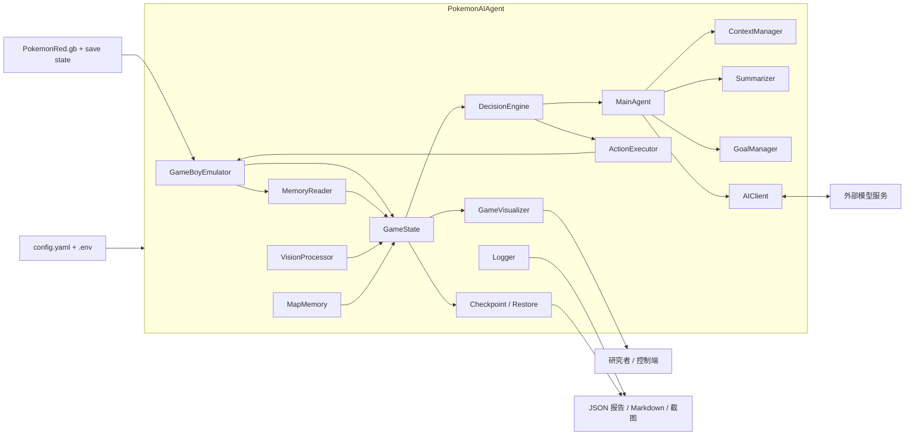

# 面向长时序任务的混合式大模型游戏智能体

## 以 Pokemon Red 早期剧情自主推进为例

## 摘要

长时序游戏环境为通用智能体研究提供了兼具复杂交互、稀疏里程碑、部分可观测状态以及多阶段目标耦合的高难度测试平台。与 Atari 一类强调局部反应和短时控制的经典基准不同，`Pokemon Red` 将探索、剧情触发、战斗菜单、地图切换、文本推进与资源管理耦合在同一任务链上，使得“感知、记忆、规划、执行与恢复”能否形成长期闭环成为问题的核心。本文围绕一个运行于 `PyBoy` 模拟器之上的混合式大模型游戏智能体系统展开研究，系统以 `PokemonAIAgent` 为运行时协调器，通过 RAM 状态读取、截图感知、地图记忆、上下文管理、目标管理、规则安全控制、主模型决策、动作执行、检查点恢复与标准化 smoke/batch 评估脚本，形成一个可持续运行、可追溯、可复验的实验框架。与纯脚本或纯强化学习路线不同，本文采用一种受约束的生成式控制范式：普通回合主要由大模型生成动作，规则层仅在启动、稳定恢复、剧情边界保护与局部异常处理时提供有限接管，从而在保留 AI 主导性的同时降低灾难性失稳的风险。

在理论上，本文借鉴 `Generative Agents` 对长期记忆、上下文压缩和行为连续性的处理思路，并结合 `Pokémon Red via Reinforcement Learning` 对环境复杂性的刻画，将 `Pokemon Red` 的早期剧情推进表述为一个部分可观测长时序决策问题。围绕这一问题，本文进一步提出适用于生成式运行时系统的证据分类方法，将工程有效性、长程韧性、真实 AI 主导性以及失败证据明确区分，以避免把 fallback 主导的运行误写为 AI 主导结果。基于截至 `2026-04-06` 的本地复验，当前仓库在正常权限环境下通过 `299 passed, 1 warning` 的全量测试，`test_setup.py` 为 `7/7` 通过，`test_custom_api.py` 成功连接真实模型端点。在真实 AI 参与的短程实验中，单次 `120` turn smoke 的 `ai_authored_ratio` 达到 `0.7667`；加入故事引导后，`Phase 3` story guidance probe 将该值提高到 `0.8917` 并成功进入 `Route 1`；进一步加入战斗引导后，battle guidance probe 在 `ai_authored_ratio = 0.8417`、`fallback_turns = 0` 的条件下记录到 AI 在真实模型条件下做出 `FIGHT` 与 `Scratch` 的首个正确战斗决策。与此同时，重复 batch 的方差仍然偏大，`got_pokedex` 与 `oak_got_parcel` 等更强里程碑尚未稳定达成。因此，当前证据足以支撑如下结论：该系统已经建立完整工程闭环，并且已经证明真实 AI 能在若干短程运行中主导多数普通回合并推进到关键早期节点；但它仍应被表述为“具有早期剧情可行性验证的长时序智能体原型”，而非“稳定完成中程主线推进的成熟自治体”。

**关键词**：长时序任务；大模型智能体；Pokemon Red；混合控制；RAM 状态读取；实验可复现性

## Abstract

Long-horizon game environments provide a demanding testbed for general-purpose agents because they combine sparse milestones, partially observable state, UI-heavy interaction, local recovery, and long-term goal maintenance. Compared with short-horizon arcade benchmarks, `Pokemon Red` requires an agent to coordinate navigation, dialogue progression, battle menus, event triggers, map transitions, and runtime recovery over extended trajectories. This paper studies a hybrid LLM-driven game agent for early-story progression in `Pokemon Red`. The system is built around a runtime coordinator that integrates emulator control, RAM-based state extraction, screenshot perception, map memory, context summarization, goal management, deterministic safety controllers, a primary language-model agent, action execution, checkpoint recovery, and standardized smoke/batch evaluation scripts. Rather than following a pure scripted or pure reinforcement-learning route, the proposed framework adopts a constrained generative-control paradigm in which ordinary turn-level decisions are primarily owned by the language model while deterministic logic remains limited to bootstrapping, safety, recovery, and story-boundary safeguards.

Inspired by `Generative Agents`, the system organizes long-horizon context into recent turns, historical summaries, guidance notes, and a compact task notebook; inspired by recent reinforcement-learning work on `Pokemon Red`, it formulates early-story progression as a partially observable long-horizon decision problem and evaluates it through AI ownership ratios, fallback ratios, milestone reachability, timeline validity, and resilience metrics. As of April 6, 2026, the latest local reverification shows `299 passed, 1 warning` in the full test suite under normal permissions, `7/7` environment checks, and successful direct API connectivity. Positive real-AI probes reach `ai_authored_ratio` values up to `0.8917`, successfully enter `Route 1`, and explicitly produce the first correct actionable battle choices (`FIGHT`, `Scratch`) under real model conditions. However, repeated-batch variance remains high, stronger milestones such as `got_pokedex` and `oak_got_parcel` are not yet stable, and provider availability fluctuates intra-day. The current system can therefore be rigorously claimed as a complete long-horizon runtime framework with verified early-story feasibility, but not yet as a mature autonomous agent that stably completes medium-horizon story progression.

---

## 第 1 章 绪论

### 1.1 研究背景

近年来，智能体研究的关注重点正在从“某一步动作是否正确”转向“跨越长时间尺度的行为链能否保持一致”。在短回合任务中，错误通常只影响局部收益；但在长时序任务中，一个微小的误判可能在几十步之后才表现为路线偏航、剧情锁死、资源浪费或恢复失败。因此，长时序智能体所面临的困难并不只是决策次数增加，而是系统必须在更长的时间尺度上维持对当前状态、历史信息和任务优先级的统一解释。

游戏环境天然适合承担这一研究角色，因为它同时具备可重复、低风险、强交互和可记录等特征。尤其是相比纯文本环境，游戏更容易暴露智能体在观测不足、UI 状态切换、局部循环以及长期目标漂移上的真实问题。然而，若仅停留在 Atari 这类短回合街机场景，研究者往往仍然主要面对快速控制问题，而难以充分观察长期剧情链、菜单交互和多阶段任务耦合所带来的结构性挑战。`Pokemon Red` 恰好处于这一研究空缺之中。作为一款经典 JRPG，它把房间和地图导航、NPC 对话、剧情脚本触发、战斗菜单与资源管理同时纳入同一条主线任务。玩家在拿到初始宝可梦之前看似可以自由移动，但实际上很多行为已经被脚本锁与剧情先后关系限制；进入战斗之后，动作空间的语义又会从方向移动突然切换为菜单选择和文本推进。对于一个试图长期自主运行的智能体来说，这种环境比单纯的像素控制环境更能揭示“感知、记忆、规划、执行、恢复”是否真正形成闭环。

### 1.2 研究动机与问题陈述

本文关注的核心问题并不是“能否让大模型在一段视频中看起来像是在玩游戏”，而是“能否构造一个在真实 API 条件下运行、具备清晰控制边界并能够被严谨审计的长时序游戏智能体系统”。这一问题至少包含三层含义。第一，系统必须工程上可运行，能够稳定接入 ROM、模拟器、真实模型和日志体系；第二，系统必须在控制权层面足够透明，能够回答每一步究竟由规则层、fallback 还是主模型做出；第三，系统必须在论文证据层面可追溯，既保留正向样例，也保留失败样例和负证据。

基于这一动机，本文围绕三个研究问题展开。其一，能否构造一个完整的、可长时运行的 `Pokemon Red` 混合式大模型智能体系统，使其在真实 API 条件下具备可观测、可恢复、可追溯与可复验的工程闭环。其二，在 `llm_primary_mode = true` 与 `ai_full_control_mode = true` 的条件下，真实 AI 是否已经能够在普通回合中占据主导，并在 `Pallet Town -> Route 1 -> 首场野战` 这类关键局部场景中做出有效决策。其三，当系统尚未稳定取得 `got_pokedex` 或 `oak_got_parcel` 等更强剧情里程碑时，主要瓶颈究竟来自运行时恢复策略、状态表达与提示设计、局部战斗引导，还是外部 provider 的可用性波动。

### 1.3 研究目标与贡献

本文并不试图证明当前系统已经稳定完成 `Pokemon Red` 的中程主线推进，更不试图宣称在同一评价框架下已经优于现有强化学习路线。相反，本文的目标是以更克制而严谨的方式建立一组边界清晰的结论：首先，证明系统已经形成完整的工程闭环，能够在真实环境下长时运行、记录和复验；其次，证明在若干短程实验中，真实 AI 已经主导了多数普通回合，并推进到了 `Route 1` 与首场野战这一类关键局部节点；最后，明确指出哪些命题已经被证据支持，哪些仅被部分支持，哪些在当前阶段仍然不能写入论文主结论。

围绕这一目标，本文的贡献主要体现在三个方面。方法上，本文提出了一个面向 `Pokemon Red` 的混合式大模型运行时框架，将 RAM 状态读取、截图感知、地图记忆、上下文管理、目标管理、规则控制和生成式决策统一在同一系统中。实验上，本文建立了一套将工程有效性、长程韧性与真实 AI 主导性严格区分的证据治理框架，从而避免把 fallback 主导运行误写成 AI 主导结果。写作与研究组织上，本文基于现有仓库内的测试、图片、JSON 和阶段评估文档，形成了一份可继续迭代的长篇论文初稿，并将顶刊标准下尚需补充的图表、消融、基线和图片重制任务明确保留为占位项。

### 1.4 论文结构

本文余下部分安排如下。第二章回顾相关工作，并说明本文与 `Generative Agents`、`Pokémon Red via Reinforcement Learning` 及混合式智能体路线之间的关系。第三章对 `Pokemon Red` 早期剧情推进任务进行形式化建模，给出状态、动作、控制权与里程碑的定义。第四章从系统视角介绍整体架构与运行闭环。第五章深入说明关键模块的实现逻辑，包括状态构造、记忆管理、主模型提示设计、决策路由与动作执行。第六章描述实验设计、证据分类、评价指标与可复现流程。第七章报告核心实验结果并分析其边界。第八章讨论局限性、有效性威胁以及距顶刊标准仍然存在的差距。第九章对全文进行总结，并提出下一阶段最优先的改进方向。

---

## 第 2 章 相关工作与理论基础

### 2.1 生成式智能体、长期记忆与行为连续性

`Generative Agents` 一文的重要性并不在于提出了某种单一的模型技巧，而在于它重新定义了“智能体为何能表现出长期一致性”这一问题的处理方式。该工作指出，如果一个代理体要在开放环境中维持可信的长期行为，那么系统就不能只依赖当前瞬时输入，而必须显式维护经验记录、对经验进行高层概括，并在需要时从长期记忆中检索与当前决策最相关的片段。在其经典表述中，记忆检索分数可写为

$$
\mathrm{score}_i=\alpha_r \cdot \mathrm{recency}_i+\alpha_i \cdot \mathrm{importance}_i+\alpha_s \cdot \mathrm{relevance}_i,
$$

其中新近性、重要性与相关性共同决定某条历史经验会以多大强度参与当前行为的生成。对于本文而言，这一思想极具启发性，因为 `Pokemon Red` 这类长时序游戏环境中的许多错误都不是由当前截图本身引起，而是由系统没有正确继承近几十步的任务上下文所导致。例如，在 Oak Lab 或 Pallet Town 北出口附近，智能体之所以会陷入横向徘徊，并不是因为单帧图像完全无法辨认，而是因为它没有把“当前真正的任务是沿剧情主线离开当前区域”这一目标压到足够高的优先级。

本文并没有照搬 `Generative Agents` 的社会模拟设定，也没有完整实现其反思生成器与多智能体交互结构；但本文明确继承了其中最关键的结构性思想，即通过近期回合、摘要历史、任务笔记和临时指导注记来组织长时上下文，使系统在面对复杂环境时不必每一回合都从零开始解释“我现在究竟在做什么”。

### 2.2 Pokemon Red 作为长时序研究环境

`Pokémon Red via Reinforcement Learning` 从强化学习角度系统论证了 `Pokemon Red` 作为研究环境的复杂性。该文强调，`Pokemon Red` 的难点并不只在于地图大或战斗多，而在于它将 2D 导航、UI 交互、战略战斗、资源管理与长时任务链有机耦合在一起。环境中的重要里程碑往往被大量中间状态隔开，任务回报极为稀疏，且不同类型的决策需要在不同时刻切换完全不同的动作语义。这一点对本文同样成立。本文的目标虽然不是训练一个 PPO 代理来最大化回报，但环境复杂性本身并不会因为方法路线不同而消失。恰恰相反，大模型在线决策路线会更直接地暴露状态表达、上下文维护和局部恢复设计上的问题。

因此，本文借用该文的主要方式并非直接复用其实验结果，而是承认并强调 `Pokemon Red` 作为长时序、强交互、强阶段耦合环境的研究价值。在这一前提下，本文转而探讨一个不同方向的问题：当不引入大规模训练，而是借助预训练语言模型与结构化运行时系统时，智能体是否仍然能够在这种环境中形成局部自治能力，以及这种能力应如何被严谨地度量和表述。

### 2.3 混合控制、工具增强与运行时智能体

纯脚本系统的优点在于确定性强、可控性高，但它在开放剧情理解和复杂局部泛化上的能力极其有限；纯大模型系统则相反，它在开放场景中更灵活，但也更容易因为 UI 误判、上下文漂移或外部服务波动而失稳。近年来，越来越多的智能体系统采取折中路线，即不把所有控制都交给模型，也不把主要行为全部写成脚本，而是通过工具层、约束层和安全层对模型输出进行运行时管理。本文的方法正位于这一脉络之中。它既不追求完全端到端，也不允许规则层悄悄接管全部剧情推进，而是将规则控制严格限制在启动、恢复和安全边界附近，让普通场景下的主要决策仍然由主模型给出。

这种方法的意义在于，它把“大模型是否真正参与并主导了任务”从一个模糊印象，转化为可记录、可计数、可审计的控制权问题。只有当系统能够明确区分主模型、AI 缓存计划、确定性工具阶段和 fallback 阶段时，研究者才能在论文中对“AI 到底做了什么”给出负责任的回答。

### 2.4 本文的方法定位

综合来看，本文处于三个研究方向的交叉点上。它借鉴了生成式智能体关于记忆、计划和行为连续性的思想，也承认 `Pokemon Red` 作为复杂长时序环境的研究价值，同时又坚持把系统搭建成一套可运行、可复验、可记录的工程平台。最准确的定位并不是“提出了一种新的基础模型”，也不是“在 `Pokemon Red` 上完成了新的最优策略训练”，而是提出了一个面向长时序 JRPG 环境的混合式大模型运行时框架，并通过分层证据表明这一框架已经实现了早期剧情的局部有效性验证。

---

## 第 3 章 任务定义与形式化描述

### 3.1 任务范围

本文聚焦 `Pokemon Red` 的早期剧情推进，而非完整通关。之所以明确限定任务范围，是因为当前仓库中的正向证据主要集中在以下阶段：启动与进入可控世界、室内房间导航、Oak Lab 相关剧情、离开 Pallet Town、进入 `Route 1`，以及首个野战场景中的战斗菜单决策。虽然这一范围尚未覆盖中程剧情中的 `Viridian City`、`Oak's Parcel` 和更远区域，但它已经足够包含智能体研究中最重要的几类子问题：UI 状态识别、地图与房间导航、剧情脚本锁识别、地图出口定位、战斗界面理解以及局部失败恢复。换言之，本文并非只验证某一个片段式技巧，而是在一个结构完整的长时序子任务上检验系统能否成立。

### 3.2 POMDP 建模

本文将 `Pokemon Red` 的早期剧情推进建模为一个部分可观测马尔可夫决策过程

$$
\mathcal{M}=(\mathcal{S}, \mathcal{A}, \mathcal{O}, T, \Omega, R, \gamma),
$$

其中 $\mathcal{S}$ 表示游戏的内部真实状态，包括地图、坐标、NPC 位置、剧情事件位、战斗状态与背包、队伍等信息；$\mathcal{A}$ 表示高层离散动作空间；$\mathcal{O}$ 表示智能体能够观测到的信息；$T$ 为状态转移函数，$\Omega$ 为观测函数，$R$ 为外部评价函数，$\gamma$ 为折扣因子。虽然本文并不以在线强化学习方式对策略进行训练，但这一建模仍然有必要，因为它准确说明了系统在运行时所面临的核心难点：智能体永远只能看到内部状态的一部分投影，任何仅基于当前瞬时输入的决策都可能丢失对长期任务至关重要的上下文信息。

### 3.3 观测与动作表示

在当前系统中，单步观测可抽象写为

$$
o_t=\big[x_t^{ram}, x_t^{img}, x_t^{nav}, x_t^{ctx}, x_t^{goal}\big],
$$

其中 $x_t^{ram}$ 表示通过 `MemoryReader` 从 RAM 中读取的结构化状态，例如地图、坐标、角色朝向、队伍、金钱、UI 标志与战斗信息；$x_t^{img}$ 表示当前截图及其可选的视觉提示；$x_t^{nav}$ 表示地图记忆、局部 frontier、已知出口与相邻阻挡信息；$x_t^{ctx}$ 表示近期回合、摘要历史、指导注记和任务笔记；$x_t^{goal}$ 表示当前 focus、todo 以及主次目标。与只给一张截图的做法相比，这种多源状态组织方式显著降低了模型对模糊视觉细节的依赖，并使其能够在决策时显式利用过去信息。

动作空间则定义为

$$
\mathcal{A}=\{\texttt{up}, \texttt{down}, \texttt{left}, \texttt{right}, \texttt{a}, \texttt{b}, \texttt{start}, \texttt{select}\}.
$$

在实现上，`MainAgent` 还允许内部表示 `wait`，但提示词明确禁止模型把 `wait` 作为正常动作输出，以防模型将犹豫和失措包装为保守决策。进入执行层之后，这些动作不会被简单视为一次裸按键，而是经过动作合法性检查、方向位移补偿与 settle frames 处理，以确保高层动作 token 尽可能稳定地映射到模拟器中的有效行为。

### 3.4 混合式决策与控制权定义

本文系统的关键特征之一在于决策并非完全由一个单一策略函数给出，而是由规则阶段与生成式阶段共同构成。用形式化方式表示，系统的决策可以写为

$$
a_t=
\begin{cases}
a_t^{(k)}, & \exists k,\; C_k(o_t,h_t)\neq \varnothing, \\
\pi_\theta(o_t,h_t), & \text{otherwise},
\end{cases}
$$

其中 $C_k$ 表示第 $k$ 个确定性控制器，$h_t$ 表示截至当前时刻的历史上下文，$\pi_\theta$ 表示主模型策略。这个式子的重要意义不在于强调规则层有多强，而在于明确规则层与模型层的边界：当系统处于启动、恢复或明确脚本保护区时，控制器可以优先处理；在普通探索与交互回合中，模型应当拥有主要决策权。

为了严谨刻画这种控制边界，本文进一步定义三个控制权指标

$$
\rho_{\mathrm{main}}=\frac{N_{\mathrm{main}}}{N_{\mathrm{total}}}, \qquad
\rho_{\mathrm{AI}}=\frac{N_{\mathrm{main}}+N_{\mathrm{plan}}}{N_{\mathrm{total}}}, \qquad
\rho_{\mathrm{fallback}}=\frac{N_{\mathrm{fallback}}}{N_{\mathrm{total}}},
$$

其中 $N_{\mathrm{main}}$ 表示主模型直接生成动作的回合数，$N_{\mathrm{plan}}$ 表示由缓存的 AI 行动计划执行的回合数，$N_{\mathrm{fallback}}$ 表示 fallback 占据的回合数，$N_{\mathrm{total}}$ 表示总回合数。这组定义与系统中的 `main_model_ratio`、`ai_authored_ratio` 和 `fallback_turns` 直接对应，其目的在于把“AI 参与过”与“AI 主导了”这两种性质严格区分开来。

### 3.5 里程碑与证据边界

考虑到本文并不使用累计回报作为训练目标，剧情里程碑比单一的总分指标更适合作为结果报告方式。当前系统重点关注的里程碑包括 `entered_oaks_lab`、`reached_route1`、`got_pokedex`、`oak_got_parcel`、`reached_route2` 与 `reached_viridian_forest`。这些里程碑共同勾勒出从早期剧情到更远地图推进的路径，也使论文可以在不同强度的结果之间保持清晰区分。例如，进入 `Route 1` 明显强于在 Pallet Town 北缘反复徘徊，而在战斗菜单中做出 `FIGHT` 与 `Scratch` 的选择则又强于仅仅进入战斗场景；但这些结果依然不足以支撑“系统已经稳定拿到 Pokedex 并完成中程主线”的表述。正因为如此，本文在后文中始终将“工程有效性”“韧性”“AI 主导短程能力”“更强剧情里程碑”分别报告，而不将其混写为单一成功故事。

---

## 第 4 章 系统总体设计

### 4.1 设计原则

本文系统的设计从一开始就不是围绕“如何录到一段看起来不错的视频”展开的，而是围绕“如何构造一个能够支持研究写作与证据审计的运行时框架”展开的。围绕这一目标，系统在工程上坚持了四个原则。首先，能够稳定从 RAM 获得的状态不交给模型去猜，能够从近期历史中提炼出的任务线索也不交给模型每一回合重新发明。其次，决策控制权必须可追踪，每一步都应回答“这是谁决定的、为什么这样决定、是否发生过 fallback 或重写”。再次，恢复机制必须边界清晰，它可以服务于稳定性保护，但不能悄悄替代主模型完成本应由 AI 负责的剧情推进。最后，系统需要天然产出可追溯的证据，包括测试结果、JSON 报告、图片证据、附录联系表和检查点元数据。正是这些原则决定了本文系统更接近一个研究平台，而不是一个临时的 prompt demo。

### 4.2 总体架构与运行闭环

当前项目以 `main.py` 中的 `PokemonAIAgent` 为总协调器，围绕环境接入、状态感知、决策控制、记忆与目标以及执行与支撑五个层面组织。环境接入层主要由 `GameBoyEmulator` 与 `MemoryReader` 构成，前者负责 ROM、按键、截图和状态存取，后者负责将游戏内存解释为可供上层使用的语义状态。状态感知层以 `GameState` 为核心，它并不简单转述 RAM，而是将 RAM 状态、截图、地图记忆、局部导航线索与近期动作结果整合成面向决策的统一状态表示。决策控制层由 `DecisionEngine`、确定性控制器、异步决策器和 `MainAgent` 组成，用以在规则边界与生成式推理之间进行路由。记忆与目标层由 `ContextManager`、`Summarizer` 和 `GoalManager` 组成，负责维护长时上下文、摘要历史和任务焦点。执行与支撑层则包括 `ActionExecutor`、检查点恢复、日志系统、进度追踪和可视化仪表盘，它们共同把动作落实到模拟器，并将运行过程沉淀为可复验的研究证据。

如果用一条统一的运行时链路来概括，系统每个回合都会先从模拟器中读取 RAM、截图和必要元数据，然后由 `GameState` 生成统一的结构化状态与文本状态，再由 `DecisionEngine` 决定是进入某个确定性控制阶段还是转交主模型做决策，最后由 `ActionExecutor` 将高层动作写回模拟器，并在执行后更新日志、上下文、截图与各类评估字段。因而，本文系统并不仅仅生成动作，而是在动作生成的同时持续构造研究所需的证据链。

为了让这一闭环更直观，图 4-1 给出了当前系统的总体现状视图。与单纯的源码树相比，这张图更适合论文叙述，因为它同时呈现了观测、决策、执行和证据输出之间的关系，而不是把系统误解为一组彼此无关的模块。

图 4-2 给出了现有 Web 仪表盘界面。该图在论文中的价值并不只是展示一个前端页面，而是帮助读者理解系统已经具备实时状态观察、事件流记录和运行诊断能力。对于一个长时序游戏智能体而言，没有全局可视化界面就很难严肃分析“为什么这一步会出错”。

与之对应，图 4-3 展示了当前系统已经实现的地图记忆能力。地图记忆的意义不在于生成一张好看的热力图，而在于它为系统提供了一种比单帧截图更稳定的空间先验，使“哪些区域已探索、哪些方向存在 frontier、哪里可能是出口或阻挡”可以进入后续的状态表示与决策上下文中。

### 4.3 检查点、可视化与研究平台属性

对于长时序任务而言，检查点与实验复现机制并不是附属功能，而是研究成立的前提。如果没有固定起始状态，系统在不同时间点产生的运行结果就很难进行修复前后对比，更难说服读者某一次进展究竟来自方法改进还是来自偶然起点差异。当前仓库通过命名 checkpoint 的方式固定实验起点，例如 `checkpoint_195913` 就被反复用于后文所有 `120` turn short smoke。这使研究者能够在相同起点、相同 turn budget、相同 AI 模式下比较不同修复对结果的影响。配合可视化仪表盘、原始 JSON 报告和截图导出，整个系统已经具备明显的实验平台属性，而不仅是某种一次性运行脚本。

---

## 第 5 章 核心方法与关键模块实现

### 5.1 RAM 状态读取与高层语义构造

本文系统之所以能够在复杂长时序环境中维持较强的状态可解释性，一个关键原因在于其并不完全依赖像素观测。`MemoryReader` 直接从游戏内存中读取玩家位置、地图编号、角色朝向、徽章数、金钱、背包物品数、队伍信息、战斗状态以及关键剧情事件位，例如 `got_pokedex`、`oak_got_parcel` 和 `got_oaks_parcel`。这种设计并非取巧，而是出于研究上的必要性。对于低分辨率 Game Boy 画面而言，许多对论文结论至关重要的状态根本无法稳定地从截图中恢复；如果这些状态完全交由模型自行猜测，那么系统不仅更容易失误，论文里的结论也会失去可验证的依据。

然而，RAM 读取并不能单独解决问题。地图中的墙体、黑色边界、局部可走区域、菜单层级以及某些正在发生的视觉事件仍然需要通过截图理解。因此，本文并不把 RAM 当作图像的替代品，而是将其视为一种高可信度的结构化观测来源。它负责提供难以从像素中稳定读出的底层事实，而图像负责提供当前屏幕语义与局部布局线索，两者在 `GameState` 中被统一组织。

### 5.2 GameState：从原始观测到任务化文本状态

`GameState` 是本文方法的核心桥梁。它的作用不是简单将各类字段拼接成一段大文本，而是根据当前任务场景主动重排和强化最影响决策的信息。现有实现会将位置信息、队伍和招式、战斗摘要、UI 标志、视觉总结、故事引导、战斗引导、状态增量、运动模式以及探索线索组织成统一的文本状态。这样的好处在于，模型拿到的并非一堆彼此平铺的字段，而是一段已经经过语义提纯的“任务化状态说明”。用抽象形式表达，可将这一过程写为

$$
\tilde{o}_t=f\big(x_t^{ram},x_t^{img},x_t^{nav},x_t^{ctx},x_t^{goal}\big),
$$

其中 $f$ 并不是机械拼接，而是一种面向当前行动的压缩、筛选与重排函数。对于长时序任务而言，这种有结构的状态表达远比单纯把截图送进模型更有价值，因为很多错误其实来自系统没有把“眼下什么最重要”以足够清晰的方式呈现出来。

当前 `GameState` 在 Phase 3 中新增了两个尤其关键的局部引导模块。其一是 `STORY GUIDANCE`，其作用是在某些特定剧情区间内把“当前真正应该做什么”从一类模糊意图压缩为更明确的局部叙述。例如，当系统已经离开 Oak Lab 并在 Pallet Town 北缘附近徘徊时，故事引导会强调当前不是一般性的横向探索，而应当优先理解并通过北侧出口进入 `Route 1`。其二是 `BATTLE GUIDANCE`，它用于在战斗文本、战斗命令菜单和招式选择菜单之间建立更清晰的局部语义边界，从而避免模型把“还在推进战斗文本”和“应该做出真正的战斗决策”混为一谈。这两个模块都不是为了偷偷把固定脚本重新塞进运行时，而是通过更清晰的状态表达来减少模型在复杂局部场景中的误解。

### 5.3 上下文管理、任务笔记与长期一致性

如果说 `GameState` 解决的是“这一刻我看到了什么”，那么 `ContextManager` 解决的就是“我应该如何把过去带到现在”。当前系统的上下文被组织为近期回合、摘要历史、指导注记与任务笔记四个层次。近期回合保留最近若干步的动作、screen type、reasoning 与结果，以便模型感知局部因果链；摘要历史负责压缩更早的回合，以免上下文无限膨胀；指导注记可以注入暂时性的外部提示；任务笔记则将当前焦点、下一步、最近进展和应避免重复的错误压缩为工作记忆。

这种结构与 `Generative Agents` 中强调的长期经验组织在精神上是一致的，但更贴合单智能体游戏环境。它既不试图保留每一个历史细节，也不依赖一次性的全局总结，而是在近期详细信息与高层概括之间保持平衡。若用形式化方式概括，可以把模型每一回合实际收到的历史上下文表示为

$$
c_t=\mathrm{Concat}\big(r_t^{recent},s_t^{summary},n_t^{notes},b_t^{notebook},g_t^{goals}\big),
$$

其中 $r_t^{recent}$ 表示近期回合，$s_t^{summary}$ 表示摘要历史，$n_t^{notes}$ 表示指导注记，$b_t^{notebook}$ 表示任务笔记，$g_t^{goals}$ 表示目标层次。这样的设计使系统不必在每一步都重新解释长期背景，而可以把“当前最重要的任务线索”显式压缩到上下文前部。

### 5.4 MainAgent：受约束的生成式决策

`MainAgent` 的系统提示词虽然很长，但其核心思想十分明确：模型的任务不是“尽可能聪明地解决整部游戏”，而是在严格输出格式和明确优先级约束下做出短程、局部且可执行的下一步动作。与很多简短 prompt 不同，当前 prompt 大量吸收了前期失败样本暴露出的误判模式，例如把黑色区域误当作房间延伸、在早期剧情中对家具等可选对象过度交互、在对话框已结束时继续无意义连按 `A`，或者在战斗菜单出现后迟迟不愿意做出真正的命令选择。换言之，提示词并非一个独立于系统之外的“语言装饰”，而是根据失败分析不断被校正的运行时约束。

为了保证系统能够稳定解析模型输出，`MainAgent` 要求模型严格以 `SCREEN_TYPE`、`REASONING`、`ACTION`、`ACTION_PLAN` 和 `GOAL_UPDATE` 这几个字段返回结果。这一设计有三重作用。首先，它防止模型输出无法执行的自由文本。其次，它把当前 स्क्रीन状态理解、行动决策与目标更新统一到一个可追溯的结构中。最后，它为后续实验报告保留了 reasoning 字段，使研究者在分析错误时不必只看动作本身，而可以进一步考察模型当时如何理解局面。值得注意的是，系统允许 `ACTION_PLAN` 在稳定移动场景中给出一个短序列，但真正的执行仍然以逐步观察和逐步落子为主，因此本文更接近受限的短程计划，而非完全放任模型输出长程脚本。

### 5.5 DecisionEngine 与控制边界

`DecisionEngine` 的代码实现非常简洁，但从论文角度看，它是整个系统最重要的控制边界之一。当前实现将若干确定性阶段按顺序排列，只要其中某一阶段返回决策，该决策就立即被采纳；若所有阶段均不匹配，则进入 fallback，也就是主模型决策阶段。这种设计使每一步都能够被解释为“某个规则阶段命中”或者“真正进入了 AI 路径”，并且系统可以通过 `decision_trace` 显式记录被依次检查过哪些阶段、哪些阶段没有命中、最终是哪一路径产出了动作。

这种结构上的透明性至关重要。因为在长时序代理系统中，最容易被夸大的部分并不是某一回合是否成功，而是控制权是否被不恰当地归因给主模型。本文选择保留规则阶段，但同时对其边界保持严格限制，正是为了防止出现“看起来是 AI 在玩，实际上却是脚本在推进剧情”的研究误导。

### 5.6 ActionExecutor 与动作层补偿

`ActionExecutor` 负责把高层动作 token 映射为模拟器中的有效操作。它所解决的问题并不只是“按下对应按钮”，而是高层动作与游戏实际响应之间的时序不匹配。例如，在 Game Boy 类环境中，方向键第一次按下时有时只会改变角色朝向，并不会立刻完成格点位移；如果系统把这一朝向变化当成一次完整动作的结束，那么上层模型就必须一次次重新发现“其实还要继续按同方向”。为避免这种低层控制细节不断消耗决策预算，当前执行器会在必要时对方向动作做有限重试，并在按键后加入适量 settle frames，以提高下一轮观测的稳定性。

同时，执行器还维护最近动作历史，并结合 UI 状态判断系统是否陷入卡死。重要的是，这一 stuck 检测并非粗暴地把任何重复动作都判为异常，而是能够区分对话、菜单和命名界面中正常的重复确认行为与普通地图中的无意义重复。在一个同时包含文本推进、导航和战斗的环境中，这种细分非常必要，因为“重复按 A”在不同场景中可能分别代表高效推进和完全失控。

### 5.7 局部恢复与运行时安全策略

尽管本文希望尽可能保留 AI 在普通场景中的主导性，但长时序系统如果完全没有恢复策略，就会在 provider 波动、短时超时或局部误操作之后迅速坍缩。当前仓库在 `main.py` 中加入了多类运行时 safeguard，例如同回合重试耗尽后的短期处理、field recovery 中临时回避方向的重新启用、对 micro-loop 的检测以及对已知 blocked directions 和 warp 风险的规避。Phase 3 的 runtime field recovery 修复正是一个典型例子：它并未重新引入强脚本路线，而只是允许系统在某个被暂时回避但其实是唯一剩余安全方向的局部场景中重新尝试前进。这种改动的研究意义不在于它让系统更“聪明”，而在于它防止运行时容错被错误地放大为长时间 fallback 接管，从而提高后续 real-AI 证据的可信度。

---

## 第 6 章 实验设计与证据组织

### 6.1 证据分类与实验目标

本文的实验设计首先服务于证据边界，而不是服务于展示效果。基于当前仓库的证据索引，本文将材料分为工程有效性证据、韧性证据、真实 AI 主导证据以及论文支持文档四类。工程有效性证据回答系统本身是否正常运行，例如全量测试、环境检查和真实 API 连通性。韧性证据回答系统能否在较长时间内持续运行并在异常后恢复，但并不自动意味着主模型主导了其中大部分回合。真实 AI 主导证据则要求在模式、时间线和控制权指标上同时成立，才能支撑有关 AI 能力的主结论。论文支持文档包括架构图、图号索引、附录联系表和评估流程，它们本身并不证明能力，却决定了能力结论能否被规范地写进论文。

围绕这一分类，本文实验目标可进一步概括为三个层次。第一层是确认系统工程闭环已经成立；第二层是确认在固定协议下确实存在 AI 主导的短程运行；第三层是观察当协议被冻结后，重复 batch 的方差和失败模式究竟呈现何种结构。长程 smoke 则主要用于回答系统是否具备韧性，而不直接参与“AI 是否已经稳定完成中程剧情”的结论。

### 6.2 固定协议与可复现流程

当前仓库已经形成相对标准化的实验工作流。对于真实 AI 的短程评估，系统优先使用从 `checkpoint_195913` 出发的 `120` turn short smoke，并固定 `llm_primary + ai_full_control`、`--reset-context`、`--decision-max-tokens 384` 与 `--action-plan-max-actions 3` 等关键参数。批量实验则通过 `scripts/autonomous_smoke_batch.py` 在这一协议基础上重复运行，并自动生成每次 run 的原始 JSON 报告、标准输出与错误输出、batch manifest、JSON 汇总以及 Markdown 汇总。这种设计使论文中的“同协议多次实验”不再依赖人工整理，而是成为系统的一部分。

标准化流程的另一个重要环节是图片证据与附录联系表的整理。当前仓库在 `docs/img/2026-04-05/` 下已经区分出正文主图、逐 turn 原始截图与联系表三个层次。正文主图适合承担论文主要视觉证据，联系表则服务于连续运行过程的核验，而原始逐帧截图则为答辩和后续质询保留最细粒度的可追溯材料。与许多只保留少量“最好看截图”的项目不同，这种组织方式更接近正式研究应有的证据归档方式。

### 6.3 评价指标

考虑到本文关注的是生成式运行时系统，而非训练回报本身，当前评价主要由四类指标构成。第一类是有效性指标，包括 `fatal_error`、`timeline_valid` 以及终止状态与时间线是否一致，它们决定一个 run 是否有资格进入正式分析。第二类是控制权指标，包括 `main_model_ratio`、`ai_authored_ratio`、`fallback_turns` 和 `ai_dominant`，它们共同决定一份运行报告能否被严谨地称为“AI 主导”。第三类是剧情进展指标，包括 `entered_oaks_lab`、`reached_route1`、`got_pokedex`、`oak_got_parcel`、`reached_route2` 和 `reached_viridian_forest` 等，它们刻画了剧情推进强度。第四类则是过程性指标，如 `decision_source_counts`、`decision_path_counts` 和 `ai_latency_summary`，它们有助于区分失败究竟来自模型能力、运行时路由还是 provider 波动。

从论文写作角度看，最关键的一点是这些指标必须联合解释，而不能只看其中一项。高 `ai_authored_ratio` 并不自动等于高质量剧情推进，高里程碑也不自动等于高 AI 主导性，长时间运行更不自动等于系统已经学会了中程自治。正因为如此，本文在结果分析中始终同时报告控制权、里程碑与时间线有效性。

### 6.4 最新本地复验

为了避免整篇论文只建立在 `2026-04-05` 的阶段文档之上，本文额外纳入了 `2026-04-06` 的本地复验结果。当前记录表明，在正常权限环境下，`pytest -q` 的结果为 `299 passed, 1 warning`；`python test_setup.py` 的结果为 `7/7` 通过；`python test_custom_api.py` 成功连接 `https://api.ququ233.com/v1` 并返回模型 `gpt-5.4` 的可用响应。值得注意的是，同日更早的审计材料里也记录到了 provider `500 / 没有可用 token` 的失败样例。这两者并不矛盾，而是共同表明：系统具备真实 API 运行条件，但外部 provider 存在明显的日内波动。这一点将在后文被视作重要的实验噪声源，而不是简单忽略。

---

## 第 7 章 实验结果与分析

### 7.1 工程完整性与运行基础

从工程角度看，当前系统已经达到了相当扎实的研究原型水平。全量测试在正常权限环境下达到 `299 passed, 1 warning`，说明主流程、评估脚本与主要辅助模块之间没有明显的结构性回归；`test_setup.py` 的 `7/7` 通过说明 Python、ROM、依赖、配置和目录结构均已满足运行要求；`test_custom_api.py` 的成功连接则说明后文所讨论的 AI 行为并非发生在 dummy endpoint 或离线 mock 环境中。这样的基础结果虽然无法直接证明智能体已经具备复杂能力，却为后续所有能力分析提供了前提：本文研究的是一个真实可运行系统的行为边界，而不是一个尚未连通的概念验证。

### 7.2 单次短程 real-AI 证据

当前最早的关键正向证据之一是 `tmp/2026-04-05_real_ai_smoke_120.json`。该报告在 `llm_primary_mode = true` 与 `ai_full_control_mode = true` 条件下完成了固定 `120` turn 的 short smoke，满足 `fatal_error = null` 与 `timeline_valid = true`，同时给出了 `main_model_ratio = 0.7083`、`ai_authored_ratio = 0.7667`、`fallback_turns = 0` 的控制权结果。这组数据的重要性在于，它表明真实 AI 已经不是偶然介入，而是在多数普通回合中拥有实际决策权。虽然单次正向样本不能直接推出中程自治性，但它足以证明：在同一固定 checkpoint 和真实模型端点下，AI 主导的短程推进是可以发生的。

### 7.3 Phase 2：修复前批量结果揭示的负证据

与单次正向样本同样重要的是 Phase 2 的第一轮固定协议 batch。该批量实验在相同 checkpoint、相同参数和相同模式下运行三次，汇总结果显示 `3/3` 均完成了请求的 `120` turn，然而 `0/3` 达到 AI-dominant，`avg_ai_authored_ratio` 仅为 `0.0194`，三个 run 的 `fallback_ratio` 分别达到 `0.7833`、`0.8167` 和 `0.8167`，并且 `decision_source_counts` 主要被 `api_unavailable_field_interaction` 占据。从论文角度看，这一组结果并不适合作为正向能力展示，却是非常重要的负证据。它明确揭示出一个事实：在修复前，瞬时 transport/provider 异常被错误放大为长时间 cooldown 与 fallback 接管，导致整段运行的控制权严重失真。也就是说，当时极低的 AI 占比并不能被简单解释为“模型完全不会玩”，其中有相当一部分属于系统运行时对短时异常的放大效应。

这一发现对后续实验设计具有决定性作用。它迫使研究者先修复控制权失真问题，而不是继续堆积看似更多却其实不可比较的 negative run。换言之，Phase 2 的价值并不在于展示成功，而在于识别了“真实 AI 证据为什么会被污染”这一更根本的问题。

### 7.4 Phase 2：transport 分类修复后的恢复情况

在将 `ConnectionResetError` 等 transient transport failure 从“长期不可达”类别中剥离之后，系统先进行了单次 probe，再进行了第二轮固定协议 batch。单次 probe 的汇总结果显示，`avg_ai_authored_ratio` 恢复到 `0.8417`，`avg_main_model_ratio` 为 `0.6833`，`fallback_turns = 0`，并且最终位置已经推进到 `map 12`。这说明修复后的系统重新获得了高比例 AI 参与，表明修复前大部分失败并非单纯由剧情理解不足引起。

修复后的第二轮 batch 则给出了更接近真实研究场景的图景。三次运行依旧全部完成了请求的 turn 数，其中 `1/3` 达到 AI-dominant，`avg_ai_authored_ratio` 提升至 `0.3000`，`avg_main_model_ratio` 为 `0.2778`。与修复前的近乎全盘 fallback 主导相比，这已经是显著改善；但它同时也清楚表明，transport 分类修复并未自动将系统推升到稳定剧情推进状态。换言之，修复之后的问题结构发生了变化：系统不再主要受制于错误的长 cooldown，而是开始更多暴露出 Oak Lab 与早期剧情局部语义理解不足这一真正的模型侧瓶颈。

### 7.5 Phase 3：从 recovery 到 story guidance

Phase 3 的第一步并未直接尝试让智能体跑得更远，而是先修复运行时 field recovery 中会放大局部死循环的机制。对应的 `phase3_field_recovery_probe.json` 显示，在 `120` turn 的 short smoke 中，`main_model_ratio = 0.6083`，`ai_authored_ratio = 0.7000`，`fallback_turns = 0`，但最终仍未到达 `Route 1`。这一结果具有一种研究上很有价值的“中间态”特征：它证明恢复逻辑的确被改善了，因为 run 已经不再坍缩成大段 fallback 尾巴；但它同时也揭示出，仅仅修复恢复层并不足以推动故事里程碑前进，真正的瓶颈已经转移到了早期剧情目标解释本身。

在此基础上，系统进一步在 `GameState` 中加入 `STORY GUIDANCE`。新的 `phase3_story_guidance_probe.json` 结果显示，`main_model_ratio = 0.7500`，`ai_authored_ratio = 0.8917`，`fallback_turns = 0`，并且 `reached_route1 = true`，最终位置达到 `map 12, (11,32)` 且已经进入战斗状态。这是一个非常关键的阶段性结果。它说明早前在 Pallet Town 北出口附近的横向徘徊，并不只是简单的“模型笨”，而是系统没有把当前真正的剧情目标足够明确地表达出来。当 `STORY GUIDANCE` 将“当前应该离开 Pallet Town 并通过北出口进入 Route 1”这一局部目标更清楚地压入状态文本之后，模型不仅更容易推进到关键节点，AI ownership 指标也同步提升。

图 7-1 展示了这一阶段对应的正文主图。图像本身并不能独立证明模型主导了这一步，但它与 JSON 报告、控制权指标和后续联系表共同构成了论文中关于 `Route 1` 到达的复合证据。

### 7.6 Phase 3：battle guidance 与首个正确战斗决策

进入 `Route 1` 之后，新的瓶颈迅速转移到野战界面。对此，系统又在 `GameState` 中加入了 `BATTLE GUIDANCE`，并同步调整了 smoke 模式下的 cooldown 处理以减少短时 provider 波动对 battle segment 的污染。最终得到的 `phase3_battle_guidance_probe_shortcooldown.json` 显示，该 run 在 `120` turn 内保持了 `main_model_ratio = 0.7083`、`ai_authored_ratio = 0.8417` 和 `fallback_turns = 0`，且仍然满足 `reached_route1 = true`。更重要的是，时间线上明确记录到在 `turn 196025` 时模型选择了 `FIGHT`，并在 `turn 196026` 进一步选择了 `Scratch`。这组证据标志着系统已经从“AI 能到达 Route 1 并在战斗前停住”迈进到了“AI 能在真实模型条件下做出首个正确战斗菜单决策”。

这一点在论文中尤其值得强调，因为战斗菜单是一个局部语义高度离散的场景。在战斗命令菜单中选择 `FIGHT` 与在招式菜单中进一步选择 `Scratch`，意味着模型不仅理解了自己处于战斗状态，而且理解了当前屏幕层级和最合理的下一步行动。图 7-2 展示了进入战斗前的相关主图，而图 7-3 则给出了覆盖关键回合附近的附录联系表，后者对于答辩或论文审阅阶段的连续过程核验尤其重要。

需要特别指出的是，这里依然不能把结论扩写为“AI 已稳定打完首场战斗并连续推进到 Viridian City”。目前可以严谨写出的只是：在真实模型条件下，AI 已经完成了首个正确的战斗命令链，且这一命令链发生在高 AI ownership 与零 fallback 段污染的短程运行中。

### 7.7 图像证据与正文主图的角色

当前仓库中的图像证据已经足以支撑答辩与论文附录核验。除了前述 `Route 1` 与战斗图像之外，Oak Lab 阶段和地图记忆图同样承担着正文证据功能。图 7-4 给出了 Oak Lab 阶段截图，它并不是为了说明系统已经解决了 Oak Lab 全部问题，而是用来证明系统已经真实进入了这一关键剧情区域，从而使后文对局部循环、恢复逻辑和剧情引导的讨论具备明确对象。

不过，从顶刊图形质量标准看，这些图片仍然更接近“证据图”而非“发表级主图”。目前它们大多仍保留原始 Game Boy 分辨率，缺少局部放大、箭头、框注和决策链标识，这意味着它们已经足以服务于严谨论证，却还不足以承担最终投稿中最强的视觉表达任务。

### 7.8 长程韧性结果及其边界

在 `docs/thesis_logs/latest_smoke_summary.md` 中，系统还提供了 `1800`、`2600` 与 `4000` turn 的长程 smoke 汇总，三份报告全部完成指定 turn 数，并都到达了 `Pokedex`、`Route 2` 与 `Viridian Forest`。若仅从地图推进与长时运行角度看，这组结果非常强，它证明了检查点恢复、运行时安全层与异常处理逻辑整体上是有效的，系统在较长时间尺度内不会轻易崩溃。

但正如前文反复强调的那样，这类长程结果目前只能被归入韧性证据，而不能被直接用作“真实 AI 已稳定主导中程剧情”的核心论据。原因在于，长时运行本身并不保证控制权主要由主模型持有。若忽略这一点，论文就很容易把“系统没死掉并最终走得较远”误写成“AI 一路自主做出了正确决策”。因此，长程 smoke 在本文中的作用是证明系统已经具备成为研究平台的稳定性，而不是证明 AI 已完成中程自治。

### 7.9 阶段性结论

综合上述结果，当前可以被严格证实的结论是：系统已经建立完整工程闭环；真实 AI 在若干短程实验中已经主导多数普通回合；在引入 `STORY GUIDANCE` 之后，系统能够进入 `Route 1`；在进一步引入 `BATTLE GUIDANCE` 之后，AI 能在真实模型条件下完成首个正确的战斗菜单动作链；此外，系统的长程韧性已经成立。与此同时，也必须清楚承认：当前 repeated batch 的方差仍偏大，`got_pokedex`、`oak_got_parcel` 等更强里程碑尚未稳定出现，因此中程剧情自治性仍未被证明。这种“工程成熟度较高、局部 AI 能力已成立、但中程稳定性不足”的结果形态，恰恰构成了本文最真实也最具有研究价值的结论边界。

---

## 第 8 章 讨论与局限性

### 8.1 与参考工作相比的真实位置

若将本文放回参考文献的语境中，可以更清楚地看出它的真实位置。与 `Generative Agents` 相比，本文并不研究多智能体社会模拟和行为可信感的宏观涌现，而是研究单智能体在强交互游戏环境中的长期状态组织、局部决策与证据治理；与 `Pokémon Red via Reinforcement Learning` 相比，本文并不追求通过训练得到稳定最优策略，而是探索在无额外大规模训练前提下，通过 RAM 状态、上下文压缩和运行时路由，预训练语言模型能在多大程度上获得局部自治能力。因此，本文不应被写成“对现有路线的替代”，更适合被表述为“在同一复杂环境上，面向生成式运行时系统的一种不同研究路径”。

### 8.2 当前系统的核心优势

当前系统最强的地方并不是它已经在 `Pokemon Red` 上推进到了多远，而是它已经把一个通常停留在演示层的问题提升为一个可被系统研究的问题。首先，它在工程上已经形成闭环，具备测试、日志、可视化、检查点、JSON 报告与标准化批量评估脚本。其次，它在控制权上有足够透明的记录机制，可以区分主模型、AI 计划、确定性工具与 fallback。再次，它已经拥有真实 AI 主导的短程正向证据，并能把失败样本与负证据保留在研究叙述中，而不是仅保留成功片段。这些特征共同决定了本文已经明显超出了“一段演示视频”或“一份课程项目说明”的范围。

### 8.3 主要局限性

但如果将目标提高到顶刊标准，当前系统的短板也同样清晰。最直接的局限在于中程剧情推进能力尚未稳定建立。尽管 `Route 1` 到达和首个战斗菜单决策都已经被证明，但 `got_pokedex`、`oak_got_parcel` 以及 `Route 1 -> Viridian City` 的连续推进仍未稳定实现。其次，重复 batch 的方差依旧偏大。修复前后的对比已经说明系统具备重复实验能力，但“重复实验能力已建立”并不等于“重复实验结果已稳定”。再者，当前图片体系更接近严谨证据材料，而非发表级主图，许多关键截图缺少放大、箭头和行为链标注。最后，本文尚未补齐正式消融矩阵、人类或启发式基线以及成本与时延统计表，这些都决定了论文目前更适合被定位为高质量研究型初稿，而不是完整的顶刊实证稿件。

### 8.4 有效性威胁

本文面临的有效性威胁主要来自三个方面。第一，内部有效性威胁来自 provider 日内波动、局部修复之间的相互影响以及部分 probe 仍然是单次短程实验这一事实。虽然当前证据已足以说明某些能力已经存在，但若要更精细地拆分每一项改动的贡献，仍需系统性消融。第二，构念有效性威胁来自指标解释本身。高 `ai_authored_ratio` 并不自动等于高质量剧情推进，到达更远地图也并不自动等于主模型主导了整个过程，这正是本文必须将控制权、剧情里程碑与长程韧性分开报告的原因。第三，外部有效性威胁在于当前结果首先只覆盖 `Pokemon Red` 的早期剧情，并且大量状态组织依赖该游戏的 RAM 布局和 UI 规律，因此本文结论更适合作为一种方法与系统框架的案例研究，而不应被轻率推广到所有复杂游戏环境。

### 8.5 顶刊目标下仍需补充的材料

当前如果要继续向顶刊风格靠近，最需要补齐的并不是更多零散文档，而是若干关键硬材料。首先是正式消融表，需要在固定协议下系统比较 `llm_primary`、`ai_full_control`、`story guidance`、`battle guidance` 与 field recovery 修复等因素的独立贡献。其次是成本与时延统计表，因为外部服务波动已经被证明会显著扭曲运行结果，而顶刊论文通常需要同时报告能力、时延和稳定性。再次是人类或启发式基线，这将决定论文能否从“系统论文”提升为“更强的实证比较论文”。此外，当前架构图和关键截图仍需重绘和重制，特别是 `FIGHT -> Scratch` 的战斗决策链，应当以放大图与箭头标注的方式重构为真正的主图。最后，还应当将现有负证据整理为失败案例 taxonomy，从而把“系统为什么会在这里失效”也纳入论文的正式知识贡献。

---

## 第 9 章 结论与展望

本文围绕 `Pokemon Red` 早期剧情推进任务，提出并分析了一个混合式大模型游戏智能体系统。系统通过模拟器驱动、RAM 状态读取、截图感知、地图记忆、上下文管理、目标管理、规则安全控制、主模型决策、动作执行、检查点恢复和标准化评估脚本，构成了一个可长时运行、可追溯、可复验的研究型运行时框架。与纯脚本或纯强化学习路线相比，本文的方法更强调在真实运行过程中如何组织状态、划定控制边界并保留证据，而不是单纯追求某一条成功路径的展示效果。

截至 `2026-04-06` 的证据表明，系统在工程层面已经成立：代码在正常权限环境下通过全量测试，环境与真实 API 条件均满足运行要求；在能力层面，真实 AI 已经能够在若干短程实验中主导多数普通回合，并推进到 `Route 1` 以及首个野战场景；在局部行为层面，系统已经记录到 AI 在真实模型条件下做出 `FIGHT` 与 `Scratch` 的正确战斗决策链。与此同时，当前 repeated batch 的方差仍然较大，`got_pokedex`、`oak_got_parcel` 和更长中程剧情推进尚未稳定实现，因此论文不能声称系统已经形成成熟的中程自治能力。

本文最重要的价值，在于它把“让大模型玩老游戏”从一个容易停留在演示层的问题，推进为一个可以被方法化、工程化和证据化讨论的研究问题。未来工作的优先方向也因此十分明确：第一，应继续提升中程剧情推进能力，优先突破 `Viridian City` 与 `Oak's Parcel`；第二，应补齐正式消融、基线和成本时延统计；第三，应将当前证据材料升级为发表级图表包，使方法、结果与失败边界都能以更专业的方式呈现。

---

## 参考文献

[1] Park, J. S., O'Brien, J. C., Cai, C. J., Morris, M. R., Liang, P., & Bernstein, M. S. Generative Agents: Interactive Simulacra of Human Behavior. Proceedings of the 36th Annual ACM Symposium on User Interface Software and Technology, 2023.

[2] Pleines, M., Addis, D., Rubinstein, D., Zimmer, F., Preuss, M., & Whidden, P. Pokémon Red via Reinforcement Learning. arXiv preprint arXiv:2502.19920, 2025.

[3] Pokemon-AI 项目内部文档. `2026-04-05_system_architecture_diagram.md`. 2026.

[4] Pokemon-AI 项目内部文档. `2026-04-05_thesis_evidence_index.md`. 2026.

[5] Pokemon-AI 项目内部文档. `evaluation_workflow.md`. 2026.

[6] Pokemon-AI 项目内部文档. `2026-04-05_phase2_real_ai_batch_assessment.md`. 2026.

[7] Pokemon-AI 项目内部文档. `2026-04-05_phase3_runtime_field_recovery_assessment.md`. 2026.

[8] Pokemon-AI 项目内部文档. `2026-04-05_phase3_story_guidance_assessment.md`. 2026.

[9] Pokemon-AI 项目内部文档. `2026-04-05_phase3_battle_guidance_assessment.md`. 2026.

[10] Pokemon-AI 项目内部文档. `docs/thesis_logs/latest_smoke_summary.md`. 2026.

[11] Pokemon-AI 项目内部文档. `docs/thesis_logs/2026-04-06_local_reverification.md`. 2026.

---

## 附录 A 关键结果汇总表

| 证据 | turns | `main_model_ratio` | `ai_authored_ratio` | `fallback_turns` | 关键里程碑 | 论文解释 |
| --- | ---: | ---: | ---: | ---: | --- | --- |
| `2026-04-05_real_ai_smoke_120.json` | 120 | 0.7083 | 0.7667 | 0 | `entered_oaks_lab` | 证明真实 AI 已能主导多数短程回合 |
| `phase3_field_recovery_probe.json` | 120 | 0.6083 | 0.7000 | 0 | 未到 `Route 1` | 证明 recovery 退化已被抑制，但剧情理解仍不足 |
| `phase3_story_guidance_probe.json` | 120 | 0.7500 | 0.8917 | 0 | `reached_route1 = true` | 证明局部故事引导显著增强了早期推进 |
| `phase3_battle_guidance_probe_shortcooldown.json` | 120 | 0.7083 | 0.8417 | 0 | `reached_route1 = true` | 证明 AI 做出 `FIGHT -> Scratch` 首个正确战斗链 |

## 附录 B 待补材料占位表

| 占位项 | 当前状态 | 论文中的处理方式 |
| --- | --- | --- |
| 正式消融表 | 缺失 | 仅保留为占位，不伪造数据 |
| 成本与时延统计表 | 原始字段已有，汇总表缺失 | 在讨论章节中明确说明待补 |
| 人类 / 启发式基线 | 缺失 | 不做比较性结论 |
| 发表级系统架构图 | Mermaid 草图已有 | 初稿采用现有图，正式版重绘 |
| Battle Decision Chain 放大图 | 原始截图已有 | 初稿使用主图与联系表，正式版重制 |

## 附录 C 图片路径说明

正文当前主要使用如下图片：`img/2026-04-05/main_figures/fig01_dashboard_desktop.png`、`img/2026-04-05/main_figures/fig03_oaks_lab_milestone.png`、`img/2026-04-05/main_figures/fig04_route1_story_progress.png`、`img/2026-04-05/main_figures/fig05_route1_battle_prebattle.png` 与 `img/2026-04-05/main_figures/fig07_route2_map_memory.png`。附录连续过程核验主要使用 `img/2026-04-05/appendix_run_130/contact_sheets/sheet_12.png`，如需逐帧核查，则可直接引用 `img/2026-04-05/appendix_run_130/raw/turn_195914.png` 至 `turn_196043.png` 的原始截图序列。
