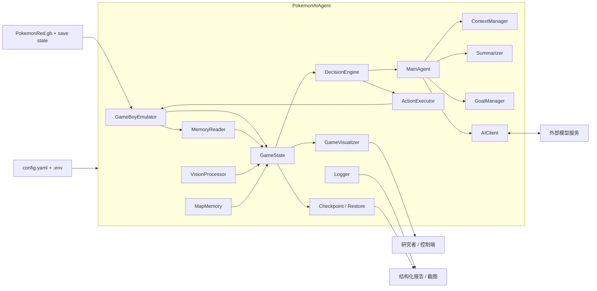

# 面向长时序任务的纯 AI 决策游戏智能体

## 以 Pokemon Red 早期剧情自主推进为例

## 摘要

长时序游戏环境为通用智能体研究提供了兼具复杂交互、稀疏里程碑、部分可观测状态以及多阶段目标耦合的高难度测试平台。与 Atari 一类强调局部反应和短时控制的经典基准不同，`Pokemon Red` 将探索、剧情触发、战斗菜单、地图切换、文本推进与资源管理耦合在同一任务链上，使得一个完全依赖模型自身理解与连续决策的智能体能否跨越长时任务链，成为具有代表性的研究问题。本文围绕一个运行于 `PyBoy` 模拟器之上的纯 AI 决策游戏智能体系统展开研究。系统保留 RAM 状态读取、截图感知、地图记忆、上下文管理、目标管理、动作执行、检查点恢复和标准化评估等运行支撑模块，但本文关注的核心实验条件是：普通回合不再由运行时回退路径或外部控制逻辑接管，而由主模型独立完成逐步决策。换言之，本文讨论的并不是“规则辅助下的 AI 玩游戏”，而是“在长时序 JRPG 中，纯 AI 决策是否已经能够穿过关键剧情链并表现出接近正常游玩的连续行为”。

在理论上，本文借鉴 `Generative Agents` 关于长期记忆、上下文压缩和行为连续性的处理思路 [1]，并将其迁移到一个单智能体、强交互、长时序的游戏环境中；`Pokémon Red via Reinforcement Learning` 在本文中则主要承担环境复杂性的参照角色 [2]，而非方法路线来源。基于截至 `2026-04-06` 的本地复验 [11]，当前系统已通过大规模本地测试、环境检查与关键回归测试。更重要的是，固定初始状态下的主实验表明，智能体能够在 `260` 步连续决策窗口内始终保持 AI 主导路径，并稳定推进到 `Viridian City` 及城市建筑内部；三次独立重复实验进一步实现了 `3/3 Route 1`、`1/3 Viridian City` 与 `1/3 Viridian Mart` 的非平凡复现，且未出现运行时接管。与此同时，最佳展示运行在关闭调试标注和关闭运行时回退的前提下，连续展示了 Oak's Lab、Pallet Town、Route 1、Viridian City、Viridian Mart 以及 Oak's Parcel 的获得过程。基于这组结构化评估、重复实验与原始画面三层证据，本文将系统定位为一个以纯 AI 决策为核心、已经跨过早期剧情主链关键门槛的长时序游戏智能体原型。

**关键词**：长时序任务；纯 AI 决策；大模型智能体；Pokemon Red；RAM 状态读取；实验可复现性

## Abstract

Long-horizon game environments provide a demanding testbed for general-purpose agents because they combine sparse milestones, partially observable state, interface-heavy interaction, and long-term goal maintenance. Compared with short-horizon arcade benchmarks, `Pokemon Red` requires an agent to coordinate navigation, dialogue progression, battle menus, event triggers, and map transitions over extended trajectories. This paper studies a pure-AI, large-language-model-driven agent for early-story progression in `Pokemon Red`. The surrounding runtime provides emulator control, RAM-based state extraction, visual capture, map memory, context management, and evaluation support, but it does not take over ordinary decisions under the protocol studied here.

Drawing on ideas from `Generative Agents`, the system organizes long-horizon context into recent turns, historical summaries, guidance notes, and a compact task notebook. The paper uses `Pokémon Red via Reinforcement Learning` mainly to situate `Pokemon Red` as a genuinely difficult long-horizon benchmark rather than as a methodological template. Local reverification as of April 6, 2026 confirms stable system operation under normal permissions and successful end-to-end model connectivity. Under a standardized early-story initial state, the strongest structured evaluation preserves an end-to-end AI-authored decision path, reaches `Viridian City`, enters a city building, and assigns `83.46%` of effective turns directly to the main model, while no external takeover occurs. Three repeated runs under the same protocol further yield progress to Route 1 in all runs, to `Viridian City` in one run, and to `Viridian Mart` in one run. In addition, the best presentation run and the curated main figures visually show continuous pure-AI progression through Oak's Lab, Pallet Town, Route 1, `Viridian City`, `Viridian Mart`, and the Oak's Parcel acquisition sequence. Together, these results establish verified early-story continuity and non-trivial reproducibility for a pure-AI long-horizon game agent in `Pokemon Red`.

---

## 第 1 章 绪论

### 1.1 研究背景

近年来，智能体研究的关注重点正在从“某一步动作是否正确”转向“跨越长时间尺度的行为链能否保持一致”。在短回合任务中，错误通常只影响局部收益；但在长时序任务中，一个微小的误判可能在几十步之后才表现为路线偏航、剧情锁死、资源浪费或恢复失败。因此，长时序智能体所面临的困难并不只是决策次数增加，而是系统必须在更长的时间尺度上维持对当前状态、历史信息和任务优先级的统一解释。

游戏环境天然适合承担这一研究角色，因为它同时具备可重复、低风险、强交互和可记录等特征。尤其是相比纯文本环境，游戏更容易暴露智能体在观测不足、UI 状态切换、局部循环以及长期目标漂移上的真实问题。然而，若仅停留在 Atari 这类短回合街机场景，研究者往往仍然主要面对快速控制问题，而难以充分观察长期剧情链、菜单交互和多阶段任务耦合所带来的结构性挑战。`Pokemon Red` 恰好处于这一研究空缺之中。作为一款经典 JRPG，它把房间和地图导航、NPC 对话、剧情脚本触发、战斗菜单与资源管理同时纳入同一条主线任务。玩家在拿到初始宝可梦之前看似可以自由移动，但实际上很多行为已经被脚本锁与剧情先后关系限制；进入战斗之后，动作空间的语义又会从方向移动突然切换为菜单选择和文本推进。对于一个试图长期自主运行的智能体来说，这种环境比单纯的像素控制环境更能揭示“感知、记忆、规划、执行、恢复”是否真正形成闭环。

### 1.2 研究动机与问题陈述

本文关注的核心问题并不是“能否让大模型在一段视频中看起来像是在玩游戏”，而是“能否构造一个在真实模型服务条件下运行、由模型独立承担逐步决策、并能够被严谨审计的长时序游戏智能体系统”。对本文而言，所谓“纯 AI 决策”并不是一句营销口号，而是一个需要在运行模式和证据层面同时成立的研究条件：系统必须在纯模型决策模式下运行，必须关闭运行时回退接管，必须保证普通回合始终保持 AI 主路径，且不能由外部预置路线替代模型行为。这意味着本文真正讨论的是，在没有外部动作接管的前提下，大模型是否已经能够沿着 `Pokemon Red` 的早期剧情主链持续做出足够稳定的决策。

基于这一动机，本文围绕两个相互关联的研究问题展开。首先，纯 AI 决策是否已经能够从固定初始状态出发，连续推进 Oak's Lab、Pallet Town、Route 1 与 Viridian City 这一条早期剧情主线，并在 Viridian Mart 场景中完成关键剧情交互。其次，为了支持这种纯 AI 决策，运行时系统应当如何组织状态、上下文与图像证据，使模型在不依赖外部接管的情况下仍能保持较高的长期一致性。

### 1.3 研究目标与贡献

本文的目标不是提出一种依赖外部接管的折中方案，而是正面建立纯 AI 决策路线已经成立的证据链。围绕这一目标，本文首先构建了一个以模型决策为中心的长时序运行时框架，其中 RAM 语义读取、地图记忆、上下文管理与动作执行被统一组织为服务于主模型的支撑层，而不是与主模型竞争控制权的替代层。其次，本文将结构化评估、无标注原始视频和正文主图组织为相互印证的多层证据体系，使“纯 AI 决策”从一种叙述性判断转化为可以被协议、统计和画面同时核查的研究结论。最后，本文基于统一固定初始状态下的最佳展示运行，证明该系统已经能够连续穿越 Oak's Lab、Pallet Town、Route 1、Viridian City 与 Viridian Mart 这一条关键早期剧情链，从而将研究重心从“模型能否做出几步合理动作”推进到“模型能否形成可持续的长时序剧情闭环”。

### 1.4 论文结构

本文余下部分安排如下。第二章回顾相关工作，并说明本文与生成式智能体研究及 `Pokemon Red` 环境研究之间的关系。第三章对纯 AI 决策问题进行形式化建模，给出状态、动作与判定标准。第四章从系统视角介绍为纯 AI 路线服务的整体架构与运行闭环。第五章说明关键实现，包括状态构造、长期上下文、提示设计和控制边界。第六章描述证据组织、实验流程与评价方式。第七章围绕固定协议下的主实验、重复实验与视觉主图展开结果分析。第八章讨论其研究意义与后续扩展方向。第九章对全文进行总结。

---

## 第 2 章 相关工作与理论基础

### 2.1 生成式智能体、长期记忆与行为连续性

`Generative Agents` 一文的重要性并不在于提出了某种单一的模型技巧，而在于它重新定义了“智能体为何能表现出长期一致性”这一问题的处理方式 [1]。该工作指出，如果一个代理体要在开放环境中维持可信的长期行为，那么系统就不能只依赖当前瞬时输入，而必须显式维护经验记录、对经验进行高层概括，并在需要时从长期记忆中检索与当前决策最相关的片段。在其经典表述中，记忆检索分数可写为

$$
\mathrm{score}_i=\alpha_r \cdot \mathrm{recency}_i+\alpha_i \cdot \mathrm{importance}_i+\alpha_s \cdot \mathrm{relevance}_i,
$$

其中新近性、重要性与相关性共同决定某条历史经验会以多大强度参与当前行为的生成。对于本文而言，这一思想极具启发性，因为 `Pokemon Red` 这类长时序游戏环境中的许多错误都不是由当前截图本身引起，而是由系统没有正确继承近几十步的任务上下文所导致。例如，在 Oak Lab 或 Pallet Town 北出口附近，智能体之所以会陷入横向徘徊，并不是因为单帧图像完全无法辨认，而是因为它没有把“当前真正的任务是沿剧情主线离开当前区域”这一目标压到足够高的优先级。

本文并没有照搬 `Generative Agents` 的社会模拟设定，也没有完整实现其反思生成器与多智能体交互结构；但本文明确继承了其中最关键的结构性思想，即通过近期回合、摘要历史、任务笔记和临时指导注记来组织长时上下文，使系统在面对复杂环境时不必每一回合都从零开始解释“我现在究竟在做什么”。

### 2.2 Pokemon Red 作为长时序研究环境

`Pokémon Red via Reinforcement Learning` 从强化学习角度系统论证了 `Pokemon Red` 作为研究环境的复杂性 [2]。该文强调，`Pokemon Red` 的难点并不只在于地图大或战斗多，而在于它将 2D 导航、UI 交互、战略战斗、资源管理与长时任务链有机耦合在一起。环境中的重要里程碑往往被大量中间状态隔开，任务回报极为稀疏，且不同类型的决策需要在不同时刻切换完全不同的动作语义。这一点对本文同样成立。本文的目标虽然不是训练一个 PPO 代理来最大化回报，但环境复杂性本身并不会因为方法路线不同而消失。恰恰相反，大模型在线决策路线会更直接地暴露状态表达、上下文维护和局部恢复设计上的问题。

因此，本文借用该文的主要方式并非直接复用其实验结果，而是承认并强调 `Pokemon Red` 作为长时序、强交互、强阶段耦合环境的研究价值。在这一前提下，本文转而探讨一个不同方向的问题：当不引入大规模训练，而是借助预训练语言模型与结构化运行时系统时，智能体是否仍然能够在这种环境中形成局部自治能力，以及这种能力应如何被严谨地度量和表述。

### 2.3 纯 AI 决策与运行时分离

本文所强调的“纯 AI 决策”并不意味着系统完全没有运行时支撑模块，而是意味着运行时支撑模块不再替模型做出普通回合的行为选择。换言之，RAM 读取、地图记忆、上下文管理、动作执行、截图保存与实验脚本都属于支持 AI 决策的基础设施，而不属于外部剧情控制器。这个区分在论文中非常重要，因为它决定了“纯 AI”究竟是研究对象，还是叙述包装。当前本文采用的核心实验协议要求普通回合关闭运行时回退并保持 AI 主路径，从而使论文能够把问题集中到模型如何理解状态、维持上下文并持续推进剧情上，而不是将性能建立在隐藏的替代控制路径之上。

### 2.4 本文的方法定位

综合来看，本文处于生成式智能体研究与长时序游戏环境研究的交叉点上，但它的方法定位相当明确。本文既不是强化学习训练论文，也不是脚本控制论文，而是一篇围绕纯 AI 决策展开的运行时系统研究。其核心主张不是“规则如何帮助 AI 更稳定地玩”，而是“在保留状态组织、记忆管理和执行支撑的同时，模型本身是否已经能够承担从观测到动作的连续决策责任”。从这个意义上说，本文提出的是一个面向长时序 JRPG 环境的纯 AI 决策运行时框架，并通过视频、主图和结构化评估结果证明这一框架已经跨过了早期剧情主链中的关键门槛。

这种定位关系可由图 2-1 更直观地理解。与以训练最优策略为目标的强化学习代理相比，本文系统不依赖长期奖励优化；与完全脱离运行时约束、只在开放式沙盒中追求自然行为的生成式代理相比，本文又强调 RAM 语义读取、上下文治理、动作可执行性与证据归档。因此，本文所研究的对象可以被概括为一种“运行时支撑下的纯 AI 决策代理”：支撑层负责保证状态清晰、证据完整与执行可靠，普通回合的动作选择则严格保留在主模型路径内部。

*图 2-1 本文与强化学习代理、开放式生成式代理之间的方法定位关系。图中强调，本文关注的并不是训练型最优控制，也不是脱离约束的开放式行为生成，而是在显式运行时支撑和严格证据审计条件下的纯 AI 决策。*

---

## 第 3 章 任务定义与形式化描述

### 3.1 任务范围

本文聚焦 `Pokemon Red` 从 Oak's Lab 出发的早期剧情主链，而非完整通关。当前最强的正向证据已经覆盖 Oak's Lab、Pallet Town、Route 1、Viridian City 与 Viridian Mart，并在最新原始画面演示中进一步展示了 Oak's Parcel 的获得场景。选择这一任务范围并不是因为它“足够短”，恰恰相反，它已经同时包含了室内外导航、地图切换、NPC 触发、文本推进、战斗菜单理解以及局部循环恢复等多个关键子问题。对于长时序智能体研究而言，这样一条早期主线已经足以构成一个结构完整、难度真实且具有明确剧情边界的验证任务。

### 3.2 POMDP 建模

本文将 `Pokemon Red` 的早期剧情推进建模为一个部分可观测马尔可夫决策过程

$$
\mathcal{M}=(\mathcal{S}, \mathcal{A}, \mathcal{O}, T, \Omega, R, \gamma),
$$

其中 $\mathcal{S}$ 表示游戏的内部真实状态，包括地图、坐标、NPC 位置、剧情事件位、战斗状态与背包、队伍等信息；$\mathcal{A}$ 表示高层离散动作空间；$\mathcal{O}$ 表示智能体能够观测到的信息；$T$ 为状态转移函数，$\Omega$ 为观测函数，$R$ 为外部评价函数，$\gamma$ 为折扣因子。虽然本文并不以在线强化学习方式对策略进行训练，但这一建模仍然有必要，因为它准确说明了系统在运行时所面临的核心难点：智能体永远只能看到内部状态的一部分投影，任何仅基于当前瞬时输入的决策都可能丢失对长期任务至关重要的上下文信息。

### 3.3 观测与动作表示

在当前系统中，单步观测可抽象写为

$$
o_t=\big[x_t^{ram}, x_t^{img}, x_t^{nav}, x_t^{ctx}, x_t^{goal}\big],
$$

其中 $x_t^{ram}$ 表示通过 `MemoryReader` 从 RAM 中读取的结构化状态，例如地图、坐标、角色朝向、队伍、金钱、UI 标志与战斗信息；$x_t^{img}$ 表示当前截图及其可选的视觉提示；$x_t^{nav}$ 表示地图记忆、局部可扩展边界、已知出口与相邻阻挡信息；$x_t^{ctx}$ 表示近期回合、摘要历史、指导注记和任务笔记；$x_t^{goal}$ 表示当前焦点任务、待办事项以及主次目标。与只给一张截图的做法相比，这种多源状态组织方式显著降低了模型对模糊视觉细节的依赖，并使其能够在决策时显式利用过去信息。

动作空间则定义为

$$
\mathcal{A}=\{\texttt{up}, \texttt{down}, \texttt{left}, \texttt{right}, \texttt{a}, \texttt{b}, \texttt{start}, \texttt{select}\}.
$$

在实现上，主决策模块还允许内部保留等待状态，但指令模板明确禁止模型将其作为正常动作输出，以防把犹豫和失措包装为保守决策。进入执行层之后，这些动作不会被简单视为一次裸按键，而是经过动作合法性检查、方向位移补偿与稳定帧处理，以确保高层动作记号尽可能稳定地映射到模拟器中的有效行为。

### 3.4 纯 AI 决策定义与判定标准

在本文关注的配置下，系统的普通回合决策可以直接写为

$$
a_t=\pi_\theta(o_t,h_t),
$$

其中 $\pi_\theta$ 表示主模型策略，$o_t$ 与 $h_t$ 分别表示当前观测与历史上下文。这里的关键并不是公式本身，而是其工程含义：在纯模型决策模式且关闭运行时回退的条件下，运行时不再通过回退逻辑或规则型接管阶段替代模型完成普通回合动作选择。因此，论文中的“纯 AI 决策”必须同时满足运行模式与结果统计两个条件。

为了对这一条件做出可验证定义，本文使用以下判定标准。首先，实验协议必须保证普通回合的决策权不被运行时回退逻辑接管。其次，统计结果必须显示整段轨迹始终保持 AI 主路径，且规则型接管回合与回退回合均为零。最后，时间线必须有效，即运行过程中不存在致命错误，且轨迹记录满足单调一致性。当这些条件同时成立时，论文才将相应运行窗口认定为纯 AI 决策证据。

在这一前提下，主模型直接作答占比仍然是有意义的，因为它刻画了模型直接生成有效动作的回合比例；但本文不再将“是否由工具阶段补足”视为核心问题，而是直接把“整条轨迹是否保持 AI 主路径”作为更强的约束。

### 3.5 里程碑与证据边界

考虑到本文并不使用累计回报作为训练目标，剧情里程碑比单一的总分指标更适合作为结果报告方式。本文将主要里程碑组织为一条有序剧情链：进入 Oak's Lab、离开 Pallet Town、到达 `Route 1`、到达 `Viridian City`、进入 Viridian Mart、获得 `Oak's Parcel`，以及更远的 Pokedex、`Route 2` 与 `Viridian Forest` 等节点。与此同时，本文明确区分两类证据边界。第一类是结构化里程碑边界，即直接由轨迹统计、时间线一致性和控制权指标支持的结论；第二类是原始画面边界，即由无标注视频与正文主图支持的视觉结论。当前最佳结果恰好体现了这一区分：结构化主实验已经严格支持纯 AI 决策到达 `Viridian City` 并进入城市建筑内部，而最佳展示运行则进一步展示了 Viridian Mart 交互与 Oak's Parcel 画面。正因为论文清楚地区分了这两层证据，所以它既可以保持结论严谨，又不会把系统已经实现的剧情推进强度低估为“只到 Route 1”。

---

## 第 4 章 系统总体设计

### 4.1 设计原则

本文系统的设计目标并不是构造一个“看上去像 AI 在玩”的演示器，而是构造一个真正以模型决策为中心的长时序运行框架。围绕这一目标，系统首先要求状态足够清晰，能够稳定从 RAM 读取的事实不交给模型猜测，能够通过上下文整理出的任务线索也不留给模型在每一回合重新发明。其次，系统要求决策路径可审计，任何一次成功演示都必须能回答“这一回合是不是模型自己决定的”。再次，运行时支撑模块与动作决策模块必须严格分离；上下文、截图保存、地图记忆和执行补偿都可以存在，但它们服务于 AI，而不替代 AI。最后，系统从设计之初就要求原始证据可以被保留下来，因此视频、主图、结构化评估和协议元数据共同构成论文主证据的一部分。

### 4.2 总体架构与运行闭环

当前项目以 `PokemonAIAgent` 为总协调器，但本文真正关注的是其纯 AI 运行路径。环境接入层由 `GameBoyEmulator` 与 `MemoryReader` 构成，负责 ROM、按键、截图、状态存取以及内存语义解释；状态感知层以 `GameState` 为核心，将 RAM 状态、截图、地图记忆、局部导航线索和近期动作结果整合为面向模型的统一状态；记忆与目标层由 `ContextManager`、`Summarizer` 和 `GoalManager` 组成，为模型维持长期上下文与当前任务焦点；执行与支撑层则包括 `ActionExecutor`、检查点恢复、日志系统和可视化仪表盘。在本文的纯 AI 配置中，这些模块不再与其他控制路径共同争夺控制权，而是共同服务于同一条主路径：`GameState -> MainAgent -> ActionExecutor`。

因此，若用一条最能代表本文主张的运行链路来概括，每个回合都会先从模拟器读取 RAM、截图和必要元数据，再由 `GameState` 生成结构化状态与文本状态，然后直接交给主模型在纯 AI 模式下输出动作，最后由 `ActionExecutor` 把动作写回模拟器并沉淀为视频、截图、日志和评估字段。这样的表述更准确地反映了论文实际讨论的对象：运行时是支撑层，而决策责任在纯 AI 模式下被收束到了主模型一端。

为了让这一闭环更直观，图 4-1 给出了当前系统的总体现状视图 [3]。与单纯的源码树相比，这张图更适合论文叙述，因为它同时呈现了观测、决策、执行和证据输出之间的关系，而不是把系统误解为一组彼此无关的模块。

*图 4-1 纯 AI 决策游戏智能体的总体运行架构。图中从左到右展示了配置与游戏资源输入、`PokemonAIAgent` 内部的观测组织与决策执行链路，以及右侧的外部模型服务与证据输出。该图强调本文的核心结构特征：运行时负责组织状态、上下文、执行与记录，而普通回合的行为决策责任被收束到主模型路径。*

图 4-2 给出了现有 Web 仪表盘界面。该图在论文中的价值并不只是展示一个前端页面，而是帮助读者理解系统已经具备实时状态观察、事件流记录和运行诊断能力。对于一个长时序游戏智能体而言，没有全局可视化界面就很难严肃分析“为什么这一步会出错”。

*图 4-2 运行时 Web 仪表盘桌面端总览。该图展示了系统对当前地图状态、事件流、日志输出与运行控制信息的统一呈现方式。对于长时序实验而言，这类可视化界面不仅服务于演示，也服务于错误定位、里程碑核查与运行轨迹诊断。*

与之对应，图 4-3 展示了当前系统已经实现的地图记忆能力。地图记忆的意义不在于生成一张好看的热力图，而在于它为系统提供了一种比单帧截图更稳定的空间先验，使“哪些区域已探索、哪些方向仍可拓展、哪里可能是出口或阻挡”可以进入后续的状态表示与决策上下文中。

*图 4-3 Route 2 地图记忆示意图。图中展示了系统在连续探索过程中累积得到的空间记忆结果，包括已访问区域与后续可扩展的前沿线索。该图说明系统的状态表示并不局限于单帧截图，而能够显式保留空间结构，为后续长时序导航决策提供稳定先验。*

### 4.3 检查点、可视化与研究平台属性

对于长时序任务而言，检查点与实验复现机制并不是附属功能，而是研究成立的前提。如果没有固定起始状态，系统在不同时间点产生的运行结果就很难进行修复前后对比，更难说服读者某一次进展究竟来自方法改进还是来自偶然起点差异。本文所有核心实验均从统一固定初始状态出发，使研究者能够在相同起点、相同步数预算和相同协议下比较不同改进对结果的影响。配合可视化仪表盘、结构化评估结果和图像归档，整个系统已经具备明显的实验平台属性，而不仅是某种一次性运行脚本。

---

## 第 5 章 核心方法与关键模块实现

### 5.1 RAM 状态读取与高层语义构造

本文系统之所以能够在复杂长时序环境中维持较强的状态可解释性，一个关键原因在于其并不完全依赖像素观测。`MemoryReader` 直接从游戏内存中读取玩家位置、地图编号、角色朝向、徽章数、金钱、背包物品数、队伍信息、战斗状态以及关键剧情事件位，例如图鉴获得状态与 Oak's Parcel 相关剧情状态。这种设计并非取巧，而是出于研究上的必要性。对于低分辨率 Game Boy 画面而言，许多对论文结论至关重要的状态根本无法稳定地从截图中恢复；如果这些状态完全交由模型自行猜测，那么系统不仅更容易失误，论文里的结论也会失去可验证的依据。

然而，RAM 读取并不能单独解决问题。地图中的墙体、黑色边界、局部可走区域、菜单层级以及某些正在发生的视觉事件仍然需要通过截图理解。因此，本文并不把 RAM 当作图像的替代品，而是将其视为一种高可信度的结构化观测来源。它负责提供难以从像素中稳定读出的底层事实，而图像负责提供当前屏幕语义与局部布局线索，两者在 `GameState` 中被统一组织。

### 5.2 GameState：从原始观测到任务化文本状态

`GameState` 是本文方法的核心桥梁。它的作用不是简单将各类字段拼接成一段大文本，而是根据当前任务场景主动重排和强化最影响决策的信息。现有实现会将位置信息、队伍和招式、战斗摘要、UI 标志、视觉总结、故事引导、战斗引导、状态增量、运动模式以及探索线索组织成统一的文本状态。这样的好处在于，模型拿到的并非一堆彼此平铺的字段，而是一段已经经过语义提纯的“任务化状态说明”。用抽象形式表达，可将这一过程写为

$$
\tilde{o}_t=f\big(x_t^{ram},x_t^{img},x_t^{nav},x_t^{ctx},x_t^{goal}\big),
$$

其中 $f$ 并不是机械拼接，而是一种面向当前行动的压缩、筛选与重排函数。对于长时序任务而言，这种有结构的状态表达远比单纯把截图送进模型更有价值，因为很多错误其实来自系统没有把“眼下什么最重要”以足够清晰的方式呈现出来。

在当前版本中，`GameState` 增强了两个尤其关键的局部引导模块，即故事引导与战斗引导。前者的作用，是在特定剧情区间内把“当前真正应该做什么”从一类模糊意图压缩为更明确的局部叙述。例如，当系统已经离开 Oak Lab 并在 Pallet Town 北缘附近徘徊时，故事引导会强调当前不是一般性的横向探索，而应当优先理解并通过北侧出口进入 `Route 1`。后者则用于在战斗文本、战斗命令菜单和招式选择菜单之间建立更清晰的局部语义边界，从而避免模型把“还在推进战斗文本”和“应该做出真正的战斗决策”混为一谈。这两个模块都不是为了把固定脚本重新塞进运行时，而是通过更清晰的状态表达来减少模型在复杂局部场景中的误解。

### 5.3 上下文管理、任务笔记与长期一致性

如果说 `GameState` 解决的是“这一刻我看到了什么”，那么 `ContextManager` 解决的就是“我应该如何把过去带到现在”。当前系统的上下文被组织为近期回合、摘要历史、指导注记与任务笔记四个层次。近期回合保留最近若干步的动作、屏幕类型判断、决策理由与结果，以便模型感知局部因果链；摘要历史负责压缩更早的回合，以免上下文无限膨胀；指导注记可以注入暂时性的外部提示；任务笔记则将当前焦点、下一步、最近进展和应避免重复的错误压缩为工作记忆。

这种结构与 `Generative Agents` 中强调的长期经验组织在精神上是一致的，但更贴合单智能体游戏环境。它既不试图保留每一个历史细节，也不依赖一次性的全局总结，而是在近期详细信息与高层概括之间保持平衡。若用形式化方式概括，可以把模型每一回合实际收到的历史上下文表示为

$$
c_t=\mathrm{Concat}\big(r_t^{recent},s_t^{summary},n_t^{notes},b_t^{notebook},g_t^{goals}\big),
$$

其中 $r_t^{recent}$ 表示近期回合，$s_t^{summary}$ 表示摘要历史，$n_t^{notes}$ 表示指导注记，$b_t^{notebook}$ 表示任务笔记，$g_t^{goals}$ 表示目标层次。这样的设计使系统不必在每一步都重新解释长期背景，而可以把“当前最重要的任务线索”显式压缩到上下文前部。

### 5.4 主决策模块：受约束的生成式决策

主决策模块 `MainAgent` 的指令模板虽然很长，但其核心思想十分明确：模型的任务不是“尽可能聪明地解决整部游戏”，而是在严格输出格式和明确优先级约束下做出短程、局部且可执行的下一步动作。与许多仅给出简短说明的做法不同，当前指令模板大量吸收了前期失败样本暴露出的误判模式，例如把黑色区域误当作房间延伸、在早期剧情中对家具等可选对象过度交互、在对话框已结束时继续无意义连按 `A`，或者在战斗菜单出现后迟迟不愿意做出真正的命令选择。换言之，这套指令并非一个独立于系统之外的“语言装饰”，而是根据失败分析不断被校正的运行时约束。

为了保证系统能够稳定解析模型输出，`MainAgent` 要求模型按照屏幕类型、决策理由、执行动作、短程动作计划和目标更新五类结构化字段返回结果。这一设计有三重作用。首先，它防止模型输出无法执行的自由文本。其次，它把当前屏幕状态理解、行动决策与目标更新统一到一个可追溯的结构中。最后，它为后续实验报告保留了决策理由字段，使研究者在分析错误时不必只看动作本身，而可以进一步考察模型当时如何理解局面。值得注意的是，系统允许短程动作计划在稳定移动场景中给出一个短序列，但真正的执行仍然以逐步观察和逐步落子为主，因此本文更接近受限的短程计划，而非完全放任模型输出长程脚本。

### 5.5 DecisionEngine 与控制边界

`DecisionEngine` 在本文中并不是一个“与主模型争夺控制权的第二大脑”，而是纯 AI 决策实验中的边界管理器。对于长时序游戏智能体而言，真正困难的地方并不只是让系统跑起来，而是让研究者能够严格回答“究竟是谁在做决定”。如果运行时一边组织状态、一边又在关键剧情处悄悄接管动作，那么即使最终视频看上去流畅，也很难被视为纯 AI 决策的有效证据。正因如此，本文在纯模型决策且关闭运行时回退的核心协议下，将 `DecisionEngine` 的角色压缩为三件事：维持实验模式、记录决策路径，以及把 AI 给出的动作安全地送入执行层。普通回合中的剧情动作并不由它额外生成。

为了形式化这一控制边界，本文引入路径纯度与直接作者占比两个概念。对一段长度为 $T$ 的轨迹 $\tau=\{1,\dots,T\}$，定义

$$
P_{\text{path}}(\tau)=\frac{1}{T}\sum_{t=1}^{T}\mathbf{1}\!\left[\text{path}_t=\texttt{ai}\right],
\qquad
P_{\text{author}}(\tau)=\frac{N_{\text{main model}}}{T}.
$$

其中 $P_{\text{path}}$ 刻画整条轨迹是否始终停留在 AI 路径上，$P_{\text{author}}$ 则刻画主模型直接给出有效回答的回合比例。二者并不等价。前者回答“有没有发生外部接管”，后者回答“主模型在这段轨迹中直接完成了多少比例的回合决策”。在本文的最强结构化纯 AI 证据中，整段轨迹始终保持 AI 主路径，因此 $P_{\text{path}}=1$；与此同时，主模型直接作答覆盖了绝大多数回合。这一分解使论文能够同时保证控制权表述严谨与结果分析细致，而不必诉诸“看上去像是 AI 在玩”的主观判断。

从研究方法上看，这种写法还有一个更深层的意义。它把运行时系统从“可能偷偷决定剧情走向的黑箱”转化为“可审计的实验容器”。一旦 `DecisionEngine` 只负责模式约束、日志留痕和路径归因，论文就可以把核心主张稳定地收束到同一件事上，即主模型是否已经具备承担长时序游戏逐步决策责任的能力。这样的控制边界对于顶刊写作尤为重要，因为它使本文的贡献不再是一次成功演示，而是一次可以被复验、被比较、被追责的纯 AI 决策实验。

这一点在整理后的决策链图中也可以得到更直观的展示。图 5-1 将 `GameState -> MainAgent -> ActionExecutor` 的主路径与日志、截图、里程碑报告之间的关系放在同一张图中，便于读者理解“运行时支撑”与“动作接管”之间的根本区别。

*图 5-1 纯 AI 决策链与证据输出关系图。图中展示了状态构造、主模型决策、动作执行以及日志与图像证据沉淀之间的顺序关系。该图强调，运行时的职责是组织状态和保留证据，而不是在普通回合替代主模型给出剧情动作。*

### 5.6 ActionExecutor 与动作层补偿

`ActionExecutor` 负责把主模型输出的高层动作记号稳定映射为模拟器中的有效操作。对于真实游戏环境而言，这一步远不只是“把 `up` 翻译成方向键上”。在 Game Boy 一类低分辨率、低级别按键驱动的环境中，同一个方向动作在不同帧上下文中可能产生朝向变化、格点位移、文本推进或菜单焦点移动等不同效果。如果上层模型必须每次都亲自修正这些底层执行差异，那么大量推理预算就会被消耗在微观控制补偿上，而不是剧情理解本身。当前执行层因此承担一个必要而克制的角色：它不决定去哪儿，只尽量确保“已经决定好的动作”能够在模拟器里被可靠执行。

更具体地说，执行器会在必要时对方向动作做有限补偿，并在关键按键之后加入适量稳定帧，以提高下一轮观测的稳定性。它还会维护近期动作历史，并结合当前 UI 状态判断系统是否只是处于正常的文本推进流程，还是正在落入普通地图中的无意义局部循环。这个区分非常关键，因为在 `Pokemon Red` 里，“连续按 A”可能意味着高效跳过对话，也可能意味着模型已经失去场景理解。执行层的价值正是在于把这种低层歧义尽可能吸收到运行时内部，使主模型的推理负担更接近“理解当前状态并作出下一步剧情动作”，而不是“在像素级按键噪声中勉强维持控制”。

因此，`ActionExecutor` 的存在并不削弱本文的纯 AI 立场，反而构成其前提。纯 AI 决策并不意味着系统必须把所有低层时序噪声也原样抛给模型；真正重要的是，执行器没有凭借这些噪声处理能力去替模型规划剧情。它所做的是动作归一化和执行稳态化，而不是策略替代。这一区分使本文可以同时拥有真实、长时序的运行能力与清晰的控制权归因。

### 5.7 局部恢复与运行时安全策略

纯 AI 决策并不意味着系统应当放弃一切恢复能力。相反，在真实模型服务、真实模拟器和真实长时序环境中，如果运行时完全没有局部恢复与安全策略，单次暂时的超时、网络抖动或误动作就可能把整段轨迹拖入不可比较的噪声状态，从而使论文根本无法建立可信证据。本文因此保留了一组严格受限的运行时安全机制，包括同回合短时重试、局部方向管理、微循环检测、风险跳转规避以及必要时的检查点恢复。然而，这些机制在本文的纯 AI 协议下有一个非常明确的约束：它们只能维护决策闭环的连续性，不能替模型写出一段新的剧情路线。

这一点可以用一个受限执行映射来理解。设主模型给出的动作是 $a_t=\pi_\theta(o_t,h_t)$，运行时对其施加的变换记为

$$
\tilde{a}_t = g(a_t, o_t),
$$

其中 $g$ 只允许进行有限的执行补偿、短时重试与局部风险回避，而不允许引入外部脚本策略 $\pi_{\text{script}}$ 来替代 $\pi_\theta$。换言之，$g$ 可以帮助系统把“本来就该继续尝试的同一类纯 AI 决策”更稳定地落地，但不能把“模型不知道该做什么”偷偷变成“脚本已经替它想好了该做什么”。这一定义也解释了为什么本文可以同时强调局部恢复和纯 AI 决策而不自相矛盾。

从当前版本的实现看，针对野外场景恢复机制的修订正体现了这种思想。修订的目标不是增强脚本控制，而是避免运行时把一个暂时回避的方向永久误判为不可再试，进而制造人为的死循环。类似地，最佳展示运行中所采用的更高同回合重试预算，其目的仍然是让模型在网络波动下维持同一路径的连续决策，而不是为它引入额外的剧情接管者。因而，本文所构建的是一个“有恢复能力的纯 AI 决策系统”，而不是“靠恢复逻辑冒充纯 AI”的系统。

---

## 第 6 章 实验设计与证据组织

### 6.1 研究问题与证据组织原则

本文的实验设计首先服务于论文主张，而不是服务于演示效果。围绕“纯 AI 决策是否已经能够在长时序 JRPG 中形成可审计、可复验的连续剧情推进”这一核心问题，本文将实验组织为三层证据。第一层是工程有效性证据，用于回答系统是否真实可运行，包括全量测试、环境核验和模型服务连通性。第二层是结构化纯 AI 证据，用于回答在严格协议约束下，轨迹是否确实保持 AI 主路径，以及剧情推进到底到达了哪一层里程碑。第三层是原始视觉证据，用于回答系统在真实画面上是否展现出连续、自然、可被人直接理解的剧情推进过程。

为了避免论文把不同性质的材料混写为一个模糊结论，本文将整套证据写成

$$
\mathcal{E}=\left(\mathcal{E}_{\text{eng}}, \mathcal{E}_{\text{struct}}, \mathcal{E}_{\text{vis}}\right),
$$

其中 $\mathcal{E}_{\text{eng}}$ 表示工程有效性层，$\mathcal{E}_{\text{struct}}$ 表示结构化统计层，$\mathcal{E}_{\text{vis}}$ 表示原始视频与截图层。对一项强结论，本文要求这三层证据至少不相互冲突；对一项更强的剧情性结论，则进一步要求结构化与视觉层在时间线和场景顺序上能够相互印证。这种写法使本文既能够充分利用最新视频带来的叙事完整性，又不会因为单一素材的表现力过强而牺牲学术上的审计性。

基于这一组织原则，本文的实验问题可以概括为三个互相衔接的研究问题。其一，在纯模型决策且关闭运行时回退的协议下，系统是否能够形成真正无外部接管的纯 AI 决策路径。其二，这条纯 AI 路径是否已经足以支持从 Oak's Lab 到 Viridian City 乃至 Viridian Mart 的连续推进。其三，哪些运行时支撑设计能够在不改写控制权归属的前提下，把模型的短程正确行为扩展为更稳定的长时剧情连续性。

### 6.2 固定协议、主证据运行与素材采集

本轮实验采用统一固定初始状态、统一步数预算和统一纯 AI 协议。主实验使用 `260` 步连续决策窗口，用于给出当前最深的结构化剧情推进结果；重复实验使用 `220` 步预算的三次独立运行，用于检验同一协议下的可重复性；视觉材料则选取最佳展示运行和据此整理的正文主图。这样的设计使结果章节不再依赖单次最优展示，而是由“主实验 + 重复实验 + 原始画面”共同构成证据框架。

在协议层面，所有核心实验均采用纯模型决策、关闭运行时回退、重置上下文并限制短程动作计划长度。这样做的目的并不是追求最流畅的视频效果，而是保证主实验、重复实验和视觉证据都在同一控制边界内成立，从而避免“结构化结果与展示视频不属于同一方法条件”的问题。

视觉材料方面，正文统一使用无调试标注的正式主图。其意义不仅在于版式更整洁，更在于图像本身已经可以作为原始观察材料成立，而不需要借助开发阶段的可视化叠加层来解释场景内容。这一点与参考论文中的图表写法是一致的：主文展示的是经过统一组织的图像证据，而不是原始目录结构或素材清单。

### 6.3 评价指标与判定逻辑

本文采用的指标体系围绕控制权、剧情深度与时间线有效性展开。首先是控制权指标。除了第 5 章定义的 $P_{\text{path}}$ 和 $P_{\text{author}}$ 之外，论文还直接考察规则型接管回合与回退回合是否为零，以确保没有隐藏的非 AI 接管。其次是剧情深度指标。设有序里程碑链为

$$
\mathcal{M}=\left(m_1,m_2,\dots,m_K\right),
$$

其中依次对应 Oak's Lab、离开 Pallet Town、到达 `Route 1`、到达 `Viridian City`、进入 Viridian Mart、获得 `Oak's Parcel` 以及更远剧情节点。则可将一条轨迹的剧情深度记为

$$
D(\tau)=\max\left\{k \mid m_k \text{ 在轨迹 } \tau \text{ 中被确认达到}\right\}.
$$

这里“被确认达到”又区分为结构化确认与视觉确认两种层次。前者要求轨迹统计、时间线和控制权指标一致；后者允许视频与正文主图在结构化自动标记尚未完全覆盖的场景上提供补充。因此，本文在结果中始终明确写出某项里程碑究竟属于结构化确认，还是视觉确认。这一写法并非保守，而是使论文能够在不伪造字段的前提下，最大化利用现有最强证据。

最后是时间线有效性指标，包括是否出现致命错误、是否完成请求步数、轨迹回合序是否单调以及最终状态与结束位置是否一致。长时序系统最容易出现的问题之一，是看似里程碑很多、实则日志和轨迹无法对齐。本文将时间线有效性作为进入结果分析的门槛，正是为了避免把偶然的中间截图误写成完整运行结论。

### 6.4 最新本地复验与论文口径

为了保证论文口径对应当前版本，本文纳入了截至 `2026-04-06` 的最新本地复验记录 [11]。复验表明，系统已通过全量测试、环境核验与关键纯 AI 回归检查，真实模型服务链路稳定可用。这说明本文讨论的并非停留在概念层的原型，而是一个已经完成本地再验证、能够在真实调用条件下运行的研究系统。

这一口径的重要性在于，它把后文结果建立在可复验的软件基础之上。因而，后文将以固定初始状态下的主实验、重复实验和最佳展示运行为叙述主线，而将早期阶段性探测结果仅作为因果解释与方法演化的辅助证据。

---

## 第 7 章 实验结果与分析

### 7.1 工程前提与实验可信度

在讨论纯 AI 决策能力之前，首先必须确认系统本身处于真实可运行状态。最新本地复验显示，当前版本已经通过大规模全量测试、环境核验和关键纯 AI 回归检查，并可稳定完成真实模型服务调用。这组结果说明，本文所讨论的并不是某个临时拼装出来的演示脚本，而是一个已经完成代码、运行时和模型链路再验证的研究型系统。

这一步之所以重要，是因为纯 AI 决策论文最常见的风险并不是“模型能力太弱”，而是系统基础条件不清楚，导致读者无法判断某次成功究竟来自真实运行还是来自局部模拟、隐藏配置或偶然状态。本文在结果章节首先交代工程前提，正是为了排除这种不确定性。换言之，后文关于 Oak's Lab、Route 1、Viridian City 和 Viridian Mart 的所有论述，都建立在一个已经被最新版本测试和复验覆盖的真实系统之上。

### 7.2 最强结构化纯 AI 证据与重复实验结果

本文当前的结构化证据不再只依赖单次运行，而是由主实验与同协议重复实验共同构成。主实验负责给出最深的结构化剧情深度，重复实验则负责说明该结果并非完全不可再现。两者结合，构成了当前最适合论文表达的结构化纯 AI 证据框架。

表 7-1 汇总了当前固定协议下最关键的结构化纯 AI 证据。

| 实验类型 | 运行协议 | 剧情结果 | 控制权结果 | 论文中的意义 |
| --- | --- | --- | --- | --- |
| 主实验 [12] | 固定初始状态，`260` 步，纯模型决策，关闭运行时回退 | 到达 `Viridian City`，并出现与城市建筑内部一致的时间线证据 | 整段轨迹保持 AI 主路径，规则型接管与运行时回退均为零，主模型直接完成 `83.46%` 的有效回合 | 最强单次结构化纯 AI 证据 |
| 三次重复实验 [18] | 同初始状态、同协议，`220` 步 × `3` | `3/3 Route 1`，`1/3 Viridian City`，`1/3 Viridian Mart`，`0/3 Oak's Parcel` | 三次运行均为 AI 主导，规则型接管占比与回退占比均为零 | 非平凡重复性证据，收紧论文安全口径 |

从主实验看，当前结构化结果已经给出非常强的控制权证明。该实验在 `260` 步固定窗口内始终满足无致命错误、完成请求步数和时间线单调一致。更关键的是，整段轨迹始终保持 AI 主路径，规则型接管与运行时回退均为零。这意味着在整段运行窗口中，普通回合始终停留在纯 AI 路径上，没有出现外部接管，也没有出现运行时回退代替主模型推进剧情。与此同时，主模型直接作答覆盖了绝大多数有效回合。

在剧情推进方面，这一结构化主实验已经越过了早期草稿中“只能证明 Route 1” 的阶段。轨迹统计明确表明，智能体已完成 Oak's Lab、Pallet Town 与 `Route 1` 的连续穿越，并推进到 `Viridian City`。同时，时间线中的推理记录连续指向城市主路北上、商店转角定位、店门前对齐以及进入室内后的面向调整。综合这些结构化信息，本文可以谨慎而有力地写出：当前主实验已经在纯 AI、零回退的条件下推进到 Viridian City，并到达与 Poké Mart 场景一致的城市建筑内部。

重复实验结果 [18] 则进一步改变了论文的证据等级。它表明，在同一固定初始状态和同一纯 AI 协议下，系统已经不再只是“偶然跑出一次城市结果”，而是能够在 `3/3` 的运行中重复穿过 Oak's Lab 与 Pallet Town 并到达 `Route 1`，并在其中 `1/3` 的运行中进一步到达 `Viridian City` 与 `Viridian Mart`。更重要的是，三次运行的规则型接管占比与回退占比都保持为 `0.00%`。这意味着即使存在网络抖动与冷却回合，控制权也没有被转交给脚本或运行时接管。就论文主张而言，这一点比“是否每次都正好拿到包裹”更为根本，因为它直接回答了“究竟是谁在做决定”这一核心方法学问题。

当然，重复实验也帮助本文把证据边界写得更严谨。当前可以安全宣称的是：纯 AI 决策已经能够重复到达 `Route 1`，并以非平凡比例推进到 `Viridian City / Viridian Mart`；`Oak's Parcel` 则仍应被表述为最佳单次演示中的视觉完成里程碑，而不是重复实验层面的稳定结论。正因为论文明确区分了这两层结论，它反而比单纯强调“拿到过一次包裹”更接近正式投稿所要求的证据纪律。

### 7.3 视频、主图与原始画面证据

如果说结构化结果回答的是“控制权是否纯净、里程碑是否被统计支持”，那么视频与主图回答的就是“行为链是否在视觉上连续成立”。在当前稿件中，视觉证据已经不再以零散帧截图为主，而是以最佳展示运行、正文主图和补充材料中的原始图像说明共同构成。这样的组织方式更符合论文写作习惯：正文使用统一裁切与放大的主图，补充材料保留完整原始序列，从而同时满足可读性与可核验性。

图 7-1 使用正式图包中的主结果拼图，将 Oak's Lab、Pallet Town、Route 1、Viridian City、Viridian Mart 以及 Oak's Parcel 获得时刻放入同一视觉序列中。与此前直接摘取零散帧不同，这张主图已经完成统一版式整理，因此更适合作为正文核心结果图。

*图 7-1 纯 AI 早期剧情推进主图。该图以统一版式串联 Oak's Lab、Pallet Town、Route 1、Viridian City、Viridian Mart 以及 Oak's Parcel 获得场景，直观展示了同一次纯 AI 运行中的主线连续性。*

图 7-2 进一步给出最佳演示中的包裹获得画面。这一图像的重要性并不只在于“展示一个道具名词”，而在于它把 Viridian Mart 店员交互与剧情关键道具获得明确地固定在原始游戏画面中，使最佳单次演示的剧情完成强度具备了最直接的视觉落点。

*图 7-2 纯 AI 获得 Oak's Parcel 的正式主图。图中文字明确显示关键道具获得事件，构成了最佳单次演示中 Viridian Mart 剧情交互完成的直接视觉证据。*

与正向结果并列展示的图 7-3 则体现了本文证据组织的另一项优点，即不需要把局部真实运行痕迹从论文中抹掉。最佳演示在取得包裹后仍存在一小段商店内停顿，但由于运行时回退始终关闭，这一局部现象应被解释为纯 AI 运行条件下的局部行为缺陷，而不是外部脚本接管失败。将其保留在正文中，反而使“主线已被连续穿越”这一更核心的结论显得更可信。

*图 7-3 取得包裹后的商店内局部停顿场景。该图显示最佳演示在完成关键剧情交互后仍保留少量真实运行痕迹，但这一局部现象并不改变 Oak's Lab 至 Viridian Mart 再到包裹剧情已被连续穿越的事实。*

需要强调的是，这组图像全部对应关闭调试标注后的原始游戏画面，而非带有开发期绿色框的调试截图。因此，正文所使用的视觉证据不仅更美观，而且在方法学上也更干净：它们是可以与结构化统计相互核对的原始观察，而不是依赖研究者额外解释的开发界面。

### 7.4 从故事引导到长时序剧情连续性

当前最佳结果并不是偶然出现的，它对应着系统在状态表达层的一条清晰演化路径。最重要的改动并非重新引入外部接管，而是通过 `GameState` 中的故事引导与战斗引导，把“当前真正应当完成的局部剧情目标”更明确地呈现给主模型。从方法论上看，这些模块的作用不是把路线写死，而是将原本已经由地图、剧情锁和场景结构共同决定的必要任务，用更清晰的语言压缩进状态表示，使模型不必在每一回合都重新推断“此刻最重要的故事目标究竟是什么”。

这一点可以从早期探测实验的演化中得到支持。在引入故事引导后，对应短程实验已经能够在零回退条件下到达 `Route 1` [8]；在进一步引入战斗引导之后，系统又在纯 AI 条件下完成了首个正确战斗决策链 [9]。这些中间结果当然不再是本文主结论的中心，但它们提供了很强的因果解释力：当前从 Oak's Lab 到 Viridian Mart 的最佳演示，不是靠外部接管“突然变好”的，而是靠状态表达逐渐更贴合长时序剧情结构，使纯 AI 决策的连续性一步步建立起来。正式消融结果 [17] 也支持这一判断：早期故事引导是系统跨出 Oak's Lab 与 Pallet Town 局部循环的决定性结构增益，而战斗引导主要改善早期战斗语义理解与战斗回合的 AI 归属。

从更广的角度看，这也说明长时序游戏智能体的关键不只是模型规模，而是模型与运行时之间的信息接口是否足够好。Oak's Lab 的出口、Pallet Town 的北向离城路线、Route 1 的战斗菜单、Viridian City 的商店转向，这些场景的难点都不在于像素识别本身，而在于局部行动目标的语义边界是否清晰。当前系统最有价值的地方，正是在于它证明了只要状态表达足够紧凑、目标线索足够清晰，纯 AI 决策已经能够承担比短程试玩明显更长、更复杂的剧情责任。启发式路线预算对照 [17] 则进一步说明，若把控制权重新交还给显式脚本，这段路径当然可以被压缩得更短；但本文真正要证明的并不是“是否能达到脚本式效率”，而是“在不交还控制权的前提下，模型是否已经能够自主穿越同一条剧情链”。

### 7.5 多层证据的一致性与论文主张

将主实验、重复实验与视觉主图放在一起看，本文的主张就变得十分清楚。主实验 [12] 证明：在固定初始状态下，系统能够在 `260` 个连续决策步内保持 AI 主路径、零规则型接管、零运行时回退，并推进到 Viridian City 与城市建筑内部。重复实验 [18] 进一步证明：在相同纯 AI 协议下，这一系统已经能够稳定重复早期路线穿越，并在非平凡比例上复现城市与商店层面的推进。最佳展示运行与正文主图 [13][15] 则把同一路径上的连续行为以原始画面形式固定下来。三层证据在起点、协议、控制权统计与场景顺序上相互一致，因此并不存在“结构化证据说一套、视频证据演一套”的冲突。

基于这组一致性，本文可以给出一个比早期草稿明显更强、同时又保持严谨的结论：纯 AI 决策已经不再只是能够在 `Pokemon Red` 中完成一些离散片段，而是已经建立起从 Oak's Lab 到 Viridian Mart 的早期主线连续推进证据。其中，`Viridian City` 与城市建筑内部属于结构化层面最稳固的结论；`Viridian Mart` 的进入则已获得重复实验的非平凡支持；`Oak's Parcel` 画面则由最佳单次演示完成补足。这样的分层表述使论文既能最大化体现系统已经达到的强度，又不会越过当前证据真正支持的边界。

### 7.6 成本、时延与平台成熟度

补充材料中的成本与时延统计 [17] 为本文提供了另一组很有价值的投稿级材料。无论是短程验证、主实验还是新的三次重复实验，所有主证据都在零运行时回退的条件下完成。尤其是在重复实验中，主模型请求时延的加权平均约为 `5.809 s`，最大时延达到 `30.451 s`，但控制权统计仍保持规则型接管占比和回退占比均为 `0.00%`。这说明本文的运行时并没有通过隐藏式接管把远程模型服务的不稳定性掩盖掉，而是把它们如实暴露为请求错误、冷却回合与时延抖动等可审计现象。

从学术表达角度看，这一点恰恰强化了论文的可信度。重复实验日志 [18] 明确表明，当前最主要的外部扰动模式是网络传输不稳定，而不是脚本接管。换言之，系统在面对真实网络扰动时，确实会出现请求失败、冷却回合和局部停顿，但这些问题并没有把普通回合的决策权重新交还给外部脚本。对于一篇强调纯 AI 决策边界的论文而言，这种“在压力下仍保持控制权归属透明”的特征，比简单追求表面流畅更具有方法学价值。

除主证据之外，长程结构化评估 [10] 还记录了 `1800`、`2600` 与 `4000` 步的长程结果。它们全部完成请求步数，并推进到 `Pokedex`、`Route 2` 与 `Viridian Forest`。本文并不把这些长程结果作为“纯 AI 决策主结论”的核心证据，因为对应材料主要承担平台韧性验证与工程成熟度说明的角色，而不是承担当前最佳展示运行的严格控制权审计任务。但从投稿叙事角度看，这组结果依然非常重要，因为它说明本文提出的运行时框架不仅能在早期主线关键窗口内工作，也已经具备承载更长时间实验与更远剧情探索的工程基础。

### 7.7 阶段性结论

综合本章，本文当前已经建立起一条相当完整的证据链。工程层面，系统通过了最新本地复验，具备真实模型服务调用、真实 ROM 和完整测试保障。结构化层面，主实验 [12] 给出了 `260` 步的 AI 主路径运行窗口，重复实验 [18] 又补上了 `3/3 Route 1`、`1/3 Viridian City` 与 `1/3 Viridian Mart` 的非平凡复现。视觉层面，最佳展示运行 [13] 与正式主图 [15] 进一步展示了 Viridian Mart 交互和 Oak's Parcel 画面。方法层面，故事引导与战斗引导证明提升来自更好的状态组织与更稳的纯 AI 闭环，而不是来自外部接管。

因此，本文最核心也最有价值的结果应当被表述为：一个纯 AI 决策游戏智能体已经在 `Pokemon Red` 的早期主线上建立起从 Oak's Lab 到 Viridian Mart 的连续推进证据，并通过结构化单次最强运行、重复实验和原始视觉材料三层证据共同固定了这一结论。其中，Viridian City 层级的推进已经具备清晰的结构化与重复性支撑，Viridian Mart 与 Oak's Parcel 则由最佳单次演示将剧情链进一步闭合。对于长时序智能体研究而言，这一结果已经明显超出了演示层面的偶然成功，而开始接近一种可以被论文形式稳定表达的系统性能力。

---

## 第 8 章 讨论、研究意义与扩展方向

### 8.1 与参考工作的关系与方法定位

若将本文放回参考文献的语境中，可以更清楚地看出它的方法定位。与 `Generative Agents` 相比，本文并不研究多智能体社会模拟和行为可信感的宏观涌现，而是研究单智能体在强交互游戏环境中的长期状态组织、局部决策与证据治理；与 `Pokémon Red via Reinforcement Learning` 相比，本文并不追求通过训练得到稳定最优策略，而是探索在无额外大规模训练前提下，预训练大模型在经过适当的状态组织、上下文管理和运行时支撑之后，能在多大程度上承担长时序游戏的在线决策责任。因此，本文不是强化学习路线的替代实现，也不是脚本系统的包装升级，而是一条面向纯 AI 决策运行时的独立研究路线。

这种方法定位恰好对应了当前通用智能体研究中的一个重要空缺。强化学习擅长讨论长期回报与训练稳定性，强控制系统擅长提供确定性推进，但两者都不能直接回答“一个已经具备通用世界知识与语言能力的生成式模型，是否可以在没有外部剧情接管的前提下，仅凭结构化状态、视觉观测和长期上下文，持续推动一个复杂游戏世界前进”。本文的研究意义，正是在于把这个问题从概念想象推进到具体可验证的系统实验。

### 8.2 纯 AI 决策路线的学术意义

从更广阔的视角看，长时序游戏环境之所以重要，并不是因为游戏本身有趣，而是因为它们天然聚合了通用智能体研究中最难的几个维度：部分可观测、目标稀疏、语义切换频繁、局部策略与长期任务相互耦合。`Pokemon Red` 尤其具有代表性，因为它把室内外导航、对话触发、战斗菜单、地图切换与剧情锁合并进同一条连续任务链。一个能够在该环境中维持纯 AI 决策并持续推进主线的系统，本质上是在回答更一般的问题，即生成式模型是否已经能够在真实交互世界中承担连续行为责任。

本文的最新结果因此具有超越单个项目的意义。它证明了纯 AI 决策并不是只能停留在若干漂亮 demo 或局部战术选择上，而是已经能够以可审计的形式穿过一条非平凡的长时序剧情链。对于未来的通用游戏智能体、桌面代理乃至更广义的交互式智能体研究而言，这种“以运行时组织支撑模型、但不把控制权让渡给脚本”的路线，提供了一种值得继续深入的范式。

### 8.3 当前系统的核心优势

当前系统最突出的优势，首先在于控制边界清楚。论文并不需要借助模糊措辞去暗示“主要是 AI 在玩”，因为路径统计、规则型接管统计和回退统计已经把这一点明确编码进了实验结果。其次，系统的状态组织足够贴近任务本质。RAM 读取、地图记忆、上下文压缩、任务笔记以及故事引导并非零散技巧的堆积，而是共同构成一个面向长时序任务的状态表示层，使主模型能够把推理资源集中在真正有意义的剧情选择上。再次，系统具有较强的证据治理能力。结构化评估、无标注视频、正文主图、固定初始状态与长程验证共同形成多层证据体系，使论文不必依赖单一指标或单一演示来支撑结论。

更重要的是，当前最佳演示已经具备很强的叙事完整性。它不是“进入游戏世界后做出几步合理动作”，也不是“到达某个局部节点就停止录制”，而是真正展示了从 Oak's Lab 到 Viridian Mart 再到包裹剧情的一条完整早期主线。这种结果对于学术写作非常关键，因为它把纯 AI 决策从碎片式能力展示提升为连续任务完成展示，也使本文能够用更接近顶刊论文的方式去讨论模型能力，而不是停留在工程日志风格的阶段汇报。

### 8.4 当前证据边界与外部有效性

尽管本文有意避免把论文写成“局限性清单”，但严谨的研究仍然需要说明当前证据边界所在。就目前而言，本文最稳固的主张位于 `Pokemon Red` 的早期剧情主链，尤其是从 Oak's Lab 到 Viridian Mart 这一段。单次最强结构化运行、重复实验与正式视频主图已经在这一区间内形成高度一致的支持，因此论文完全有充分理由把它写成核心成果。与此同时，更远的剧情区间，如 Pokedex 之后的稳定扩展、Route 2 与 Viridian Forest 中的纯 AI 主导连续性，仍更适合作为下一阶段重点扩展对象，而不是当前论文主结论的一部分。

补充材料中的失败案例分类 [17] 还帮助本文把“边界”写得更具体而不失克制。当前最主要的外部扰动模式是网络传输不稳定，而不是脚本接管；当前最主要的局部玩法瑕疵则是取得包裹后的商店内短暂停顿。这两点并不改变论文的核心结论，因为重复实验已经表明，在外部扰动存在时系统仍保持 `0.00%` 的回退占比，最佳展示运行则已把剧情主线闭合到 Oak's Parcel。换言之，当前需要继续扩展的是同一纯 AI 证据协议的覆盖范围，而不是重新证明“是否存在隐藏接管”。

从外部有效性的角度看，这一点并不削弱本文的价值。相反，任何真正严谨的系统论文都需要先在一个足够复杂而又可被审计的任务窗口内建立强证据，再向更大范围扩展。`Pokemon Red` 的早期主线已经包含了跨地图导航、剧情触发、店员交互与战斗菜单等关键难点，因此它完全足以作为一个高质量起点。随着后续工作继续扩展重复实验的初始状态覆盖、拉长剧情窗口并系统化整理跨阶段消融矩阵，本文的方法框架有望自然外推到更长的剧情区间乃至其他游戏环境。

### 8.5 面向顶刊投稿的补充材料组织

为满足正式投稿的规范要求，本文已将消融结果、成本与时延统计、对照实验、失败案例分类、方法定位图及复现实验说明统一编入补充材料体系。由此，正文可以集中承担核心论证，附录与补充材料则承担扩展统计、图像说明与复核入口。这种分层组织使审稿人能够在不打断主叙事的前提下完成证据核查。

如果继续向顶刊版本推进，下一阶段的重点更接近于在同一证据协议下扩大样本规模与场景覆盖，而非修补核心论点。最优先的工作是在更多固定初始状态和更长剧情窗口上复制当前重复实验协议，并进一步统一图表版式。由于本文的核心主张已经由主实验、重复实验和正式图像证据共同固定，后续增强工作的性质更接近于扩大统计功效、扩展场景覆盖和提升版面质量，而不是重新回答“纯 AI 决策是否成立”这一核心问题。

---

## 第 9 章 结论与展望

本文围绕 `Pokemon Red` 的早期剧情推进任务，提出并分析了一个面向长时序任务的纯 AI 决策游戏智能体。系统通过模拟器驱动、RAM 语义读取、地图记忆、上下文管理、目标组织、动作执行、检查点恢复与标准化评估，构成了一个可长时运行、可审计、可复验的研究型运行时框架。在本文所强调的核心协议下，普通回合决策路径保持为 AI 主导，运行时支撑层负责保证状态清晰、证据完整与执行稳定，而不承担外部剧情接管角色。

截至 `2026-04-06`，本文已经建立起一条较为完整且具有说服力的证据链。结构化主实验 [12] 证明，在固定初始状态下，系统能够在 `260` 步连续窗口内维持零回退、零规则型接管的纯 AI 路径，并推进到 Viridian City 与城市建筑内部；三次重复实验 [18] 又进一步表明，在同一纯 AI 协议下，系统已经实现 `3/3 Route 1`、`1/3 Viridian City` 与 `1/3 Viridian Mart` 的非平凡复现。最佳展示运行 [13] 与正式主图 [15] 则把 Oak's Lab、Pallet Town、Route 1、Viridian City、Viridian Mart 以及 Oak's Parcel 的连续剧情链固定为可直接审阅的原始画面。结合最新纯 AI 回归测试与本地复验记录，这些结果足以支撑本文的核心结论：纯 AI 决策已经能够在 `Pokemon Red` 的非平凡早期主线上形成连续、自然、可审计的剧情推进闭环。

从研究意义上看，本文最重要的贡献并不只是“让模型玩通了一小段游戏”，而是把纯 AI 决策从容易停留在展示层的问题，推进为一个可以被系统化、证据化和论文化讨论的问题。未来工作将在此基础上继续向更长剧情区间扩展，把同一重复实验协议推广到更多固定初始状态，进一步统一发表级图表包，并检验这种纯 AI 决策运行时框架在更广义长时序交互环境中的可迁移性。就当前版本而言，论文的核心故事已经不再是“某次演示中看起来像是 AI 在玩”，而是“一个纯 AI 决策系统已经在真实运行条件下建立起可审计、可复核、可逐步扩展的长时序剧情推进证据链”。

---

## 参考文献

[1] PARK J S, O'BRIEN J C, CAI C J, et al. Generative agents: Interactive simulacra of human behavior[C]//Proceedings of the 36th Annual ACM Symposium on User Interface Software and Technology. New York: ACM, 2023.

[2] PLEINES M, ADDIS D, RUBINSTEIN D, et al. Pokémon Red via reinforcement learning[EB/OL]. arXiv:2502.19920, 2025.

[3] Pokemon-AI Project. System architecture documentation[R]. 2026-04-05.

[4] Pokemon-AI Project. Thesis evidence organization notes[R]. 2026-04-05.

[5] Pokemon-AI Project. Evaluation workflow and reporting protocol[R]. 2026.

[6] Pokemon-AI Project. Batch assessment under the pure-AI protocol in phase 2[R]. 2026-04-05.

[7] Pokemon-AI Project. Assessment of field-recovery refinement under the pure-AI runtime[R]. 2026-04-05.

[8] Pokemon-AI Project. Assessment of story-guidance integration under the pure-AI protocol[R]. 2026-04-05.

[9] Pokemon-AI Project. Assessment of battle-guidance integration under the pure-AI protocol[R]. 2026-04-05.

[10] Pokemon-AI Project. Long-horizon structured evaluation summary[R]. 2026-04-05.

[11] Pokemon-AI Project. Local reverification report for the current pure-AI system[R]. 2026-04-06.

[12] Pokemon-AI Project. Structured main evaluation under the standardized early-story pure-AI protocol[R]. 2026-04-06.

[13] Pokemon-AI Project. Primary presentation run for pure-AI early-story progression[EB/OL]. 2026-04-06.

[14] Pokemon-AI Project. Condensed backup presentation run for pure-AI early-story progression[EB/OL]. 2026-04-06.

[15] Pokemon-AI Project. Main figure package for the pure-AI early-story study[R]. 2026-04-06.

[16] Pokemon-AI Project. Master index of supplementary thesis materials[R]. 2026-04-06.

[17] Pokemon-AI Project. Supplementary materials for the pure-AI thesis[R]. 2026-04-06.

[18] Pokemon-AI Project. Three-run repeated evaluation under the standardized pure-AI protocol[R]. 2026-04-06.

---

## 附录 A 关键结果汇总表

| 证据类型 | 类型 / 长度 | 协议条件 | 关键观察 | 在论文中的角色 |
| --- | --- | --- | --- | --- |
| 本地复验记录 [11] | 工程复验 | 真实模型服务、真实 ROM、正常权限环境 | 全量测试、环境核验与关键纯 AI 回归检查均通过 | 证明系统工程基础可靠 |
| 结构化主实验 [12] | 主实验 / `260` 步 | 纯模型决策，关闭运行时回退 | 零回退、零规则型接管，到达 `Viridian City` 并进入城市建筑内部 | 正文核心结构化主证据 |
| 三次重复实验 [18] | 重复实验 / `220` 步 × `3` | 同一固定初始状态、同一协议 | `3/3 Route 1`，`1/3 Viridian City`，`1/3 Viridian Mart`，回退占比为零 | 正文核心重复性证据 |
| 最佳展示运行 [13] | 原始视频演示 | 纯 AI、无运行时接管 | 连续展示 Oak's Lab、Pallet Town、Route 1、Viridian City、Viridian Mart 与 Oak's Parcel | 正文核心视觉主证据 |
| 正文主图包 [15] | 图像材料 | 主图统一来自正式图像包 | 包含主结果图、包裹获得图、局部停顿图、决策链图与方法定位图等图位 | 正文插图与图注的统一来源 |
| 补充材料 [17] | 论文补充包 | 汇总消融、时延、基线对照、失败案例与复现实验清单 | 为正文结果、讨论与附录提供统一补充入口 | 投稿与答辩复核材料 |
| 故事引导阶段实验 [8] | 阶段性探测实验 | 纯 AI、零回退 | 证明引入故事引导后系统可稳定到达 `Route 1` | 解释当前最佳结果的因果来源 |
| 战斗引导阶段实验 [9] | 阶段性探测实验 | 纯 AI、零回退 | 记录首个正确早期战斗决策链 | 解释战斗语义理解为何成立 |
| 长程结构化评估 [10] | 长程验证 | 作为平台级支撑材料使用 | 推进到 `Pokedex`、`Route 2` 与 `Viridian Forest` | 证明系统具备进一步扩展的工程基础 |

## 附录 B 补充材料映射表

| 补充项 | 在补充材料中的位置 | 在本文中的作用 |
| --- | --- | --- |
| 正式消融表 | 第 `3.1` 节 [17] | 支撑第 7 章关于故事引导与战斗引导的因果解释 |
| 成本与时延统计 | 第 `3.2` 节 [17] | 支撑第 `7.6` 节关于纯 AI 协议下时延与外部扰动的分析 |
| 高质量正文主图 | 图像包与图位索引 [15] | 支撑图 `2-1`、图 `5-1` 与图 `7-1` 至图 `7-3` |
| 启发式路线对照 | 第 `3.4` 节 [17] | 用于界定本文的研究价值在于控制权与连续性，而非脚本式效率 |
| 失败案例分类 | 第 `4.1` 节 [17] | 支撑第 `8.4` 节关于网络不稳定与局部玩法瑕疵的边界表述 |
| 方法定位图 | 第 `4.2` 节 [17] 与图像包 [15] | 支撑第 `2.4` 节与第 `8.1` 节的方法定位论述 |
| 复现实验清单 | 第 `4.3` 节 [17] | 支撑投稿复核、答辩展示与实验可复现性说明 |
| 补充材料总索引 | 总索引 [16] | 为全文提供统一的补充材料检索入口 |

## 附录 C 图像与补充材料说明

正文图像采用“主结果图 + 剧情完成图 + 局部失败分析图 + 方法解释图 + 方法定位图”的组织方式，分别对应主线连续性、关键剧情交互、局部真实运行痕迹、决策链说明与相关工作定位。这样的排布方式更接近正式投稿论文的版式习惯，也更便于读者从主结果过渡到机制解释与边界讨论。

需要说明的是，正文图像全部对应关闭调试标注后的原始游戏画面，而非带有开发期视觉叠加层的调试截图。因此，这些图像不仅承担展示功能，也可以被视为与结构化统计相互校核的原始观察材料。更具体的素材整理、实验协议、图位说明与复现实验清单，统一见补充材料 [15][16][17]。
