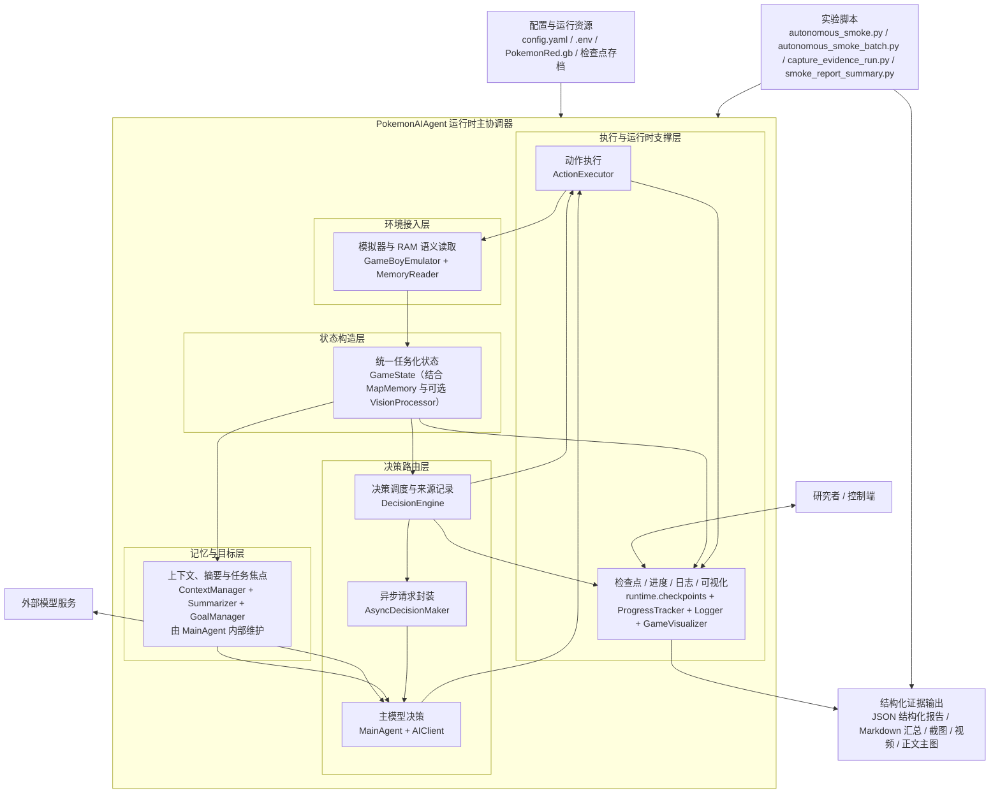

# 毕业设计初稿
## 面向长时序任务的直接决策型大语言模型游戏智能体
### 以《宝可梦 红》早期剧情自主推进为例

## 摘要

长时序游戏环境同时包含部分可观测状态、稀疏里程碑、菜单式交互、跨地图导航与长期目标维护，因此适合检验生成式模型是否能够在较长时间尺度上承担连续决策责任。与 `Arcade Learning Environment` 一类强调短时反应和局部控制的经典基准不同 [6][7]，《宝可梦 红》的早期主线要求智能体在房间、城镇、道路、对话框、战斗菜单与剧情事件之间持续切换语义，并避免局部循环、错误交互和剧情锁死。

本文实现了一个运行于 `PyBoy` 模拟器上的大语言模型游戏智能体系统。系统围绕普通回合由主模型逐步决策这一运行协议，构建了 RAM 语义状态提取、地图记忆、上下文压缩、动作合法化、同回合同观测重试、结构化日志与批量评估等运行时模块，并将故事引导与战斗引导设计为可显式开关、可单独分析的支持文本。在本文中，研究对象可概括为“直接决策型大语言模型游戏智能体”，其核心特征是普通回合动作由主模型直接生成，而运行时模块负责状态组织、执行稳定化和日志记录。基于这套系统，本文使用主模型直接决策回合占比、里程碑到达率、时间线有效性以及 AI 冷却回合、AI 调用错误回合等诊断信息对运行结果进行量化，形成了从批量复验、长程运行到模块分析相互支撑的证据链。

在本轮主实验中，本文在主实验统一初始状态下完成了新的结构化复验。当前稿件的主统计结论聚焦于完整引导条件下、`120` 回合预算内的核心里程碑窗口：`3/3` 到达 1号道路，`2/3` 到达常磐市，`2/3` 进入常磐市友好商店。各次运行的主模型直接决策回合占比均为 `1.0`，且时间线记录均有效。以 Wilson 区间计，1号道路到达率为 `100%`（95% CI: `43.9%-100.0%`），常磐市与常磐市友好商店到达率均为 `66.7%`（95% CI: `20.8%-93.9%`）。这些结果支持系统在该早期窗口内具备初步可重复推进能力。作为补充，单次 `260` 回合长程运行保留了完整的结构化路径记录，并进一步暴露了外部模型服务波动对长程运行质量的影响：该次运行推进至 1号道路，主模型直接决策回合占比为 `0.6154`，期间出现 `94` 个 AI 冷却回合和 `6` 个 AI 调用错误回合。两组探索性模块分析进一步提示，故事引导对早期路线形成更为重要，而战斗引导在当前窗口内更多改善战斗阶段的局部语义理解。整体来看，本文已经建立了从系统实现、核心窗口统计到视觉补充证据相互支撑的研究框架，表明该系统在固定起点和有限预算下具备了从大木博士研究所推进至常磐市友好商店的早期主线能力，并为正式稿进一步补充同条件基线与重复消融提供了明确基础。

**关键词**：长时序任务；游戏智能体；大语言模型；《宝可梦 红》；直接决策；可复现实验

## Abstract

Long-horizon game environments are useful testbeds for agent research because they couple partial observability, sparse milestones, menu-heavy interaction, map transitions, and long-term goal maintenance within a single task chain. Compared with short-horizon control benchmarks, early-story progression in `Pokemon Red` requires an agent to switch repeatedly across room navigation, town traversal, dialogue advancement, battle menus, and event-triggered state changes without external intervention.

This paper presents a large-language-model game agent running on the `PyBoy` emulator. The system centers ordinary-turn decisions on the main model and provides auditable runtime modules for RAM-based state extraction, map memory, context compression, action normalization, same-observation retries, structured logging, and batch evaluation. Story guidance and battle guidance are implemented as explicit, switchable support texts that can be analyzed separately. In this paper, the target system is characterized as a direct-decision LLM game agent: ordinary-turn actions are generated directly by the main model, while the runtime is responsible for state organization, execution stabilization, and evidence logging. The paper uses the main-model direct-decision ratio, milestone reach rates, timeline-validity checks, and diagnostic counts for cooldown and AI-call-error turns as primary evidence.

In the main experiment, new structured reverification has been completed from the standardized initial state. The primary statistical claim of the current draft focuses on the complete-guidance 120-turn core window: all three trials reached `Route 1`, two reached `Viridian City`, and two entered `Viridian Mart`; all three achieved a main-model direct-decision ratio of `1.0` with valid timelines. These results support a preliminary repeatability claim for early-story progression within that core window. A supplementary 260-turn stress trial preserved the same path-logging protocol and highlighted the effect of model-service instability on longer horizons, with a main-model direct-decision ratio of `0.6154`, `94` cooldown turns, and `6` AI-call-error turns. Exploratory module analyses suggest that story guidance is more important for early route formation, while battle guidance mainly improves local battle semantics within the current window. Together, these results show that the project has established an auditable system, a reproducible evaluation workflow, and a solid basis for extending the formal thesis with same-condition baselines and repeated ablations.

**Keywords**: long-horizon tasks; game agents; large language models; Pokemon Red; direct decision; reproducible evaluation

---

## 第 1 章 绪论

### 1.1 研究背景

生成式模型近年的快速发展，使“单步问答是否正确”逐渐让位于“跨越更长时间尺度的连续行为是否一致”这一问题。长时序任务中的困难并不只是动作数量增加，更在于错误会跨回合传播：一次误判可能在几十步之后表现为迷路、剧情锁死、资源浪费或上下文累积错误。与纯文本环境相比，游戏环境更容易暴露此类问题，因为它们同时包含空间导航、UI 状态切换、图像观察、脚本触发和资源约束。

《宝可梦 红》适合作为研究对象，因为它将多种困难集成在一条紧凑的早期主线中。玩家需要离开大木博士研究所、通过真新镇北口、穿越 1号道路、到达常磐市，并在常磐市友好商店中完成关键交互。这一过程同时包含门口对齐、路径转折、野战菜单、文本推进，也伴随局部死循环和伪开放区域。对于希望在长时序互动世界中承担连续决策责任的模型而言，这是一个足够具体、任务链完整且工程上便于反复复验的窗口。

### 1.2 研究问题

本文围绕两个可以直接落到系统实现与实验验证上的问题展开。

`RQ1`：在固定起点、有限预算和主模型主导的运行协议下，系统能否在《宝可梦 红》早期主线中完成非平凡推进，并留下可核验的结构化证据？

`RQ2`：在当前早期剧情窗口内，故事引导、战斗引导以及相关运行时支撑对推进稳定性呈现出怎样的作用差异？

### 1.3 研究目标与贡献

围绕上述问题，本文的主要工作和贡献如下。

1. 完成了一个面向《宝可梦 红》早期主线的直接决策型大语言模型游戏智能体运行平台，集成 `PyBoy` 模拟器接入、RAM 语义状态提取、`GameState` 任务化状态构造、地图记忆、上下文管理、主模型决策链、动作执行层、可视化界面和结构化报告管线。
2. 设计了以普通回合主模型直接决策为核心的运行协议与评估口径，并明确区分模型动作生成、运行时状态支持与可开关引导文本三者的作用边界。
3. 在主实验统一初始状态下完成了 `120` 回合完整引导条件下的小样本批量复验、`260` 回合长程压力测试以及 2 组探索性模块分析，形成了核心窗口统计、原始画面和图像主图相互支撑的实验材料。
4. 整理了论文正文图包、补充材料入口和附录索引，使系统实现、实验过程、图像证据和结构化报告能够在同一份初稿中被连续呈现。

### 1.4 论文结构

第 2 章讨论本文与生成式智能体、游戏智能体和可审计运行时研究的关系。第 3 章定义任务范围、评价口径与实验约束。第 4 章给出系统设计、已完成模块与复现实验配置。第 5 章说明状态构造、上下文组织、主决策模块以及两类引导模块。第 6 章说明实验协议、统计计划与证据组织原则。第 7 章报告主实验、历史基线对照和消融结果。第 8 章总结当前结果的适用范围、改进重点与后续扩展。第 9 章总结全文。

---

## 第 2 章 相关工作与方法定位

### 2.1 长时序生成式智能体

`Generative Agents` 强调长期记忆、摘要压缩与基于相关性的检索机制 [1]。这一思路对于本文的直接启发是：长时序行为要稳定，系统必须持续维护与当前任务相关的近期历史、阶段目标和高层摘要，而不能只依赖当前一帧观测。`ReAct` 将推理链与行动链耦合，说明语言模型可以在外部环境中形成“状态理解 - 行动选择 - 结果反馈”的循环 [3]。`Reflexion` 和 `Voyager` 等工作进一步表明，语言模型智能体可以通过结构化上下文、环境反馈和任务积累逐步提升复杂任务表现 [4][5]。

从研究范式看，上述工作大多强调开放任务中的持续交互、代表性案例或复杂任务完成能力，而较少面对封闭游戏环境中的按钮级执行、时间线核验和批量复验问题。本文对这些工作的吸收，主要落实在三个具体实现上：第一，将长期上下文落到近期回合、历史摘要和任务笔记；第二，将推理与行动耦合落到 `MainAgent` 的结构化输出接口；第三，将复杂任务支持落到地图记忆、引导说明与批量复验管线上。换言之，本文延续了长时序 LLM 智能体的“记忆 + 推理 + 行动”框架，但把评测重心进一步落到固定起点、固定预算和结构化证据边界下的重复实验。

### 2.2 游戏智能体与《宝可梦 红》研究环境

`Pokemon Red via Reinforcement Learning` 说明了该环境在地图探索、脚本触发、战斗系统、奖励稀疏性和长链任务组织上的复杂性 [2]。这一点对本文同样重要，因为本文的系统设计正是围绕这些复杂性展开的：地图切换要求更稳定的空间记忆，剧情事件要求更清晰的阶段目标，战斗和文本切换要求统一的状态抽象与动作接口。与此同时，强化学习范式更关注奖励设计、训练过程和训练后策略执行；本文关注的则是在不进行任务专用参数训练的前提下，LLM 如何通过在线语言推理完成按钮级游戏决策。因此，两者在研究对象上相邻，在方法路径上则明显不同。

与 `Arcade Learning Environment` 和 `Procgen` 等更强调短程控制或泛化评测的经典基准相比 [6][8]，《宝可梦 红》更强调异构状态切换。系统必须在自由移动、对话脚本、战斗文本、战斗菜单和跨地图传送之间来回切换，而不是在单一低层动作空间中持续优化局部反应。也正因为如此，本文并不试图把当前结果直接放进经典强化学习基准的统一指标表中，而是更关注面向该环境特点的状态组织、证据记录和早期剧情窗口推进能力。

### 2.3 可审计运行时支持体系

围绕长时序游戏智能体，本文把运行时支撑明确组织为观测层、上下文层、执行层与评估层。这样做的价值在于，每个支持模块都能在代码、日志和实验开关中被追踪，从而把系统能力落实到可复验的工程实体上。本文因此采用一种“显式、可记录、可消融的运行时支持”框架：模型负责普通回合决策，系统负责状态组织、执行稳定化和证据沉淀。在这一框架下，结构化状态、动作合法化和日志审计被视为运行时基础设施；故事引导和战斗引导则被视为可单独分析的支持文本，用于帮助解释不同条件下的行为差异。

### 2.4 本文的方法定位

因此，本文可视为一篇面向长时序 JRPG 的运行时系统与实验论文。本文完成的核心工作，是围绕《宝可梦 红》早期主线建立一条可持续运行的主模型直接决策链，并把状态组织、动作执行、日志记录、图像证据和批量评估统一到同一套实验框架中。更准确地说，本文研究的是在显式运行时支撑和可开关引导文本条件下，由 LLM 直接承担普通回合决策的直接决策型游戏智能体。

图 2-1 采用基于分类准则的定位示意图。图中首先按照“策略产生方式”区分训练后执行的强化学习游戏代理与依赖在线语言推理的 LLM 智能体，再按照“任务环境”将后者区分为通用任务型 LLM 智能体与本文研究的游戏决策智能体。这样的表示方式能够更明确地说明：本文方法的定位来自清晰的分类依据，即结构化游戏状态输入、LLM 直接承担普通回合决策以及面向封闭游戏环境的可复验证据组织。

*图 2-1 基于“策略产生方式”与“任务环境”两项分类准则的研究对象定位示意图。图中先区分训练型策略优化路径与语言模型在线推理路径，再进一步区分通用任务型 LLM 智能体与面向游戏环境的 LLM 决策智能体。由此可以看出，本文方法既不同于依赖奖励训练得到策略的强化学习代理，也不同于以开放任务求解为主的通用任务型 LLM 智能体，而是以结构化游戏状态为输入、由 LLM 直接承担普通回合决策的游戏智能体。*

---

## 第 3 章 任务定义与证据边界

### 3.1 任务范围

本文覆盖的主任务窗口是《宝可梦 红》的早期剧情，从主实验统一初始状态出发，预算为 `120` 或 `260` 回合。记单次运行预算为 $H$，则有

$$
H\in\{120,260\},\qquad
\mathcal{G}=\mathcal{G}_{\text{core}}\cup\mathcal{G}_{\text{ext}},
$$

其中

$$
\mathcal{G}_{\text{core}}=\{g_1,g_2,g_3\},\qquad
\mathcal{G}_{\text{ext}}=\{g_4,g_5,g_6,g_7\}.
$$

本文考察如下里程碑集合：

为避免将项目内部存档名称直接写入论文正文，本文统一将主实验所使用的起始存档称为“主实验统一初始状态”，将历史对照所使用的起始存档称为“历史基线初始状态”。相应内部文件名仅在补充材料目录、原始报告路径和复现实验脚本中保留。

1. $g_1$：到达 1号道路
2. $g_2$：到达 常磐市
3. $g_3$：进入 常磐市友好商店
4. $g_4$：获得 大木博士的包裹
5. $g_5$：获得 宝可梦图鉴
6. $g_6$：到达 2号道路
7. $g_7$：到达 常磐森林

其中，$\mathcal{G}_{\text{core}}$ 构成本论文当前最核心的结构化窗口；$\mathcal{G}_{\text{ext}}$ 只作为更远剧情的补充指标，不作为本轮主结论的必要前提。

### 3.2 形式化描述

可将该任务视为部分可观测马尔可夫决策过程

$$
\mathcal{M}=(\mathcal{S}, \mathcal{A}, \mathcal{O}, T, \Omega, R, \gamma).
$$

系统在每个回合获得观测 $o_t$，其内容包括截图、RAM 提取的高层语义状态、地图记忆摘要、导航摘要与上下文笔记；模型输出离散动作

$$
\mathcal{A}=\{\texttt{up}, \texttt{down}, \texttt{left}, \texttt{right}, \texttt{a}, \texttt{b}, \texttt{start}, \texttt{select}, \texttt{wait}\}.
$$

对预算为 $H$ 的单次运行，记其轨迹为

$$
\tau_H=\{(o_t,a_t)\}_{t=1}^{H},\qquad H\in\{120,260\}.
$$

本文不直接估计环境回报，而将轨迹 $\tau_H$ 上的里程碑到达情况、主模型直接决策占比和时间线有效性作为主评价对象。

### 3.3 观测与动作表示

在当前系统中，单步观测可抽象写为

$$
o_t=\big[x_t^{ram}, x_t^{img}, x_t^{nav}, x_t^{ctx}, x_t^{goal}\big].
$$

其中 $x_t^{ram}$ 表示通过 `MemoryReader` 从 RAM 中读取的结构化状态，$x_t^{img}$ 表示当前截图及其可选视觉提示，$x_t^{nav}$ 表示地图记忆与局部导航摘要，$x_t^{ctx}$ 表示近期回合和摘要历史，$x_t^{goal}$ 表示当前焦点任务和待办事项。与只给一张截图的做法相比，这种多源状态组织方式显著降低了模型对模糊视觉细节的依赖，并使其能够显式利用过去信息。

### 3.4 评价口径

本文使用与运行报告直接对齐的四类指标：

1. 主模型直接决策回合占比

$$
R_{\text{direct}}^{(r)}=\frac{N_{\text{direct}}^{(r)}}{T^{(r)}}
$$

其中，$N_{\text{direct}}^{(r)}$ 表示第 $r$ 次运行中由主模型直接完成决策的回合数，$T^{(r)}$ 表示该次运行的总回合数。

2. 里程碑到达情况

对第 $r$ 次运行和第 $i$ 个里程碑，定义

$$
I_i^{(r)}\in\{0,1\},\qquad
\hat p_i=\frac{1}{n}\sum_{r=1}^{n} I_i^{(r)}.
$$

其中，$I_i^{(r)}=1$ 表示第 $r$ 次运行到达里程碑 $g_i$，否则为 $0$；$\hat p_i$ 为批量实验中的里程碑到达率。

3. 时间线有效性

记第 $r$ 次运行的时间线有效性为

$$
V^{(r)}=m_{\text{mono}}^{(r)}\,m_{\text{state}}^{(r)}\,m_{\text{last}}^{(r)},
\qquad
m_{\text{mono}}^{(r)},m_{\text{state}}^{(r)},m_{\text{last}}^{(r)}\in\{0,1\}.
$$

其中：

1. $m_{\text{mono}}^{(r)}=1$ 表示回合编号保持单调递增；
2. $m_{\text{state}}^{(r)}=1$ 表示报告中的最终状态与结束回合一致；
3. $m_{\text{last}}^{(r)}=1$ 表示时间线记录中的最后一回合与结束回合一致。

4. 补充诊断信息

对长程运行中的补充诊断量，记

$$
N_{\text{cool}}^{(r)},\qquad
N_{\text{err}}^{(r)},\qquad
\bar{\ell}^{(r)}=\frac{1}{T^{(r)}}\sum_{t=1}^{T^{(r)}} \ell_t^{(r)}.
$$

其中，$N_{\text{cool}}^{(r)}$ 为 AI 冷却回合数，$N_{\text{err}}^{(r)}$ 为 AI 调用错误回合数，$\bar{\ell}^{(r)}$ 为平均请求时延，用于定位系统瓶颈。

据此定义两级证据：

$$
E_{\text{valid}}^{(r)}=V^{(r)},\qquad
E_{\text{full}}^{(r)}=V^{(r)}\cdot \mathbf{1}\!\left[R_{\text{direct}}^{(r)}=1\right].
$$

其中，$E_{\text{valid}}^{(r)}=1$ 表示有效运行证据成立；$E_{\text{full}}^{(r)}=1$ 表示全回合主模型直接决策证据成立。

前者说明结构化时间线可核验；后者进一步说明全部普通回合均由主模型直接产出动作，而没有退化为 AI 冷却回合或 AI 调用错误回合。

### 3.5 实验支持模块与约束

表 3-1 给出主实验纳入正文分析的支持模块与实验约束。该表的目的在于说明哪些模块被视为状态组织与执行支持，哪些机制不纳入普通回合统计。

| 模块或机制 | 在主实验中的处理 | 说明 |
| --- | --- | --- |
| RAM 只读状态提取 | 纳入 | 作为观测层，不直接生成动作 |
| 地图记忆与导航摘要 | 纳入 | 对历史走位做结构化压缩，服务于模型理解 |
| 上下文摘要、任务笔记 | 纳入 | 降低长上下文漂移 |
| 合法动作归一化 | 纳入 | 将模型输出约束到合法按钮集合 |
| ActionExecutor 单按钮执行 | 纳入 | 保持“一次模型决策对应一次主要按钮输入” |
| 同回合同观测重试 | 纳入 | 对同一观测重发模型请求，不额外生成新的动作规划 |
| 故事引导 | 纳入并显式标注 | 属于面向早期剧情窗口的外显支持文本，并在正文给出开关分析 |
| 战斗引导 | 纳入并显式标注 | 属于面向战斗语义的外显支持文本，并在正文给出开关分析 |
| 检查点恢复 | 不计入运行 | 仅用于统一单次运行的初始状态 |
| 其他会直接替代普通回合决策的机制 | 不纳入主实验统计 | 为保持正文口径一致，不作为主结果组成部分 |

### 3.6 主模型直接决策运行协议的工作定义

在本文中，“主模型直接决策运行协议”是一个针对动作生成来源的实验定义：普通回合的最终动作由主模型直接给出，系统通过可审计的方式提供观测组织、执行稳定化和结果记录。基于这一工作定义，本文把 RAM 只读状态提取、地图记忆、上下文摘要和动作合法化视为运行时基础设施，把故事引导和战斗引导视为可开关、可单独分析的支持文本，并通过日志字段持续记录决策来源、主模型直接决策占比与时间线有效性。这样定义的优势在于：既能够完整呈现系统已经实现的状态组织与执行能力，也能够在实验中把模型动作生成、运行时支持和引导文本三者的作用区别开来。

---

## 第 4 章 系统总体设计与复现实验配置

### 4.1 设计原则

本文系统的设计目标是构造一个以模型决策为中心、兼顾可观察性与可复验性的长时序运行平台。围绕这一目标，系统重点落实了四项设计原则：一是通过 RAM、截图和地图记忆形成足够清晰的任务化状态；二是让每回合决策路径都能在日志中被追踪和复盘；三是让运行时支撑模块与主决策模块形成稳定协同；四是让原始截图、视频、JSON 结构化报告、汇总表和正文主图对应于同一组实验产物。

### 4.2 系统总体架构

图 4-1 给出了与当前项目代码一致的系统总体运行架构。`PokemonAIAgent` 作为运行时主协调器，连接环境接入、状态构造、记忆与目标、决策路由、动作执行与实验取证六个部分。环境接入层由 `GameBoyEmulator` 与 `MemoryReader` 构成，负责 ROM 运行、截图采样、RAM 语义读取与检查点恢复；状态构造层以 `GameState` 为核心，并结合 `MapMemory` 与可选 `VisionProcessor` 形成任务化状态。`MainAgent` 内部持有 `ContextManager`、`Summarizer` 与 `GoalManager`，并通过 `AIClient` 调用外部模型。`DecisionEngine` 负责协调状态构造、模型调用、决策来源记录与动作分发，使普通回合决策、执行映射和日志沉淀保持一致。`ActionExecutor` 将动作写回模拟器，而检查点、进度跟踪、日志、可视化仪表盘以及 `autonomous_smoke.py` 等实验脚本共同把运行过程沉淀为可复验的研究证据。

*图 4-1 与当前项目代码一致的直接决策型大语言模型游戏智能体总体运行架构。图中以 `PokemonAIAgent` 为主协调器，展示了从模拟器与 RAM 语义读取、任务化状态构造、上下文与目标维护、决策路由、动作执行到日志、检查点、可视化和实验脚本证据输出的完整闭环。该图强调：系统的职责是为主模型决策提供状态组织、执行映射与证据沉淀。*

### 4.3 当前主实验的关键配置

表 4-1 汇总本轮主实验口径中的关键信息。正文以报告中的 `effective_settings` 和 `config_snapshot` 为准，以保证论文表述与实际实验记录完全一致。

| 项目 | 当前值 |
| --- | --- |
| 标准起点 | 主实验统一初始状态 |
| 模型 | `gpt-5.4` |
| API 基础地址 | `https://api.ququ233.com/v1` |
| 主模型温度 | `0.0` |
| 主实验协议 | 普通回合由主模型直接决策 |
| 普通回合替代决策 | 关闭 |
| 早期混合决策模式 | 关闭 |
| 全流程控制模式 | 关闭 |
| 请求超时 | `25s` |
| 请求重试 | `1` 次 |
| 重试退避 | `0.5s` |
| 同回合重试上限 | `30` 次 |
| 同回合时间预算 | `60s` |
| 决策最大输出 | `256` 个词元 |
| 动作计划上限 | `3` |
| 故事引导 | 开启 |
| 战斗引导 | 开启 |
| 模拟器 | `PyBoy 2.6.1` |
| Python | `3.13.5` |
| 操作系统 | `Windows 11 10.0.26200`, `AMD64` |
| ROM | `PokemonRed.gb` |
| ROM SHA256 | `5CA7BA01642A3B27B0CC0B5349B52792795B62D3ED977E98A09390659AF96B7B` |

除关键配置外，表 4-2 从工程实现角度概括了本项目已经完成的主要模块与对应作用。与仅列出配置开关相比，这张表更直接说明本研究已经完成的核心工作。

| 模块 | 已完成内容 | 在论文中的作用 |
| --- | --- | --- |
| 模拟器与状态接入 | 完成 `PyBoy` 接入、ROM 运行、截图采集、RAM 读取与检查点恢复 | 为所有实验提供统一初始状态和结构化观测来源 |
| 状态构造与地图记忆 | 完成 `GameState` 任务化状态构造、地图记忆、前沿候选/传送点/阻塞摘要 | 将原始游戏状态转化为模型可直接使用的长时序上下文 |
| 上下文与任务管理 | 完成近期回合记录、历史摘要、任务笔记和引导说明组织 | 支撑模型跨回合保持主线目标与局部计划 |
| 主决策链 | 完成 `MainAgent`、`DecisionEngine`、结构化输出与路径来源记录 | 形成普通回合由主模型逐步决策的核心链路 |
| 执行与稳定化 | 完成 `ActionExecutor`、合法动作归一化、同回合同观测重试 | 保证模型动作能够稳定映射到模拟器执行 |
| 可视化与实验管线 | 完成可视化仪表盘、JSON 结构化报告、批量汇总、图像与视频归档 | 支撑论文图表、批量统计、答辩展示与后续复验 |

### 4.4 可视化平台与地图记忆

图 4-2 给出了现有网页可视化仪表盘界面。该图在论文中的价值并不只是展示一个前端界面，而是帮助读者理解系统已经具备实时状态观察、事件流记录和运行诊断能力。对于一个长时序游戏智能体而言，缺少全局可视化界面将使单步失误原因的严谨分析变得困难。

*图 4-2 运行时网页可视化仪表盘桌面端总览。该图展示了系统对当前地图状态、事件流、日志输出与运行控制信息的统一呈现方式。对于长时序实验而言，这类可视化界面不仅服务于演示，也服务于错误定位、里程碑核查与运行轨迹诊断。*

图 4-3 展示了当前系统已经实现的地图记忆能力。地图记忆的意义不在于生成单纯用于展示的热力图，而在于它为系统提供了一种比单帧截图更稳定的空间先验，使“哪些区域已探索、哪些方向仍可拓展、哪里可能是出口或阻挡”能够进入后续的状态表示与决策上下文中。

*图 4-3 2号道路地图记忆示意图。图中展示了系统在连续探索过程中累积得到的空间记忆结果，包括已访问区域与后续可扩展的前沿线索。该图说明系统的状态表示并不局限于单帧截图，而能够显式保留空间结构，为后续长时序导航决策提供稳定先验。*

### 4.5 系统单回合运行流程

从单个回合的执行流程来看，当前系统已经形成了一条较为清晰的闭环。

1. 模拟器读取当前截图、RAM 状态、地图位置、事件位和基础环境信息。
2. `GameState` 联合地图记忆与近期结果，将原始观测整理成任务化状态文本。
3. `ContextManager`、`Summarizer` 和 `GoalManager` 补充近期回合、历史摘要、任务笔记和当前阶段目标。
4. `MainAgent` 基于完整上下文输出屏幕判断、决策理由、执行动作、短程动作计划和目标更新。
5. `DecisionEngine` 记录路径来源并将动作交给 `ActionExecutor` 执行到模拟器。
6. 执行结果、截图、时间线记录和结构化字段被写入日志与报告，为后续批量汇总、图像整理和实验复盘提供基础。

这一流程的工程意义在于，它把观测组织、模型决策、动作执行和证据沉淀整合成了一个可以持续重复运行的闭环，而不是一次性演示脚本。

### 4.6 复现实验说明

本轮主实验采用无界面模式运行，并在每份单次报告中记录 `environment`、`effective_settings`、`config_snapshot` 与 `report_validation`。这使得读者可以追踪所用模型、主要实验开关、时间线是否完整，以及结尾状态是否与最后一回合一致。当前稿件将这些关键信息前移到正文，便于读者直接理解系统配置与实验条件。

---

## 第 5 章 核心方法与关键模块

### 5.1 任务化状态构造（GameState）

任务化状态构造模块（`GameState`）将 RAM、UI 状态、截图元信息、队伍信息、事件位和地图记忆组合为任务化文本状态。这一层的作用，是把模型在长上下文中需要持续维护的局部事实显式化，例如当前位置、邻接方向是否被证实阻塞、当前是否仍处于战斗文本、当前网格的访问次数、最近的前沿候选等。

### 5.2 地图记忆与导航摘要

地图记忆模块持续记录已探索网格、已知出口、确认阻塞方向、传送点与前沿候选。其输出采用摘要形式，为模型提供稳定的空间先验。对于长时序导航而言，这一模块的核心价值在于减少重复探索和局部循环，并帮助模型把注意力放到真正可扩展的方向上。

### 5.3 上下文压缩与任务笔记

长时序运行中，模型最容易丢失的是阶段目标、当前位置与近期失败尝试之间的联系。因此系统显式保留近期回合、历史摘要和任务笔记，并将它们组织成主模型每回合都能直接读取的上下文。由此，模型在大木博士研究所、真新镇和 1号道路等关键区域，不仅能够利用当前状态，还能继承上一回合动作、当前阶段目标以及近期失败方向等对连续决策十分关键的信息。

### 5.4 主模型决策模块（MainAgent）

主模型决策模块（`MainAgent`）负责读取任务化状态、近期回合和引导说明，并输出当前屏幕判断、决策理由、执行动作、短程动作计划和目标更新。借助这种结构化输出，系统已经能够在导航、文本推进和战斗菜单切换之间保持统一的决策接口，同时为后续报告保留可分析的决策理由字段和目标更新记录。

### 5.5 决策调度模块（DecisionEngine）

决策调度模块（`DecisionEngine`）是主模型直接决策运行链路中的调度与审计核心。它负责维持实验模式、协调 `GameState` 与 `MainAgent` 之间的调用、记录每回合决策来源，并将动作安全地交给执行层。借助这一层，系统可以把“模型产出动作”“运行时执行动作”“日志记录决策来源”三个过程稳定地串联起来。

为了形式化这一调度层在实验分析中的作用，本文保留逐回合决策来源记录与主模型直接决策占比两个概念。对一段长度为 $T$ 的轨迹 $\tau=\{1,\dots,T\}$，定义

$$
R_{\text{direct}}(\tau)=\frac{N_{\text{direct}}(\tau)}{|\tau|}.
$$

其中，$N_{\text{direct}}(\tau)$ 表示轨迹 $\tau$ 中由主模型直接完成决策的回合数，$|\tau|=T$ 表示轨迹长度；逐回合来源记录则用于区分主模型直接决策、AI 冷却和 AI 调用错误等情况，为后续问题定位提供依据。

表 5-1 从实现角度总结了第 5 章各核心模块的输入、输出与作用。与前文的系统架构图相比，这张表更适合直接说明各模块的具体职责。

| 模块 | 主要输入 | 主要输出 | 核心作用 |
| --- | --- | --- | --- |
| `GameState` | RAM 状态、截图元信息、地图记忆、事件位 | 任务化状态文本、屏幕语义、局部事实摘要 | 把原始观测整理成主模型可直接使用的结构化状态 |
| `MapMemory` | 坐标、地图 ID、探索轨迹、阻塞反馈 | 已探索区域、前沿候选、传送点/阻塞摘要 | 为长时序导航提供稳定空间先验 |
| `ContextManager` / `Summarizer` | 近期回合、历史运行记录、阶段事件 | 近期上下文、摘要历史、任务笔记 | 帮助模型持续保持阶段目标与最近经验 |
| `MainAgent` | 任务化状态、上下文、引导说明 | 屏幕判断、决策理由、动作、短程计划、目标更新 | 完成普通回合的主模型决策 |
| `DecisionEngine` | `GameState`、`MainAgent` 输出、实验模式 | 决策来源记录、统一决策分发 | 协调模块调用并保留逐回合决策来源 |
| `ActionExecutor` | 合法动作记号、屏幕状态、执行设置 | 模拟器按键输入、执行结果 | 将模型动作稳定映射到游戏操作 |
| 故事/战斗引导 | 地图位置、事件位、战斗相位、菜单信息 | 引导说明 | 在关键窗口提供窄域任务提示和战斗语义提示 |

图 5-1 将 `GameState -> MainAgent -> ActionExecutor` 的主路径与日志、截图、里程碑报告之间的关系放在同一张图中，便于读者理解状态组织、主模型决策与证据输出之间的对应关系。

*图 5-1 主模型直接决策链与证据输出关系图。图中展示了状态构造、主模型决策、动作执行以及日志与图像证据沉淀之间的顺序关系。该图强调，系统的职责是支撑主模型决策的稳定执行与可复盘记录。*

### 5.6 动作执行层（ActionExecutor）与稳定化

动作执行层（`ActionExecutor`）负责把主模型输出的高层动作记号稳定映射为模拟器中的有效操作。对于真实游戏环境而言，这一步并非简单地将 `up` 映射为方向键上输入。在 Game Boy 一类低分辨率、按键驱动的环境中，同一个方向动作在不同帧上下文中可能产生朝向变化、格点位移、文本推进或菜单焦点移动等不同效果。当前执行层的核心价值，是把已经生成的动作稳定落实到模拟器中，并尽量保持“一次决策对应一次可审计执行”。

在当前主实验协议下，非精确模式的方向动作不会被扩展为多次自动重试，而是尽量接近“一次模型决策对应一次按钮输入”。这减少了执行层暗中放大模型意图的风险。

### 5.7 故事引导与战斗引导

当前系统包含两个可显式开关的引导模块。它们的作用，是把与当前窗口高度相关的任务信息以前馈文本的方式组织给主模型，从而提高长时序决策中的阶段一致性。

故事引导根据早期地图位置和事件位生成窄域提示文本。例如在大木博士研究所中，它会给出门口位置等与离开房间直接相关的信息；在真新镇和 1号道路中，它会提供早期主线的已验证走向。借助这一模块，系统能够把当前地图阶段最关键的剧情目标更直接地呈现给主模型，从而减少在关键路口和门口附近的无效徘徊。

战斗引导则更多来自 RAM 战斗相位、菜单状态和可用招式信息。它通常提供“当前处于战斗文本阶段，应继续按 A”或“菜单出现时优先选择 FIGHT，再选第一个可用伤害招式”之类的局部提示文本。借助这一模块，系统能够在战斗文本、菜单选择和普通移动之间切换得更稳定，使同一条主决策链能够覆盖自由探索与战斗交互两类场景。

从方法边界看，故事引导和战斗引导都属于可显式开关的支持文本，而非模型在当前实验中自行获得的内生知识。因此，完整引导条件下的结果更准确地反映了模型在结构化状态和任务支持文本共同作用下的决策表现。当前稿件已经给出两组单次开关实验，正式稿将进一步把这两类分析扩展为同条件下的小样本重复消融。

### 5.8 同回合同观测重试

主实验允许同回合同观测重试：当模型调用遭遇短暂传输异常时，系统可以在同一观测上重新请求模型，直到达到次数或时间预算上限。这一机制的工程价值在于，它既提高了真实外部模型服务环境下的运行连续性，又能把重试耗尽后的情况明确记录为 AI 调用错误回合，从而保持整条实验时间线的可解释性。

### 5.9 本章小结

综合来看，第 5 章完成的是一条完整的“状态组织 - 上下文维护 - 主模型决策 - 动作执行 - 日志记录”方法链。`GameState`、地图记忆和上下文管理负责把游戏环境整理成可用于长时序决策的输入，`MainAgent` 和 `DecisionEngine` 负责形成统一的决策接口与路径记录，`ActionExecutor`、故事引导、战斗引导和同回合同观测重试则负责提升关键阶段的执行稳定性与运行连续性。正是这些模块共同构成了本文后续实验结果的工程基础。

---

## 第 6 章 实验设计与证据组织

### 6.1 实验分层

围绕当前版本，记实验集合为

$$
\mathcal{E}=\mathcal{E}_{\text{rep}}\cup\mathcal{E}_{\text{stress}}\cup\mathcal{E}_{\text{abl}}\cup\mathcal{E}_{\text{hist}}.
$$

其中，项目已经完成的实验可以归纳为以下四类：

1. $\mathcal{E}_{\text{rep}}$：主重复实验，用于展示系统在统一主模型直接决策协议下对早期主线的重复推进能力。
2. $\mathcal{E}_{\text{stress}}$：长程压力测试，用于记录更长预算下的运行质量、冷却回合情况和外部模型服务波动影响。
3. $\mathcal{E}_{\text{abl}}$：消融实验，用于分析故事引导和战斗引导在当前窗口中的具体贡献。
4. $\mathcal{E}_{\text{hist}}$：历史基线对照，用于展示项目从早期协议阶段到当前主模型直接决策协议的演化过程。

### 6.2 当前主实验协议

表 6-1 总结了本轮论文正文使用的实验。

| 实验 | 起点 | 每次预算 | 次数 `n` | 是否纳入主结论 |
| --- | --- | --- | --- | --- |
| 直接决策重复实验，完整引导 | 主实验统一初始状态 | `120` | `3` | 是 |
| 直接决策长程压力测试，完整引导 | 主实验统一初始状态 | `260` | `1` | 仅作补充 |
| 直接决策消融：关闭故事引导 | 主实验统一初始状态 | `120` | `1` | 是，探索性 |
| 直接决策消融：关闭战斗引导 | 主实验统一初始状态 | `120` | `1` | 是，探索性 |
| 历史基线：早期混合决策协议 | 历史基线初始状态 | `120` | `3` | 否，辅助对照 |
| 历史基线：重试修复后同协议 | 历史基线初始状态 | `120` | `3` | 否，辅助对照 |

从证据组织上看，本文将完整引导条件下的重复实验作为主统计层，将长程压力测试、探索性模块分析和历史阶段材料作为解释层。这样的安排使正文能够先围绕核心窗口给出稳定的重复证据，再逐步展开对更长时程、引导作用和协议演进的讨论。后续正式稿将优先在同一初始状态、相同预算和相同模型服务条件下补充基线组，并把两类引导的开关实验扩展为小样本重复消融。

### 6.3 统计计划

对于重复实验中的二项比例，本文采用 Wilson 95% 区间：

$$
\operatorname{CI}_{95\%}^{\text{Wilson}}(\hat p_i)=
\frac{\hat p_i+\frac{z^2}{2n}\pm z\sqrt{\frac{\hat p_i(1-\hat p_i)}{n}+\frac{z^2}{4n^2}}}{1+\frac{z^2}{n}},
\qquad z=1.96.
$$

对于时延和比例类连续值，本文报告

$$
\bar{x}=\frac{1}{n}\sum_{r=1}^{n}x^{(r)},\qquad
s_x=\sqrt{\frac{1}{n-1}\sum_{r=1}^{n}\left(x^{(r)}-\bar{x}\right)^2},
$$

并同时给出中位数与极值。对于单次长程压力测试和单次消融，本文采用探索性描述而非确认性统计推断。这样做的原因是：`n=3` 仅足以表达“非零重复现象”和粗略不确定性，能够支持初步可重复性判断，但远不足以支撑强统计主张；`n=1` 的消融更适合用来揭示模块敏感性，而不是直接给出稳定的效应估计。对于后续拟补充的同条件基线和重复消融，正式稿将延续这一统计口径，并在统一起点与统一预算条件下开展横向比较。

### 6.4 视觉证据与结构化证据的关系

本文将结构化报告、代表性演示运行和补充材料组织为互补的三层证据体系。其中，结构化报告承担正文主统计作用，代表性演示运行承担视觉连续性说明，附录和补充材料则提供原始图像、视频和索引入口。这样的组织方式既能让正文聚焦主结果，也能完整展示项目已经积累的实验材料。

为避免结构化报告、视频演示和补充材料在论文中各说各话，表 6-2 对本文实际使用的证据层次做了统一整理。它的作用在于明确每类材料各自承担什么论证责任。

| 证据层 | 主要载体 | 实验条件 | 在正文中的角色 |
| --- | --- | --- | --- |
| 主重复实验 | 批量汇总 JSON 结构化报告与单次运行报告 | 主实验统一初始状态，完整引导，`3 x 120` | 正文主要小样本统计证据 |
| 长程压力测试 | 单次长程 JSON 结构化报告 | 主实验统一初始状态，完整引导，`260` 回合 | 说明长程稳定性边界 |
| 消融实验 | 两份单次消融 JSON 结构化报告 | 关闭故事引导或关闭战斗引导 | 解释引导模块的相对作用，并为后续重复消融提供参照 |
| 代表性演示运行 | 视频与正式主图包 | 直接决策演示运行，视觉上覆盖更远剧情 | 展示核心窗口之外的延伸路径 |
| 历史基线 | 两份批量汇总报告 | 不同实验初始状态、不同协议阶段 | 呈现项目演进脉络，并为后续同条件基线提供参照 |

表 6-3 则给出本稿反复引用的补充材料入口，便于后续继续扩写正式论文、准备答辩或导出附件包。

| 材料 | 位置 | 用途 |
| --- | --- | --- |
| 主重复实验汇总目录 | `tmp/real_ai_batches/2026-04-07_pure_ai_batch_checkpoint_196081_120t_fullguidance_v1/` | 提供正文主统计与 Wilson 区间来源 |
| 长程与消融报告目录 | `docs/report_assets/2026-04-07_pure_ai_demo/reports/` | 提供长程压力测试和两组消融原始记录 |
| 正式图包与交付索引 | `docs/img/2026-04-06/` 与 `docs/2026-04-06_pure_ai_delivery_index.md` | 提供正文主图与展示型材料入口 |
| 图像索引与连续截图联系表 | `docs/img/2026-04-05_figure_index.md` 与 `docs/2026-04-05_thesis_appendix_contact_sheets.md` | 提供阶段截图、联系表与答辩备查材料 |
| 总证据报告 | `docs/2026-04-05_graduation_design_full_evidence_report.md` | 提供更长篇幅的证据叙述与历史整理 |

### 6.5 正式稿的对照与消融扩展

在当前稿件已经建立主统计层和解释层基础上，正式稿将优先补充两类实验。第一类是同条件基线：在与主实验相同的初始状态、预算和模型服务条件下设置对照组，用于把当前协议放到更加严格的横向比较框架中。第二类是重复消融：对故事引导和战斗引导分别进行小样本重复开关实验，用于把当前已经观察到的模块敏感性进一步提升为更稳定的比较结果。这样安排既保持了当前稿件的主线完整性，也为后续把实验论证推进到更高严谨度预留了清晰路径。

---

## 第 7 章 实验结果与分析

### 7.1 主结果总表

表 7-1 给出本轮最重要的结构化结果。为避免叙述性描述替代统计报告，正文优先报告里程碑、主模型直接决策占比和时延。

| 条件 | `n` | 预算 | 1号道路 | 常磐市 | 常磐市友好商店 | 大木博士的包裹（扩展节点） | 主模型直接决策回合占比 | 平均时延 |
| --- | --- | --- | --- | --- | --- | --- | --- | --- |
| 完整引导，直接决策批量复验 | `3` | `120` | `3/3` (`100.0%`, 95% CI `43.9%-100.0%`) | `2/3` (`66.7%`, 95% CI `20.8%-93.9%`) | `2/3` (`66.7%`, 95% CI `20.8%-93.9%`) | `0/3` (`0.0%`, 95% CI `0.0%-56.2%`) | 均值 `1.0000` | `6.04s` |
| 完整引导，直接决策长程压力测试 | `1` | `260` | 是 | 否 | 否 | 否 | `0.6154` | `7.49s` |
| 关闭故事引导 | `1` | `120` | 否 | 否 | 否 | 否 | `0.9167` | `6.95s` |
| 关闭战斗引导 | `1` | `120` | 是 | 是 | 是 | 否 | `1.0000` | `5.97s` |

从表 7-1 可见，当前稿件最稳定的重复证据来自完整引导条件下的 `120` 回合复验。它们共同满足两个条件：时间线有效、早期里程碑出现非零重复到达率。尤其重要的是，各次运行的主模型直接决策回合占比均达到 `1.0`，即全部普通回合都由模型直接产出动作。由此，正文主结论自然聚焦于核心里程碑集合 $\mathcal{G}_{\text{core}}=\{g_1,g_2,g_3\}$；更远节点则作为扩展观察指标，用于连接后续的长程运行和视觉证据。

对核心里程碑集合 $\mathcal{G}_{\text{core}}=\{g_1,g_2,g_3\}$ 而言，其批量到达率向量可写为

$$
\big(\hat p_1,\hat p_2,\hat p_3\big)=\left(1,\frac{2}{3},\frac{2}{3}\right).
$$

### 7.2 对长程压力测试的解释

单次 `260` 回合长程运行的价值主要体现在两个方面。第一，它把评估窗口从 `120` 回合继续向后延长，使系统在更长时间尺度上的响应质量、冷却回合情况和外部模型服务波动得到了直接记录。第二，它为后续优化提供了明确定位：该次运行虽然保留了完整的时间线记录，但推进主要停留在 1号道路。若记该次长程运行的诊断向量为

$$
d_{\text{stress}}=\big(R_{\text{direct}},N_{\text{cool}},N_{\text{err}},\bar{\ell}\big),
$$

则有

$$
d_{\text{stress}}=(0.6154,94,6,7.49\text{s}).
$$

这说明长程性能当前更受外部模型服务可用性和时延波动制约。

因此，这次长程压力测试已经完成了“延长窗口 + 暴露瓶颈”的任务。它让项目不仅有早期主线复验结果，也有面向更长时序优化的直接问题定位。

### 7.3 历史基线对照

为展示项目协议演进过程，表 7-2 给出历史阶段对照。这里的重点在于说明项目如何从早期混合决策协议逐步推进到当前以主模型直接决策为中心的实验协议，并为后续补充同条件基线提供参照。

| 条件 | 起点 | `n` | 预算 | 协议概述 | 平均主模型直接决策回合占比 | 结果说明 |
| --- | --- | --- | --- | --- | --- | --- |
| 历史基线 | 历史基线初始状态 | `3` | `120` | 早期混合决策协议 | `0.0194` | 主模型有效参与极低，未到达 1号道路 |
| 历史基线，重试修复后 | 历史基线初始状态 | `3` | `120` | 修复重试流程后的同类协议 | `0.3000` | 主模型参与回升，但仍未到达 1号道路 |
| 当前主实验 | 主实验统一初始状态 | `3` | `120` | 普通回合由主模型直接决策的当前协议 | `1.0000` | `3/3 1号道路`，`2/3 常磐市`，`2/3 常磐市友好商店` |

表 7-2 的主要价值，在于呈现协议重心和主模型参与度的演化方向。由于历史阶段与当前主实验在初始状态和实验组织上并不完全一致，这组材料更适合作为发展脉络的辅助比较；随着后续正式稿补入同条件基线实验，这一脉络将能够进一步转化为更严格的横向比较。

### 7.4 消融结果

故事引导与战斗引导是当前已经完成显式开关分析的两个模块。表 7-3 给出当前结果，它们为理解系统在不同支持条件下的行为差异提供了直接线索。

| 条件 | 1号道路 | 常磐市 | 常磐市友好商店 | 主模型直接决策回合占比 | 额外现象 | 解释 |
| --- | --- | --- | --- | --- | --- | --- |
| 完整引导 | `3/3` | `2/3` | `2/3` | 均值 `1.0000` | 时间线均有效 | 当前主要小样本复验证据 |
| 关闭故事引导 | 否 | 否 | 否 | `0.9167` | `10` 个 AI 冷却回合，最终停留在大木博士研究所地图并出现 `2x2` 微循环警告 | 提示早期剧情定向文本对离开研究所和进入主线通道具有重要作用 |
| 关闭战斗引导 | 是 | 是 | 是 | `1.0000` | 单次运行仍进入常磐市友好商店 | 提示在当前窗口内，战斗引导并非主推进瓶颈，但其更长时程作用仍需继续观察 |

从当前结果看，故事引导对早期路线形成更为敏感，而战斗引导在本窗口中更多承担局部语义稳定化作用。随着后续正式稿补入同条件重复消融，这两类模块的作用差异将可以进一步用更稳定的样本统计加以刻画。

### 7.5 视频、主图与原始画面证据

如果说结构化结果回答的是“里程碑是否被统计支持、主模型决策是否保持稳定”，那么视频与主图回答的就是“行为链是否在视觉上连续成立”。在当前稿件中，视觉证据已经不再以零散帧截图为主，而是以代表性演示运行、正文主图和补充材料中的原始图像说明共同构成。这样的组织方式更符合论文写作习惯：正文使用统一裁切与放大的主图，补充材料保留完整原始序列，从而同时满足可读性与可核验性。

图 7-1 使用正式图包中的组合图，将大木博士研究所、真新镇、1号道路、常磐市、常磐市友好商店以及更远的包裹节点放入同一视觉序列中。它对应的是代表性演示运行，主要用于补充展示系统在核心统计窗口基础上继续向后延伸的视觉路径。

*图 7-1 代表性演示运行的早期剧情推进视觉序列。该图以统一版式串联大木博士研究所、真新镇、1号道路、常磐市、常磐市友好商店以及获得大木博士的包裹场景，直观展示了同一次运行中从核心统计窗口继续向后延伸的主线连续性。*

图 7-2 进一步给出代表性演示中的包裹获得画面。这一图像的重要性并不只在于展示一个道具名称，而在于它把常磐市友好商店店员交互与剧情关键道具获得明确地固定在原始游戏画面中，为核心统计窗口之外的扩展节点提供了直接的视觉落点。

*图 7-2 代表性演示中的包裹节点画面。图中文字明确显示关键道具获得事件，构成了代表性单次演示中越过当前核心统计窗口后的直接视觉证据。*

与正向结果并列展示的图 7-3 则体现了本文证据组织的另一项优点，即不需要把局部真实运行痕迹从论文中抹掉。代表性演示在取得包裹后仍存在一小段商店内停顿，但这一局部现象应被解释为主模型直接决策运行条件下的局部行为缺陷，而不是主线推进证据的缺失。

*图 7-3 取得包裹后的商店内局部停顿场景。该图显示代表性演示在完成关键剧情交互后仍保留少量真实运行痕迹，也提示包裹节点目前更适合作为单次演示层面的扩展示例。*

除了组合图和终点截图，单帧阶段图也有必要保留。图 7-4 固定了直接决策运行进入 1号道路北向通道时的典型画面，它的意义不在于展示最终推进到何处，而在于把从城镇出口进入野外狭窄路线这一段易出错的中间节点明确保存在正文里。

*图 7-4 1号道路北向推进单帧。该图补充展示了直接决策运行穿过真新镇北口后进入 1号道路狭窄通道的中间阶段，有助于说明系统并非只在起点和终点附近留下证据。*

图 7-5 则补充展示战斗前场景切换的原始画面。该图来自较早阶段的战斗引导探针实验，主要用于说明系统已经进入需要菜单语义理解的战斗上下文，而不只是停留在自由移动状态。由于它不属于本轮主统计，因此在正文中只承担方法解释和情境补充作用。

*图 7-5 1号道路首个野战前画面。该图来自较早的战斗引导阶段实验，用于补充说明系统在早期主线中已经遇到需要文本推进与菜单理解的战斗场景。*

### 7.6 结果层次化总结

基于当前结构化结果，本文将本项目已经完成的结果总结为三层。

第一层是“主统计层”：完整引导下的重复实验已经表明，系统能够从主实验统一初始状态推进到常磐市和常磐市友好商店，并留下时间线有效、主模型直接决策回合占比达到 `1.0` 的结构化记录。

第二层是“扩展示例层”：长程压力测试、代表性演示运行以及包裹节点图像说明系统已经具备继续向后推进的迹象，并为后续扩展更远剧情窗口提供了可追踪的观察材料。

第三层是“解释与补强层”：探索性模块分析和历史阶段材料帮助说明故事引导、战斗引导以及协议演进所起到的作用，同时也为正式稿继续补入同条件基线和重复消融明确了方向。

### 7.7 成本、时延与平台成熟度

对完整引导重复实验的请求时延，记统计量为

$$
\big(\bar{\ell},\operatorname{med}(\ell),s_{\ell}\big)=(6.0363\text{s},\,6.1710\text{s},\,0.2950\text{s}).
$$

相比之下，单次 `260` 回合压力测试满足

$$
\bar{\ell}_{\text{stress}}=7.486\text{s},\qquad
\ell_{\max,\text{stress}}=42.084\text{s}.
$$

这说明长程运行中的系统瓶颈并非仅来自游戏状态复杂化，也明显受外部模型服务稳定性影响。

### 7.8 小结

第 7 章的核心结论是：当前系统已经围绕核心里程碑窗口建立了可重复统计、扩展示例和解释性材料三层互补证据。围绕 1号道路、常磐市和常磐市友好商店的结果，论文已经能够同时给出结构化统计、图像补充和项目演进参照。

---

## 第 8 章 讨论

### 8.1 本项目已经完成的核心工作

就当前稿件而言，本文已经完成了三项最关键的工作。第一，项目已经实现了一套可持续运行的直接决策型大语言模型游戏智能体平台，包含模拟器接入、状态构造、地图记忆、上下文管理、主决策链、动作执行、可视化界面和结构化报告。第二，项目已经形成了统一的实验组织方式，能够从同一实验初始状态出发完成批量复验、长程压力测试和模块消融。第三，项目已经整理出一套适合论文和答辩使用的材料体系，包括主图、阶段截图、视频、批量汇总表和附录索引。

### 8.2 当前结果的适用范围

当前正文中经过最充分结构化复验的窗口，是从主实验统一初始状态出发到 1号道路、常磐市和常磐市友好商店的早期主线推进。围绕这一窗口，论文已经拥有批量统计、图像主图和模块分析三类互补材料。

更远的剧情节点，如大木博士的包裹、宝可梦图鉴、2号道路与常磐森林，当前在稿件中的角色主要是代表性演示、补充材料入口和下一阶段扩展方向。这些内容说明项目已经具备继续向后推进的工程基础，也为后续正式稿留出了清晰的扩展空间。

### 8.3 下一步重点完善的方面

围绕当前版本，后续完善可以归纳为三个相互关联的方向。首先，在实验论证层面，需要在相同实验初始状态、相同预算和相同模型服务条件下补充同条件基线实验，并将故事引导和战斗引导扩展为小样本重复消融，以提高协议比较和模块作用分析的严谨性。其次，在统计可靠性层面，需要将当前 `n=3` 的重复实验扩展到更高规模，进一步收紧里程碑到达率与相关诊断量的不确定区间。最后，在任务能力层面，需要继续向大木博士的包裹、宝可梦图鉴、2号道路与常磐森林等更远剧情窗口扩展，并逐步压缩故事引导中的人工先验，同时针对外部模型服务波动、AI 冷却回合和长时延问题继续优化长程运行稳定性。通过上述三个方向的同步推进，系统有望从“早期窗口可重复推进”进一步发展到“更长时程下的稳定决策”。

### 8.4 下一阶段实验

结合当前稿件已经完成的工作，下一阶段实验宜按由近及远的顺序展开。首先，应在主实验统一初始状态下补充同条件基线组，使当前协议能够被置于严格可比的横向框架中；其次，应对故事引导和战斗引导分别开展重复消融，避免仅依赖单次开关结果解释模块效应；再次，应将 `120` 回合批量复验样本进一步扩大，例如扩展至 `n \ge 10`，以获得更稳定的比例估计与区间结果；最后，在上述基础上继续向大木博士的包裹、宝可梦图鉴、2号道路与常磐森林等更远剧情窗口推进，使当前核心窗口的结论能够逐步向更完整的早期主线覆盖延伸。

### 8.5 正式稿的组织思路

从正式稿写作角度看，正文结构还需要进一步收束到“问题、方法、实验、结论”这一主线。方法章节应当更集中地说明系统实现、模块协同和实验流程，使运行协议与状态组织方式在前文中得到充分建立；结果章节则应围绕批量复验、长程压力测试、模块分析和视觉补充材料展开连续叙述，使主统计结论、扩展示例和解释性证据形成清晰层次；边界说明与适用范围宜主要放在讨论章，用于澄清当前结论所覆盖的核心窗口及后续扩展方向，而不宜在摘要、绪论和方法章中反复展开。经过这样的组织调整，全文的学术主线将更加集中，也更符合正式毕业论文的表达方式。

---

## 第 9 章 结论与展望

本文围绕《宝可梦 红》早期主线，完成了一套运行于 `PyBoy` 上的大语言模型游戏智能体系统。项目已经实现了 RAM 语义状态提取、任务化状态构造、地图记忆、上下文组织、主决策链、动作执行层、可视化界面和结构化评估管线，并将这些模块统一到同一套主模型直接决策实验框架中。

本文当前最核心的实验结果来自主实验统一初始状态下、完整引导条件中的 `120` 回合小样本批量复验：`3/3` 到达 1号道路，`2/3` 到达常磐市，`2/3` 进入常磐市友好商店，且各次运行的主模型直接决策回合占比均为 `1.0`，时间线记录均有效。围绕这一核心窗口，本文已经形成了由批量统计、长程运行、模块分析和代表性演示共同构成的分层叙述链。其中，批量复验支撑主统计结论，长程运行与视觉主图展示后续可扩展方向，探索性模块分析和历史阶段材料则帮助解释当前系统的行为特点。

因此，本文最重要的价值，在于把本研究已经取得的核心成果落实为既可展示又可复验的实验结果：系统已经能够在固定起点和有限预算下完成早期主线推进，已经建立起围绕核心窗口的重复评测框架，并且为后续补充同条件基线、重复消融和更远剧情窗口实验准备好了平台、材料和明确的优化方向。

---

## 参考文献

[1] PARK J S, O'BRIEN J C, CAI C J, et al. Generative agents: Interactive simulacra of human behavior[C]//Proceedings of the 36th Annual ACM Symposium on User Interface Software and Technology. New York: ACM, 2023. DOI: 10.1145/3586183.3606763.

[2] PLEINES M, ADDIS D, RUBINSTEIN D, et al. Pokemon Red via reinforcement learning[EB/OL]. 2025[2026-04-07]. https://arxiv.org/abs/2502.19920.

[3] YAO S, ZHAO J, YU D, et al. ReAct: Synergizing reasoning and acting in language models[C/OL]//The Eleventh International Conference on Learning Representations. 2023[2026-04-07]. https://openreview.net/forum?id=WE_vluYUL-X.

[4] SHINN N, CASSANO F, GOPINATH A, et al. Reflexion: Language agents with verbal reinforcement learning[C]//Advances in Neural Information Processing Systems. 2023, 36.

[5] WANG G, XIE Y, JIANG Y, et al. Voyager: An open-ended embodied agent with large language models[J/OL]. Transactions on Machine Learning Research, 2024[2026-04-07]. https://openreview.net/forum?id=ehfRiF0R3a.

[6] BELLEMARE M G, NADDAF Y, VENESS J, et al. The Arcade Learning Environment: An evaluation platform for general agents[J]. Journal of Artificial Intelligence Research, 2013, 47: 253-279. DOI: 10.1613/jair.3912.

[7] MNIH V, KAVUKCUOGLU K, SILVER D, et al. Human-level control through deep reinforcement learning[J]. Nature, 2015, 518: 529-533. DOI: 10.1038/nature14236.

[8] COBBE K, HESSE C, HILTON J, et al. Leveraging procedural generation to benchmark reinforcement learning[C]//Proceedings of the 37th International Conference on Machine Learning. PMLR, 2020, 119: 2048-2056.

---

## 附录 A 正文图表索引

### A.1 图索引

| 图号 | 文件 | 用途 |
| --- | --- | --- |
| 图 2-1 | `docs/img/2026-04-06/main_figures/fig08_method_positioning.png` | 方法定位图 |
| 图 4-1 | `docs/毕业设计初稿.md`（正文内嵌 Mermaid 图） | 系统总体架构图 |
| 图 4-2 | `docs/img/2026-04-05/main_figures/fig01_dashboard_desktop.png` | 系统可视化界面 |
| 图 4-3 | `docs/img/2026-04-05/main_figures/fig07_route2_map_memory.png` | 地图记忆示意 |
| 图 5-1 | `docs/img/2026-04-06/main_figures/fig07_decision_chain_annotation.png` | 决策链与证据输出 |
| 图 7-1 | `docs/img/2026-04-06/main_figures/fig06_pure_ai_demo_progression.png` | 代表性演示运行的视觉序列 |
| 图 7-2 | `docs/img/2026-04-06/main_figures/fig04_viridian_mart_parcel.png` | 包裹节点补充画面 |
| 图 7-3 | `docs/img/2026-04-06/main_figures/fig05_post_parcel_mart_loop.png` | 包裹节点后的局部停顿补充图 |
| 图 7-4 | `docs/img/2026-04-06/main_figures/fig03_route1_northbound.png` | 1号道路中间阶段单帧 |
| 图 7-5 | `docs/img/2026-04-05/main_figures/fig05_route1_battle_prebattle.png` | 战斗前场景补充图 |

### A.2 表索引

| 表号 | 位置 | 用途 |
| --- | --- | --- |
| 表 3-1 | 第 3.5 节 | 实验支持模块与约束 |
| 表 4-1 | 第 4.3 节 | 主实验关键配置 |
| 表 4-2 | 第 4.3 节 | 项目已完成核心模块概览 |
| 表 5-1 | 第 5.5 节 | 核心模块输入输出与作用 |
| 表 6-1 | 第 6.2 节 | 本轮实验组成 |
| 表 6-2 | 第 6.4 节 | 证据层次与正文角色 |
| 表 6-3 | 第 6.4 节 | 补充材料入口 |
| 表 7-1 | 第 7.1 节 | 主结果总表 |
| 表 7-2 | 第 7.3 节 | 历史基线对照 |
| 表 7-3 | 第 7.4 节 | 消融结果 |

## 附录 B 关键实验产物

| 产物 | 文件 |
| --- | --- |
| 长程压力测试报告 | `docs/report_assets/2026-04-07_pure_ai_demo/reports/pure_ai_latest_260_v8.json` |
| 完整引导重复实验汇总 | `tmp/real_ai_batches/2026-04-07_pure_ai_batch_checkpoint_196081_120t_fullguidance_v1/2026-04-07_pure_ai_batch_checkpoint_196081_120t_fullguidance_v1_summary.json` |
| 关闭故事引导消融报告 | `docs/report_assets/2026-04-07_pure_ai_demo/reports/pure_ai_ablation_no_story_120_v1.json` |
| 关闭战斗引导消融报告 | `docs/report_assets/2026-04-07_pure_ai_demo/reports/pure_ai_ablation_no_battle_120_v1.json` |
| 历史基线汇总 | `tmp/real_ai_batches/2026-04-05_phase2_real_ai_baseline/2026-04-05_phase2_real_ai_baseline_summary.json` |
| 历史重试修复后基线汇总 | `tmp/real_ai_batches/2026-04-05_phase2_real_ai_baseline_retryfix/2026-04-05_phase2_real_ai_baseline_retryfix_summary.json` |
| 代表性演示视频 | `docs/report_assets/2026-04-06_pure_ai_demo/videos/pure_ai_demo_v4.mp4` |

## 附录 C 图像与补充材料入口

| 材料 | 文件 |
| --- | --- |
| 图号索引（图包 A） | `docs/img/2026-04-06_figure_index.md` |
| 图号索引（图包 B） | `docs/img/2026-04-05_figure_index.md` |
| 直接决策交付索引 | `docs/2026-04-06_pure_ai_delivery_index.md` |
| 直接决策补充包 | `docs/2026-04-06_pure_ai_demo_and_supplement_pack.md` |
| 连续截图联系表 | `docs/2026-04-05_thesis_appendix_contact_sheets.md` |
| 总证据报告 | `docs/2026-04-05_graduation_design_full_evidence_report.md` |

## 附录 D 本稿相对 v3 与 v4 的整合说明

1. 保留了 v4 的核心统计口径与边界收缩，不再使用 v3 中过强的“稳定闭环”表述。
2. 重新加入了 v3 中已经放进正文的图位与图注，包括方法定位图、系统图、决策链图和视觉主图。
3. 将不同阶段的图像索引、视频和补充材料入口统一放入附录，便于写作与答辩。
4. 以当前主重复实验作为主要小样本统计证据，以代表性演示运行为视觉补充证据。
5. 将本文件定位为一篇“可继续润色的完整初稿”，而不是单纯的修订说明文档。
